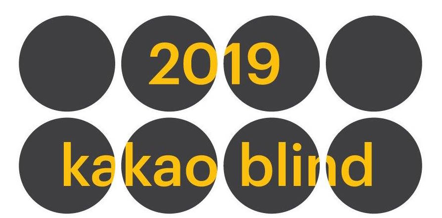
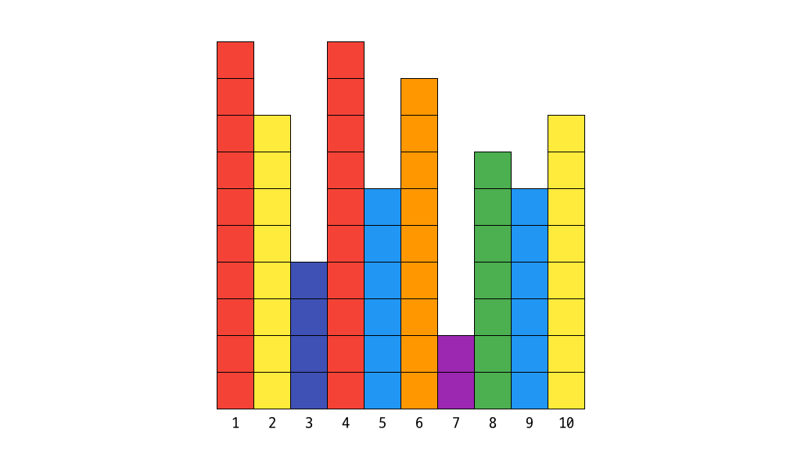
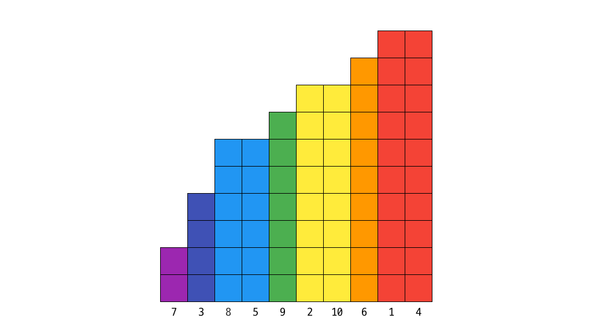
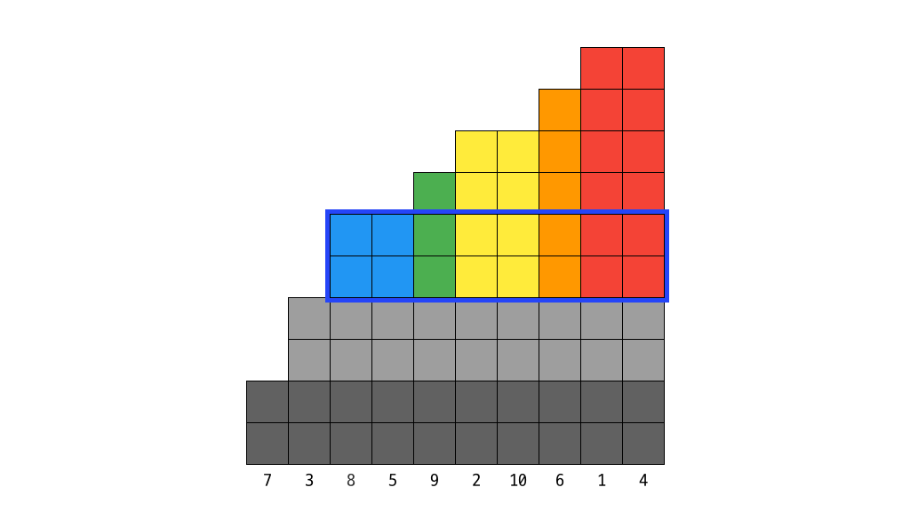
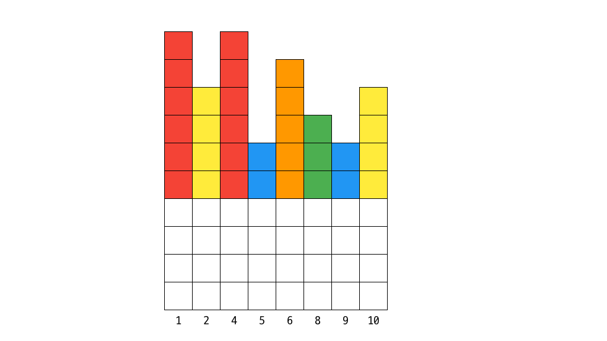

# [Algorithm] 2019 카카오 블라인드 테스트 문제풀이 - 무지의 먹방 라이브


<!-- [##_Image|kage@rLNTr/btq3atlPmFP/otf68nmkdTwafCtnLXVVp1/img.jpg|alignCenter|width="100%"|_##] -->

## 문제

```text
* 효율성 테스트에 부분 점수가 있는 문제입니다.

평소 식욕이 왕성한 무지는 자신의 재능을 뽐내고 싶어 졌고 고민 끝에 카카오 TV 라이브로 방송을 하기로 마음먹었다.

그냥 먹방을 하면 다른 방송과 차별성이 없기 때문에 무지는 아래와 같이 독특한 방식을 생각해냈다.

회전판에 먹어야 할 N 개의 음식이 있다.
각 음식에는 1부터 N 까지 번호가 붙어있으며, 각 음식을 섭취하는데 일정 시간이 소요된다.
무지는 다음과 같은 방법으로 음식을 섭취한다.

무지는 1번 음식부터 먹기 시작하며, 회전판은 번호가 증가하는 순서대로 음식을 무지 앞으로 가져다 놓는다.
마지막 번호의 음식을 섭취한 후에는 회전판에 의해 다시 1번 음식이 무지 앞으로 온다.
무지는 음식 하나를 1초 동안 섭취한 후 남은 음식은 그대로 두고, 다음 음식을 섭취한다.
다음 음식이란, 아직 남은 음식 중 다음으로 섭취해야 할 가장 가까운 번호의 음식을 말한다.
회전판이 다음 음식을 무지 앞으로 가져오는데 걸리는 시간은 없다고 가정한다.
무지가 먹방을 시작한 지 K 초 후에 네트워크 장애로 인해 방송이 잠시 중단되었다.
무지는 네트워크 정상화 후 다시 방송을 이어갈 때, 몇 번 음식부터 섭취해야 하는지를 알고자 한다.
각 음식을 모두 먹는데 필요한 시간이 담겨있는 배열 food_times, 네트워크 장애가 발생한 시간 K 초가 매개변수로 주어질 때 몇 번 음식부터 다시 섭취하면 되는지 return 하도록 solution 함수를 완성하라.
```

[프로그래머스 문제 바로가기](https://programmers.co.kr/learn/courses/30/lessons/42891)


## 풀이

```python
from collections import deque


def solution(food_times, k):
    # 남은 음식이 없는 경우
    if k >= sum(food_times):
        return -1

    # 인덱스 = 음식번호-1
    # [(인덱스, 수량)]을 수량의 오름차순으로 정렬
    foods = deque(sorted(enumerate(food_times), key=lambda x: x[1]))

    total_eaten, last_eaten = 0, 0  # 총 먹은 양, 이전 루프에서 먹은 음식 양
    while True:
        # 이번 루프에서 먹을 양 = (맨 앞 음식량 - 이전 음식량) * 남은 음식 가짓수
        to_eat = (foods[0][1] - last_eaten) * len(foods)

        # 총 먹은 양과 먹을 양의 합이 k보다 클 경우 인덱스순으로 정렬 후 루프 중단
        if total_eaten + to_eat > k:
            foods = sorted(foods, key=lambda x: x[0])
            break

        total_eaten += to_eat  # 총 먹은 양에 먹을 양 더하기
        last_eaten = foods.popleft()[1]  # 이전 단계 양에 큐 맨 앞의 음식 뽑아서 양 세팅

    # 남은 시간 = k - 총 먹은 양
    # 남은 시간을 남은 음식 가짓수로 나눈 나머지번째의 음식이 다음 먹을 음식
    return foods[(k - total_eaten) % len(foods)][0] + 1
```

어렵다. 시뮬레이션은 쉽다. 그런데 문제 요구사항 그대로 구현하면 필히 효율성 테스트에서 시간 초과가 난다. 효율성 제한사항의 경우 `food_times`의 길이가 최대 `200,000`, 각 원소의 크기가 최대 `100,000,000`이다. 어떤 규칙을 찾아서 최대한 연산을 줄이는 것이 중요하다고 생각했다. 로직을 말로만 설명하긴 좀 어려운 감이 있어서, 그림을 그려보려고 한다. 

### 테스트 케이스


<!-- [##_Image|kage@TUYY9/btq285yNQgn/XOpmCe3c4hqX0b5v2M4ov1/img.png|alignCenter|width="100%"|_##] -->

- `food_times`: [10, 8, 4, 10, 6, 9, 2, 7, 6, 8]
- `k`: 48

테스트 케이스는 임의로 지정했다. 각 세로 막대는 `음식`이고, 그 높이가 음식의 `수량`이다. 

> 10 높이의 빨간 막대는 다 먹는데 10초가 소요된다.

편의상 높이, 즉 수량이 같은 음식은 같은 색상으로 표현했다. 왼쪽부터 오른쪽의 순서로 음식이 놓여있다. 아래에는 각 `음식번호`가 붙어있다. 

> 음식번호는 인덱스+1이다.


### STEP 0: 남은 음식이 없는 경우

```python
# 남은 음식이 없는 경우
if k >= sum(food_times):
    return -1
```

정전이 발생한 k초 후에 먹을 음식이 없는 경우는 `-1`을 리턴해야한다. 음식의 총 수량, 즉 `sum(food_times)`이 `k`보다 작을 경우는 별도 연산없이 바로 `-1`을 리턴한다.

### STEP 1: 수량의 오름차순으로 정렬


<!-- [##_Image|kage@lIpht/btq3bWuhJBH/CHmCSLLGj90kCpVHh545k1/img.png|alignCenter|width="100%"|_##] -->

```python
# 인덱스 = 음식번호-1
# [(인덱스, 수량)]을 수량의 오름차순으로 정렬
foods = deque(sorted(enumerate(food_times), key=lambda x: x[1]))
```

음식을 `수량의 오름차순`으로 정렬한다. 다만 결과는 `음식번호`를 리턴해야 하기 때문에, `enumerate` 함수로 `[(음식번호-1, 음식량)]`의 형태로 변경한 후 정렬한다. 이로써 리스트의 순서가 어떻게 변경되든 최초의 인덱스를 기억할 수 있다. 그리고 `deque`를 이용해서 큐를 만든다.

> 큐 대신 리스트를 이용할 수도 있다. 그러나 큐를 사용하는 코드가 더 직관적이고 가독성이 좋았다.

### STEP 2: 루프 돌며 적은 음식부터 먹어치우기

```python
total_eaten, last_eaten = 0, 0  # 총 먹은 양, 이전 루프에서 먹은 음식 양
while True:
    # 이번 루프에서 먹을 양 = (맨 앞 음식량 - 이전 음식량) * 남은 음식 가짓수
    to_eat = (foods[0][1] - last_eaten) * len(foods)

    # 총 먹은 양과 먹을 양의 합이 k보다 클 경우 인덱스순으로 정렬 후 루프 중단
    if total_eaten + to_eat > k:
        foods = sorted(foods, key=lambda x: x[0])
        break

    total_eaten += to_eat  # 총 먹은 양에 먹을 양 더하기
    last_eaten = foods.popleft()[1]  # 이전 단계 양에 큐 맨 앞의 음식 뽑아서 양 세팅
```

실질적인 로직이다. 각 루프는 음식 1가지를 모두 먹어치우는 과정이다. 다만 음식 하나를 모두 먹어 치울 때, 다른 모든 음식들도 같은 양을 먹어야한다. 앞서 정렬한 이유는 가장 적은 음식부터 먹어치워야 뒤에 먹을 음식이 마이너스가 되는 사태를 막을 수 있기 때문이다.

각 루프마다 어떻게 동작이 이루어지는지 그림과 함께 풀이한다. 1, 2, 3 목록은 `while`안의 각 코드블록이다. 

#### Loop 1


<!-- [##_Image|kage@dQrKy6/btq3cSSuSg8/aGGioGaIlb9MgiHdph8prK/img.png|alignCenter|width="100%"|_##] -->

첫번째 루프에선 가장 수량이 적은 `7번` 음식부터 먹어치울 것이다. 시작하는 시점에서는 `total_eaten`과 `last_eaten`, 즉 총 먹은 양과 이전 루프에서 먹은 양이 모두 0이다. 

- `total_eaten`: 0
- `last_eaten`: 0

1. `foods[0][1]`, 즉 큐의 맨 앞 음식 수량은 2이고 `len(foods)`, 즉 남은 음식 가짓수는 10이다. 따라서 첫번째 루프에서 먹을 음식의 양인 `to_eat`은 `(2-0) * 10`, 즉 `20`이다.
2. `total_eaten` + `to_eat`, 즉 이번 루프를 다 돌았을 때의 총 먹은 양은 20으로, `k`인 42보다 작다. 따라서 if문은 건너 뛴다.
3. `total_eaten`과 `last_eaten`을 20, 2로 갱신한다.

이로써 단 1번의 루프로 `7번` 음식을 모두 먹어치우는 동시에, 나머지 음식도 같은 수량만큼 먹었다. 즉 오른쪽 그림의 회색 부분만큼의 음식인 20개를 먹은 셈이 됐다. 단순 시뮬레이션을 했을 경우는 20번의 루프였을 것이다.

#### Loop 2


<!-- [##_Image|kage@bzmHRm/btq3dO99sac/RIrCdLct2IoQSMK9dRiYn1/img.png|alignCenter|width="100%"|_##] -->

두번째 루프에서는 `3번` 음식을 다 먹을 것이다. `3번` 음식의 원래 수량은 4였다. 그러나 이미 앞 루프에서 2개는 먹어버렸다. 이걸 구하기 위해 `last_eaten` 변수를 갖고 있는 것이다.

- `total_eaten`: 20
- `last_eaten`: 2

1. 이번 루프에서 먹을 양은 `(4-2) * 9`인 `18`이다.
2. `total_eaten` + `to_eat`은 38이므로 여전히 `k`보다 작다.
3. `total_eaten`과 `last_eaten`을 38, 4로 갱신한다.

`3번` 음식을 먹어치우고, 같은 수량만큼 나머지 음식도 먹었다. 38번의 루프를 2번으로 줄였다. 

#### Loop 3


<!-- [##_Image|kage@FxMQK/btq3buSnpkg/eqCM9Rs4DvzqNtE6yyJReK/img.png|alignCenter|width="100%"|_##] -->

세번째 루프에서는 '시간 여유가 있다면' 8번 음식을 다 먹을 것이다. 단서를 붙인 이유는 이번에 루프를 빠져나올 것이기 때문.

- `total_eaten`: 38
- `last_eaten`: 4

1. `to_eat`은 아래에서부터 다섯번째 줄이다. `(6-4) * 8`인 `16`만큼을 먹어야 한다.
2. 그런데, 현재 total_eaten은 38이다. 즉 경과한 시간은 38초다. 그런데 16만큼을 먹어버리면 54초가 흘러버리므로, 정전이 난 시간을 지나버린다. `if break`문이 실행된다.


#### Before Break


<!-- [##_Image|kage@efWhds/btq3casnhXQ/wNzGEHApLy0OVRSe1Tj6LK/img.png|alignCenter|width="100%"|_##] -->

```python
foods = sorted(foods, key=lambda x: x[0])
```

 `foods`는 큐이므로 `last_eaten`을 갱신하는 시점에서 루프 완료된만큼 음식, 즉 `7번`과 `3번`은 이미 `pop` 되어 빠져나갔다. 현재 `foods` 큐 안에 남은 건 `8번` 즉 수량이 남은 음식들부터다. 이걸 다시 인덱스 기준으로 정렬하면 그림과 같이 된다.
 
 > 아래 투명한 부분은 이전 루프에서 먹은 부분들이다. 실제로 수량을 빼주는 로직은 없었기 때문에 실제 데이터는 투명한 부분을 포함된 수량이 저장되어 있다. 하지만 정답을 도출하는데에는 의미가 없다. 


## STEP3: 남은 음식에서 남은 시간 후 먹을 음식 찾기

```python
# 남은 시간 = k - 총 먹은 양
# 남은 시간을 남은 음식 가짓수로 나눈 나머지번째의 음식이 다음 먹을 음식
return foods[(k - total_eaten) % len(foods)][0] + 1
```

- `total_eaten`: 38
- `남은 시간`: 10

드디어 루프를 빠져나왔다. 빠져나온 시점에서 경과한 시간은 `total_eaten`과 같다. 즉 남은 시간은 `k`-`total_eaten`이다. 이제 10초만 경과, 즉 10번만 음식을 더 먹으면 된다.

- 1초 경과 -> `1번` 음식 먹고, `2번` 음식이 정답(인덱스 1) 
- 2초 경과 -> `1번`, `2번` 음식 먹고, `4번` 음식이 정답(인덱스 2)
- ...
- 8초 경과 -> `1번`~`10번` 음식 먹고, `1번` 음식이 정답(인덱스 0)
- 9초 경과 -> `1번`~`10번`, 돌아 `1번` 음식 먹고, `2번` 음식이 정답(인덱스 1)
- 10초 경과 -> `1번`~`10번`, 돌아 `1번`, `2번` 음식 먹고, `4번` 음식이 정답(인덱스 2)

위의 케이스를 보면 1~8초, 즉 큐의 길이까지는 남은 시간과 정답의 큐 내 인덱스가 같음을 알 수 있다. 그리고 큐의 길이를 넘는 경우, 즉 한바퀴 이상 경우는 남은 시간을 큐의 길이로 나눈 나머지가 정답의 위치임을 알 수 있다.

즉 현재 리스트에서 `(k - total_eaten) % len(foods)` 위치에 있는 음식의 0번째 원소(최초 인덱스) 가져와 1을 더한 값이 무지가 먹을 음식의 음식번호다.

결론적으로 이 테스트 케이스에서는 `4번` 음식이 무지가 정전이 끝난 후 먹을 음식이다.


> 풀기도 어려웠고, 해설도 오래 걸렸다.