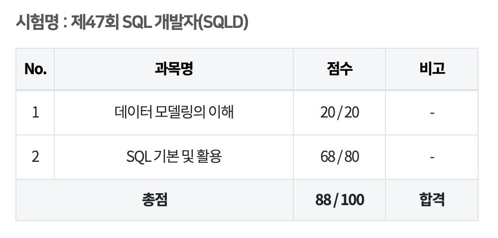

# [Database] SQLD SQL 개발자 시험 후기

2022년 11월 5일 47회 SQL 개발자 자격증 시험을 봤습니다.

누군가에게는 도움이 될까 싶어, 그리고 기록을 위해 남겨두는 후기입니다.

## 동기

시험을 본 시점에서 저는 이런 사람이었습니다.

- 4년차 백엔드 개발자
- 경제학 전공

SQLD는 난이도가 높은 시험이 아닙니다.

개발자에겐 없어도 그만, 있으면 좋은가...? 싶은 정도의 느낌인 것 같습니다.

만 3년 넘게 개발 업무를 했으면 떨어질 수 없는, 떨어져서는 안 되는 시험이라고 생각합니다.

사실 주변에도 이 시험을 본 기획자분들은 있는데, 개발자분은 못 본 것 같습니다.

그럼에도 SQLD 시험을 본 이유는 두가지입니다.

- 컴퓨터공학 학위가 없다
- SQLP 대비 체험

일단 학위가 없어도 개발 일을 할 수는 있지만, 학위가 있는 것이 유리하고 기업에서도 선호하는 것이 사실입니다.

학위가 없다면 내 지식을 증명하기 위해 보다 많은 수고가 필요합니다.

큰 영향은 없더라도 미미하게나마 증명하는 수고를 줄일 수 있지 않을까 생각했습니다.

뒤에 얘기하겠지만, 자격을 따는 데 드는 수고는 거의 없다시피 할 정도라서요.

상위 시험인 SQLP는 SQLD에 비해 취득이 어렵고, 어느 정도 지식의 증명도 되는 수준이라고 들었습니다.

나중에 필요할 수도 있겠다는 생각을 했습니다.

그런데 이 SQLP는 응시 자격이 필요합니다.

저는 그 자격 중 '학사 학위 이상 취득한 자'에 해당이 되긴 합니다.

딱히 전공에 대한 제한은 없으니깐요.

다만 그래도 기준이 바뀔 수도 있고, 또 막상 서점 가서 SQLD 관련 책을 봐도 내용의 깊이 대비 용어가 어렵다는 느낌이 듭니다.

그래서 한번 SQLD로 이런 시험은 이런 식으로 준비하면 되는구나 체험할 수 있을 거라고 생각했습니다.

## 준비 과정

### 등록

원래는 봄에 보려고 했었습니다.

근데 자격증을 땄을 때의 기대효과가 없다보니 두 번이나 미뤄졌습니다.

여름에 그래도 올해 봐보자 하고 시험 등록을 하려고 했더니 생각보다 시험비가 비쌌습니다.

큰 돈은 아니지만 꼭 이 돈을 들일만큼 효용이 있을까 생각을 하니 결제가 망설여졌습니다.

고민하고 나니 갈 수 있는 시험장이 없어 또 미뤄졌습니다.

가을이 왔고, 올해 마지막 시험을 등록할 시기였습니다.

그래도 올해 하기로 한 건데, 안 하고 넘어가면 기분이 영 좋지 못할 것 같아 5만원이라는 거금을 들여 등록을 했습니다.

여기까지가 제일 힘든 과정이었습니다.

역시 시작이 반입니다.

이제 가만히 있으면 나머지 반을 갈 수 있습니다.

### 공부

안타깝게도 실질적인 공부 팁을 얻기 위해 이 글을 보는 분께는 큰 도움을 드리기 어렵습니다.

하지만 쉽다고는 해도 막연한 불안감이 드는 분들께는 자신감을 드릴 수 있을 것 같습니다.

왜냐면 저는 정말 시작을 해서 반을 갔고, 가만히 있어서 나머지 반을 갔기 때문입니다.

물론 정말 가만히 있지는 않았고, 꿈틀은 했습니다.

[이기적 SQL 개발자 이론서 + 기출문제](https://product.kyobobook.co.kr/detail/S000061583675)

시험을 대비해 제가 본 책은 **이기적 SQL 개발자 이론서+기출문제**입니다.

[SQL 자격검정 실전문제](https://product.kyobobook.co.kr/detail/S000001399867)

다만 다른 사람들은 시험 후기를 어떻게 썼나 보다보니 **SQL 자격검정 실전문제**라는 책이 더 좋은가 봅니다.

그리고 제가 직접 이기적 SQL 개발자 책을 보다보니 아쉽거나 이상하다 느낀 부분이 많았어서 추천드리기는 어렵습니다.

SQL 자격검정 실전문제 책이 시험을 주관하는 한국데이터산업진흥원에서 낸 거라 확실히 더 신뢰도가 높을 것 같습니다.

물론 사람마다 성향이 다르니 직접 서점에서 여러 책을 살펴보고 구매하는 것이 제일 좋을 것입니다.

어쨌든 저는 순 공부일로 약 6일 정도 준비를 했습니다.

이 책은 이름과 같이 크게 이론서, 기출문제 파트로 나눌 수 있습니다.

이론서는 시험 세부 과목처럼 또 두 파트로 나눌 수 있습니다.

- 데이터 모델링의 이해
- SQL 기본과 활용

그리고 기출문제 역시 두 파트로 나눌 수 있습니다.

- 실전 150제
- 기출문제 7회분

우선 3일 동안 침대에 누워서 이론서 부분을 읽었습니다.

3일이 걸린 이유는 오래 읽지 못하고 잠들었기 때문입니다.

하루에 길어야 1시간 정도 읽었을거라 생각됩니다.

그리고 1일은 이론서 부분을 다시 읽었습니다.

어쨌든 한 번 읽은 내용이니 슥삭슥삭 빠르게 훑었습니다.

사실 학교에서 소프트웨어를 공부했거나, 백엔드 개발 경력이 있다면 결코 어렵지 않습니다.

용어나 개념적으로 생소하게 느껴지는 부분이 있을지도 모르겠습니다.

그래도 잘 보면 결국 다 아시는 내용일겁니다.

여튼 이론서 2회독 하는데 4일이 걸렸습니다.

그리고 2일은 기출문제를 풀었습니다..

이번엔 무려 도서관에 갔습니다.

12년만에 고등학교 때 살던 동네로 돌아와서 한 번 도서관 분위기를 느껴보고 싶었습니다.

나름 재미있었습니다..

150제를 먼저 풀고, 기출문제를 풀었습니다.

기출문제는 1회분에 30분 정도 걸렸던 것 같습니다.

문제는 푸는 것보다 오답을 확인하는 게 중요한데, 그냥 풀었습니다.

푸는 것도 사실 집중을 잘 안 해서 지문이나 보기도 제대로 안 읽었습니다.

근데 채점을 해보면 어쨌든 다 합격 점수였습니다..

그래도 기출문제는 오답은 한번씩 살펴봤습니다.

기출문제 파트는 정말 별로였던 게 문제 바로 밑에 정답과 해설이 있습니다.

그래서 계속 손으로 가리면서 풀어야 했습니다.

한번씩 나도 모르게 답이 눈에 들어오는 것도 있어서, 이것 때문에 합격 점수인가 의심도 들었습니다.

오답 체크도 그래서 했던 것 같습니다.

## 시험 당일

경기고에서 시험을 봤습니다.

경기고는 매우 크기 때문에 해당 시험장을 선택하신 분들은 여유있게 시험장에 도착하시길 당부합니다.

문제의 체감 난이도는 크게 다르지 않았습니다.

다만 공부할 때와는 다르게 지문과 보기를 꼼꼼히 읽느라고 좀 더 시간이 걸렸습니다.

원래는 시험이 끝날 때까지 푼 문제를 보고 또 봐야 하지만, 오후 일정이 있어서 슥 풀고 나왔습니다.

딱히 속도 경쟁을 할 생각은 없었는데 은메달은 은근히 아쉽습니다.

## 결과

<!--[##_Image|kage@cWvQ2a/btr3uDOQkFK/eoFu4sGCg7eVnez2UMpaVK/img.png|alignCenter|width="100%"|_##] -->

100점 만점에 88점을 받았습니다.

체감 난이도에 비하면 좀 아쉬운 점수입니다.

예전에 운전면허 필기나 정보처리기사 필기에서 생각도 못하게 100점 맞은 기억이 있어서 이번엔 은근 기대했는데,

역시 기대를 하면 안 되는가 봅니다.

그래도 준비 과정이나 시험 당일에 들인 노력에 비하면 적절한 점수인 것 같습니다.

아무쪼록 시험 준비하시는 분들 모두 자신감을 갖고 준비하셔서 좋은 결과 얻으시길 바랍니다.

