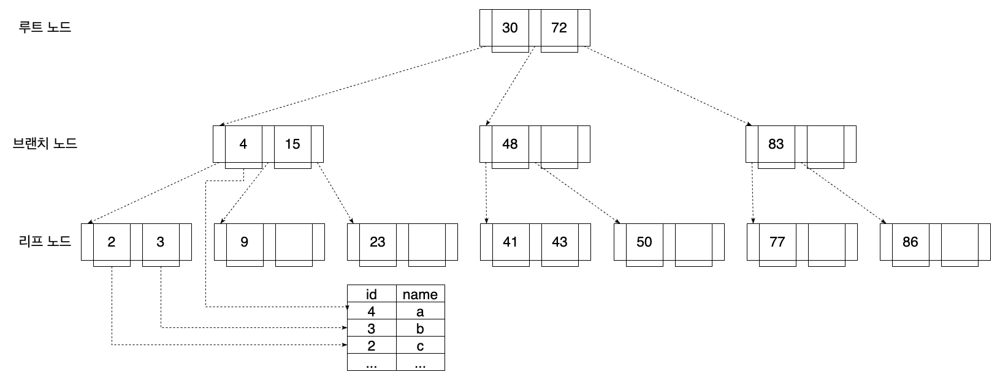

# [Database] 데이터베이스의 인덱스

## 인덱스란?

인덱스는 **데이터베이스에서 테이블의 동작 속도를 높여주는 자료구조**를 의미합니다.

말 그대로 책의 색인과도 같다고 할 수 있습니다.

<!--[##_Image|kage@obFpR/btr4hzLcUmL/yfd8PiJhKcWfcaphGlbQ0K/img.png|alignCenter|width="100%"|_##]-->

많은 책들에는 특정 키워드를 찾기 쉽도록 책의 맨 뒤에 키워드와 그 키워드가 나온 페이지를 정리해둔 색인이 있습니다.

만약 데이터베이스 책에서 Distinct란 단어를 찾고 싶다고 가정해봅시다.

가장 먼저 떠오르는 방식은 책의 1 페이지부터 한장씩 넘기면서 Distinct란 단어를 찾는 것입니다.

이건 Table Full Scan과 같습니다.

하지만 이렇게 할 경우 10 페이지 짜리 책이라면 그리 오래 걸리지 않겠지만,

1000 페이지 책이라면 상당히 많은 시간이 걸릴 것입니다.

52 페이지 쯤에서 키워드를 발견했다고 해도 뒤에서도 나올 수 있기 때문에 1000 페이지까지 봐야하죠.

 

하지만 만약 이 책이 색인을 제공하고, 우리가 맨 뒤에 색인이 있다는 것을 알고 있다면 어떨까요?

제일 먼저 색인을 펼치고, 알파벳 순으로 나열된 색인에서 Distinct란 단어를 찾고, Distinct란 단어가 52  페이지와 921 페이지에 있는 것을 확인합니다.

그리고 52 페이지와 921 페이지를 각각 한번씩 펼쳐보면 됩니다.

1000 페이지를 모두 찾는 것보단 훨씬 빠르겠죠.

즉 인덱스는 **데이터의 검색을 훨씬 빠르게 해주는 장점**이 있습니다.

 

반면 단점도 있습니다.

우선 **추가적인 저장공간**이 필요합니다.

DB의 약 10% 정도의 공간이 필요하다고 하는데요.

1000 페이지 책이라면, 100 페이지의 색인을 포함해 총 1100짜리 책이 되는겁니다.

또 데이터가 **추가, 변경, 삭제됨에 따라 인덱스 또한 업데이트를 해줘야하는 관리 비용**이 듭니다.

책의 개정판이 나오면서 특정 키워드가 나오는 페이지가 바뀌었다면 색인도 변경을 해줘야 합니다.

데이터베이스는 책에 비해 변경이 자주 일어나는만큼, 인덱스의 변경이 너무 많이 일어나지 않도록 주의해야 합니다.

 

## 인덱스의 구현

그럼 인덱스는 어떻게 구현할까요?

인덱스를 구현하는 대표적인 방식으로는 해시 테이블과 B-Tree, B+Tree가 있습니다.

하나씩 살펴보도록 하겠습니다.

 

### 해시 테이블

해시 테이블은 Key와 Value로 데이터를 저장하는 자료구조입니다.

데이터의 해시 값을 Key, 데이터가 저장된 위치의 포인터를 Value로 하여

해당 데이터의 위치를 바로 찾습니다.

 

<!--[##_Image|kage@IWNSZ/btr4igq6ssl/ajKWEkGLjRtQMnoibreg6K/img.png|alignCenter|width="100%"|_##]-->

위 그림에서 파란 선을 따라 id가 1인 데이터를 검색하는 과정을 따라가보겠습니다.

검색 조건인 id=1이라는 값은 해시 함수를 통해 임의의 해시 값으로 변경됩니다.

여기선 해시 값이 bar로 변경되었습니다.

해시 테이블에는 이 bar가 Key로, 데이터의 위치인 _123이 Value로 저장되어 있습니다.

이제 데이터의 위치를 알았으니 바로 조회해올 수 있습니다.

해시 테이블은 단건 데이터를 조회할 때 전체 데이터 개수에 관계없이 O(1)의 시간복잡도를 가지는만큼 검색이 매우 빠릅니다.

하지만 Key가 되는 해시 값은 원본 데이터의 순서대로 정렬이 되지 않기 때문에 LIKE나 BETWEEN 같은 범위 검색은 할 수가 없습니다.

따라서 일반적으로는 B-Tree, B+Tree를 사용합니다.

 

### B-Tree

이름에서 유추 가능하다시피 B-Tree는 트리 자료구조입니다.

여기서 B는 Balanced를 의미한다고 합니다.

이진트리에서 발전되어 모든 리프 노드들 같은 레벨을 갖도록 자동으로 균형을 맞추는 트리인데요.

 

<!--[##_Image|kage@becqGL/btr4jLdcR2P/TQPcb53l7CzL4F6HNIFnm0/img.png|alignCenter|width="100%"|_##]-->

B-Tree는 위 그림과 같은 모양인데, 상단을 루트 노드, 중간을 브랜치 노드, 하단을 리프 노드라고 부릅니다.

이 때 리프 노드의 깊이가 같기 때문에 항상 일정한 탐색 속도를 갖습니다.

Table Full Scan이 O(N)이라고 한다면, B-Tree를 사용한 인덱스 스캔은 O(logN)이 되겠네요.

이진탐색과 비슷하게, 정렬된 데이터라는 점을 이용해서 탐색의 범위를 줄여나가기 때문입니다.

 

<!--[##_Image|kage@p806Q/btr4gwBBt8A/SsSEbCbWS2kczuIbn5KIX0/img.png|alignCenter|width="100%"|_##]-->

위 그림에서 43을 찾아보겠습니다.

우선 루트 노드에는 30과 72가 있는데, 40은 그 중간 값이니 가운데 포인터를 타고 갑니다.

브랜치 노드에서 43은 48보다 작으니 왼쪽 포인터를 타고 갑니다.

마지막으로 리프노드에서 43을 찾을 수 있습니다.

43의 포인터로 데이터의 위치로 바로 접근 가능합니다.

 

### B+Tree

B+tree는 B-Tree를 개선시킨 자료구조입니다.

B-Tree는 브랜치 노드에서 Key와 Value(데이터의 위치)를 담을 수 있었습니다.

반면 B+Tree는 브랜치 노드에는 Key만 저장할 수 있고, 리프 노드에서 Key와 Value 모두 저장할 수 있습니다.

데이터가 정렬되어 있고, 리프노드들끼리 양방향으로 연결되어 있기 때문에 범위 검색이 가능합니다.

 

<!--[##_Image|kage@cU9s6T/btr4jLdcR4Z/NGSoJNzDRjfQ6BtQwtltp1/img.png|alignCenter|width="100%"|_##]-->

B+Tree에서 43을 찾는 방법은 B-Tree와 크게 다르지 않습니다.

하지만 4를 찾는 방법은 다릅니다.

앞서 B-Tree의 그림을 보면 브랜치 노드에서 4를 찾을 수 있습니다.

여기에 4의 데이터 위치를 가리키는 포인터가 있기에 리프 노드까지 갈 필요 없죠.

반면 B+Tree에서는 브랜치 노드에서는 포인터를 가질 수 없기 때문에 반드시 리프 노드까지 도달해야 합니다.

B+Tree는 각 리프 노드가 연결되어 있기에 순차적인 검색에 더 적합하다는 장점도 있습니다.

B-Tree에서는 모든 노드를 확인해야 하죠.

## 인덱스는 언제 사용해야 할까?

인덱스를 통해 데이터 검색을 최적화 할 수 있지만,

아무 때나 사용할 수는 없습니다.

 

**수정 및 삭제가 많이 일어나는 컬럼은 인덱스를 만들기에 부적합**합니다.

앞서 B-Tree와 B+Tree는 삽입, 수정, 삭제에 따라 자동으로 균형을 맞춰주긴 하지만,

시간이 지남에 따라 균형이 깨지고 성능이 악화될 수 있습니다.

이럴 경우 인덱스 재구성을 해서 트리의 균형을 잡는 작업이 필요한데요.

 수정 및 삭제가 많이 일어나는 컬럼에 인덱스를 잡으면 더 쉽게 균형이 깨지고 더 빨리 성능이 악화되며 더 자주 재구성을 해줘야 합니다.

 

또 **데이터의 양이 적은 테이블도 인덱스를 타지 않는 편**이 좋을 수 있습니다.

극단적으로 1건의 데이터가 있는 테이블이라면 트리를 순회해서 테이블에 접근하기보단 그냥 바로 테이블에 접근하는 편이 빠를 것입니다.

 

무작정 인덱스를 남발하듯이 생성해서도 안 됩니다.

앞서 insert, update, delete가 발생할 때마다 인덱스도 갱신을 해줘야하는만큼

**너무 많은 인덱스는 오히려 데이터베이스의 성능을 떨어뜨릴 수 있습니다.**

 

## 참고

- https://chartio.com/learn/databases/how-does-indexing-work/
- Database System Concepts

