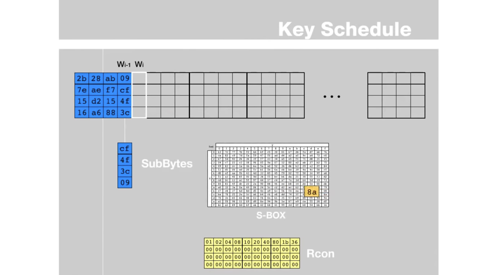

# 암호화 알고리즘

## 1. 정의

암호화는 정보 보안의 중요한 구성 요소입니다.

- 암호화: **데이터를 읽을 수 없는 형태로 변환**하여 외부로부터의 무단 접근을 방지하는 기술.
- 암호화 알고리즘: 평문을 암호문으로 변환하는 데 사용되는 수학적 프로세스.
- 평문(Plain Text): 해독 가능한 형태, 즉 암호화 전의 메시지
- 암호문(Cipher Text): 해독 불가능한 형태, 즉 암호화 후의 메시지
- 암호화(Encryption): 평문을 암호문으로 변환하는 작업
- 복호화(Decryption): 암호문을 평문으로 변한하는 작업

> 안전한 암호에는 **혼돈(Confusion)**과 **확산(Diffusion)**의 성질이 있어야한다 - 클라우드 섀넌(Claude E. Shannon)

- 혼돈: 암호문과 평문의 상관관계를 유추할 수 없게 하는 것입니다. 예를 들어 abcdef를 bcdef와 같이 바꾸면 유추가 가능합니다. 치환(substitution)으로 구현 가능. 
- 확산: 평문의 통계적 성질을 암호문 전반에 퍼트려 숨기는 것입니다. 예를 들어 평문이 a a b a인데 암호문에서 같은 패턴이 나타나는 것을 방지해야 합니다. 재배열(permutation)으로 구현 가능합니다.

## 2. 종류

### 2.1. 단방향

- 암호화만 가능하고 복호화는 불가능한 암호화 알고리즘입니다.
- 데이터 무결성 검증, 디지털 서명, 암호화 키의 생성 등에 사용됩니다.
- 단방향 암호화의 대표적인 예로는 해시 함수가 있습니다. 해시 함수는 입력된 데이터를 고정 길이의 해시값으로 변환합니다. 해시값은 입력된 데이터와 동일하지만, 입력된 데이터를 해시값으로부터 복원할 수는 없습니다.

> 💡 **해시 함수?**
> 임의의 크기의 데이터를 고정된 크기의 고유한 데이터로 매핑하는 함수입니다. 예를 들어 어떤 숫자를 10으로 나눈 나머지를 구하는 함수도, 항상 0~9라는 동일한 크기의 값 중 하나가 나오기 때문에 해시 함수입니다. 서로 다른 입력에 대해 동일한 출력이 나오는 경우를 해시 충돌이라고 부릅니다.

#### 2.1.1 SHA(Secure Hash Algorithm)

- SHA-2에는 SHA-224, SHA-256, SHA-384, SHA-512가 있는데, 일반적으로 **SHA-256**을 의미합니다.
- SHA는 왜 안전한가요?
  - 항상 **고정된 크기의 해시 값**을 생성합니다. 예를 들어 SHA-256은 256 비트의 결과 값이 만들어집니다. 항상 결과가 동일하기 때문에 원문을 유추하기 어렵습니다.
  - 다른 입력에 대해 동일한 해시 값이 생성될 확률이 매우 낮습니다. 즉 **낮은 해시 충돌 발생 가능성**을 갖고 있습니다.
  - 해시 함수는 일방향 함수이기 때문에, 해시 값을 통해 원본 데이터를 복원하는 것은 매우 어렵습니다. 즉, 해시 값을 알아도 원본 데이터를 찾는 것이 어렵다는 것을 의미합니다.
- 단점은 없나요?
  - 동일한 입력이 동일한 출력을 갖기 때문에 변환 가능한 모든 해시 값을 미리 구해둘 수 있습니다. 이러한 표를 **레인보우 테이블**이라고 부릅니다. 하지만 임의의 문자열인 **salt**를 추가하여 레인보우 테이블을 무력화할 수 있습니다.

#### 2.1.2 MD5

- 128비트 길이의 해시 값을 생성하는 단방향 암호화 함수입니다.
- 현재는 **보안 취약점**으로 인해 안전하지 않다고 여겨지며 주로 간단한 무결성 확인 등에 사용됩니다.

### 2.2 양방향

암호화와 복호화가 모두 가능한 암호화 알고리즘입니다. 양방향 암호화는 크게 대칭 키 암호화와 비대칭 키 암호화로 나눌 수 있습니다.

#### 2.2.1 대칭 키(비공개 키)

동일한 키를 사용하여 암호화 및 복호화를 수행합니다. 대칭 키 암호화는 비교적 빠르고 효율적이지만, 키를 공유해야 한다는 단점이 있습니다.

#### 2.2.1.1 AES(Advanced Encryption Standard)

- 대칭 키 암호화의 대표적인 알고리즘입니다.
- **128 비트 크기의 암호화 블록**
- **128, 192, 256 비트 크기의 키**
- 안전성과 효율성으로 널리 사용됩니다.
- 미국 정부 표준 암호화 알고리즘이며 기밀 문서 암호화에 사용됩니다.
- AES는 왜 안전한가요?
  - 암호를 해독하는 가장 효과적인 공격 중 하나는 모든 경우의 수를 계산하는 브루트 포스입니다. 256 비트의 키를 사용할 경우 2^256의 경우의 수에 대해 계산해야 하며, 현대 컴퓨터로는 매우 긴 시간이 걸립니다.
  - 국제 표준으로 채택되어 널리 사용되고 있으며, 많은 전문가들과 암호학 커뮤니티에서 검증을 받은 알고리즘입니다. 검증된 알고리즘은 새로운 공격에 대한 저항력이 있는지 확인하기 위해 계속해서 평가되고 개선됩니다.
- 단점은 없나요?
  - 대칭 키 방식이기 때문에 키 노출을 주의해야 합니다.

> 💡 AES는 미국 표준 기술 연구소의 표준 암호화 알고리즘을 가리키는 명칭이며, 현재의 AES는 Rijndael(레인달) 알고리즘을 가리킵니다. 엄밀하게는 Rijndael 알고리즘의 여러 가능성 중, 암호화 블럭의 크기가 128 비트이며 암호화 키의 길이가 128, 192, 256비트인 세 가지 종류가 AES 표준으로 지정되었습니다.

#### 2.2.1.2 DES(Data Encryption Standard)

- AES 이전의 표준입니다.
- 56 비트의 키를 사용합니다.
- 1990년대 이후 기술의 발전으로 하루 정도의 시간으로 해독 가능하게 되었습니다.

#### 2.2.2 비대칭 키(공개 키)

서로 다른 키를 사용하여 암호화 및 복호화를 수행합니다. 공개 키는 누구나 사용할 수 있는 키이고, 개인 키는 소유자만 사용할 수 있는 키입니다. 비대칭 키 암호화는 대칭 키 암호화에 비해 느리지만, 키 공유의 필요성이 없기 때문에 보안성이 더 높습니다.

- 키 전달 과정에서 암호화 키(공개키)가 노출되어도, 복호화 키(개인키)가 없으면 해독이 불가합니다.
- 역으로 개인키로 암호화, 공개키로 복호화하는 방식으로 서명에 사용할 수 있습니다.

#### 2.2.2.1 RSA(Rivest–Shamir–Adleman)

- 공개 키 암호화의 대표적인 알고리즘입니다.
- 공개 키와 개인 키를 사용하여 데이터를 암호화 및 복호화합니다.
- 소인수 분해의 어려움에 기반하여 안전성을 제공합니다.
- 키 생성 방법
  - 두 소수 p와 q를 준비합니다.
  - N=pq를 구합니다. N은 공개키의 일부가 됩니다.
  - C=(p-1)(q-1)을 구합니다. N보다 작은 정수 중 N과 서로소인 값들의 수입니다(오일러 파이 함수).
  - 1 < e < C이며, N과 C와 서로소인 e를 구합니다.
  -  d * e % C = 1인 d를 구합니다.
  - N과 e가 공개키이며, 평서문을 암호문으로 바꿀 때 씁니다.
  - d가 개인키이며, 공개키로 만들어진 암호문을 해독할 때 씁니다.
- 암호화 방법
  - A^e % N = B
  - B^d % N = A

- 예시
  - 소수 구하기: p = 2, q = 7
  - N 구하기: 2 * 7 = 14
  - C 구하기: (2-1) * (7-1) = 6
  - e 구하기: 1 < e < 6이며, 14, 6과 서로소 = 5
  - d 구하기: d * 5 % 6 = 1 -> d = 11
  - 공개 키: (e, N) = (5, 14)
  - 개인 키: d = 11
  - 평문 = 2
  - 암호화: 2^5 % 14 = 4
  - 복호화: 4^11 % 14 = 4194304 % 14 = 2 

> 💡 **서로소?**
> 최대공약수가 1인 수

## 3. AES 알고리즘

### 3.1 프로세스

- **Key Expansion**: 주 암호화 키(128,192,256)을 받아서 각 라운드에서 사용할 10, 12, 14개의 128 비트 **라운드 키를 생성**합니다. Key Schedule이라고도 부릅니다.
- **이니셜(0) 라운드:** 키 익스팬션에서 사용한 라운드 키 중 첫번째 키를 사용. **AddRoundKey**를 한 번 실행.
- **1 ~ N-1 라운드**: **SubBytes**, **ShiftRows**, **MixColumns**, **AddRoundKey**를 순서대로 실행. 키의 크기에 따라 각각 9번, 11번, 13번 실행.
- **파이널(10,12,14) 라운드**: **SubBytes**, **ShiftRows**, **AddRoundKey**를 순서대로 실행

> 💡 **이미지 출처 겸 프로세스 클립 영상**
> https://youtube.com/clip/UgkxTcXqYsnFtvFveihfmIfdiAI0IDWKc_TN?si=Sx3bqO2-fc60dhci

### 3.2 예시

- State Matrix는 평문을 128비트(16바이트) 단위로 나눈 블록입니다.
- 암호화 키 또한 128비트입니다.

#### 3.2.1 Key Expansion(Key Schedule)

**메인 암호화 키로부터 여러 개의 라운드 키를 만들어내는 작업**입니다. 키의 길이(128, 192, 256)에 따라 총 라운드 수가 달라지므로 라운드 키의 개수도 달라져야 합니다. 각각 10, 12, 14개의 라운드 키를 만듭니다.

#### 3.2.1.1 암호화 키의 4열에 대해 RotWord 수행

> 💡 **RotWord**
> 4바이트 워드를 바이트 단위로 한 칸 Shift/Rotate하는 작업입니다. 위 예시에서 RotWord([09 cf 4f 3c]) = [cf 4f 3c 09]입니다. 

#### 3.2.1.2 RotWord된 4열에 대해 SubBytes 수행

암호화 키 행렬의 각 원소 바이트를 4비트씩 나눕니다. 4비트는 16진수를 나타냅니다. 미리 주어진 S-Box를 기반으로 각 바이트를 치환합니다. 이를 SubBytes라고 부릅니다. SubBytes와 S-Box는 3.2.2장을 참고해주세요.

#### 3.2.1.3 암호화 키 1열 xor RotWord, SubBytes된 4열 xor Rcon 1열 = 1라운드 키 1열

암호화 키의 4열에 대해 RotWord 및 SubBytes 작업이 완료되었으면, 암호화 키의 1열, 그리고 Rcon의 1열과 XOR 연산을 수행합니다. 연산 결과가 1 라운드 키의 1열이 됩니다.

Rcon은 Round Constants의 줄임말로, 미리 정의된 행렬입니다. AES128인 경우 총 10개의 라운드를 수행하므로 4행 10열인 Rcon을 사용하게 됩니다. Rcon을 구하는 점화식이 있는데, 정확히 어떤 의미를 가지는지는 좀 더 알아봐야겠습니다.

> 🖇 https://en.wikipedia.org/wiki/AES_key_schedule

#### 3.2.1.4 암호화 키 n열 xor 1 라운드 키 n-1열 = 1 라운드 키 n열 (2<=n<=4)

3.2.1.3에서 만든 1 라운드 키의 1열과 암호화 키의 2열을 XOR 연산합니다. 그 결과가 1 라운드 키의 2열입니다. 같은 작업을 반복하여 1 라운드 키의 4열까지 만듭니다.

#### 3.2.1.5 같은 작업 반복하여 10, 12, 14 라운드 키까지 생성

1 라운드 키를 만들었으면, 2 라운드 키를 만들 차례입니다. 1 라운드 키를 암호화 키로 하여, 3.2.1.1 ~ 3.2.1.4를 반복하여 2 라운드 키를 만듭니다. 같은 방식으로 10 라운드 키까지 만듭니다. 암호화 키 크기에 따라 12, 14 라운드 키까지 만들 수 있습니다.

#### 3.2.2 SubBytes

#### 3.2.2.1 S-Box를 기반으로 State Matrix의 각 원소 바이트 치환

SubBytes는 암호의 특성 중 혼돈을 부여하기 위해 값을 치환하는 작업입니다. 이 때 S-Box라는 미리 주어진 표를 사용합니다. 상태 행렬은 총 128비트, 즉 1바이트 * 16의 크기를 가진 4x4 행렬입니다. 16개의 바이트에 대해 각각 치환 작업을 합니다.

치환 작업은 바이트를 4비트 씩 나누는 것에서부터 시작합니다. 4비트는 16진수로 표현할 수 있습니다. 16x16의 표인 S-Box에서 앞 4비트와 뒤 4비트가 만나는 셀의 값을 찾아 치환합니다. 예를 들어 원래 바이트의 값이 19였다면, 10과 09가 만나는 D4의 값으로 바꿉니다.

#### 3.2.2.2 S-Box

S-Box는 Substitution Box라는 뜻입니다. 참고로 복호화 할 때는 Inv S-Box를 씁니다.

여기서부턴 사견인데, 역시 미리 정해진 값을 사용하는 정확한 이유는 더 알아봐야겠습니다. AES의 목적이 표준을 정의하는 것이기 때문일 것 같단 추측이 들긴 하네요. S-Box를 알아도 암호화 키를 브루트 포스로 알아낼 수 없으니 안전성도 충분할 것이고요. 만약 더 어렵게 한다면 이 S-Box를 따로 정의하면 될 것도 같고요.

#### 3.2.3 ShiftRows

ShiftRows는 암호의 특성 중 확산을 위해 재배열 하는 작업입니다. 행렬의 n행에 대해 바이트 단위로 n-1만큼 Shift를 수행합니다. 2행은 1바이트만큼 Shift 합니다. ShiftRows([27 bf b4 41]) = [bf b4 41 27]입니다. 3행은 2바이트만큼 Shift 합니다. ShiftRows([]) = [5d 52 11 98]입니다. 4행은 3바이트만큼 Shift 합니다. ShiftRows([ae f1 e5 30]) = [30 ae f1 e5]입니다.

#### 3.2.4 MixColumns

ShiftRows가 행 단위로 재배열 하는 작업이었다면, MixColumns는 열 단위로 재배열 하는 작업입니다. 이 때도 미리 정의된 행렬을 사용합니다. 복호화 할 때는 InvMixColumns라고 하며, 마찬가지로 별도로 정의된 행렬을 사용합니다.

#### 3.2.5 AddRoundKey

Key Expansion에서 만든 라운드 키의 각 n열과 상태 행렬의 각 n열을 XOR 연산하는 작업입니다. 여기까지 수행하면 라운드가 종료됩니다. 다른 작업은 라운드에 따라 가감이 되나, AddRoundKey는 이니셜부터 파이널까지 모든 라운드에서 수행됩니다.
