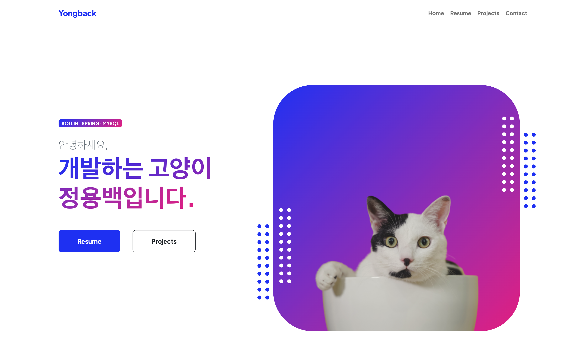

# Spring Boot, Kotlin 인프런 강의 제작 후기

## 결론

요즘은 두괄식으로 말하는 연습을 하고 있습니다. 결론부터 얘기하자면 인프런에 **입문자를 위한 Spring Boot with Kotlin - 나만의 포트폴리오 사이트 만들기** 강의를 오픈했습니다. 아래 링크 방문해서 어떤 강의인지 살펴봐주시면 감사하겠습니다.

[입문자를 위한 Spring Boot with Kotlin - 나만의 포트폴리오 사이트 만들기](https://www.inflearn.com/course/%EC%9E%85%EB%AC%B8%EC%9E%90-spring-boot-kotlin-%ED%8F%AC%ED%8A%B8%ED%8F%B4%EB%A6%AC%EC%98%A4)

블로그 방문자분들께는 50% 할인 쿠폰을 드리니 편하게 연락 주세요.

## 제작 동기

오랜만에 블로그에 글을 씁니다. 3월에 몰아서 몇 개 올리고, 2023년이 끝나기 직전이네요. 지난 겨울에 개발 강의를 만들어봐야겠다고 생각을 했습니다. 강의 제작을 결심한 이유는 아래처럼 요약할 수 있을 것 같아요.

- 내가 아는 것을 도움이 필요한 사람에게 알려주고 싶다.
- 부트캠프 특강 경험과 팀 동기의 강의 출시로 자신감이 생겼다.
- 내가 아는 것을 정리하고 싶다.
- 커리어에 도움이 될 수 있는 사이드 프로젝트
- 부수입

작년에 지인 소개로 멋쟁이사자처럼에서 운영하는 부트캠프에 원데이 특강을 할 기회가 생겼습니다. 내가 그런 걸 해도 되나 생각이 컸지만 열심히 준비는 했었고, 이후로도 계속 특강 요청을 주시더라고요. 그러다보니 준비한 특강 퀄리티가 그렇게 나쁘지는 않았구나 생각도 들고, 수강생분들의 질문도 듣다보니 나의 별 거 아닌 경험도 어떤 분들에겐 작게나마 도움이 될 수 있겠다는 생각도 하게 됐습니다.

마침 그와 동시에, 같은 팀 친한 동기가 인프런이라는 플랫폼에 강의를 오픈했습니다. 평소 일도 공부도 열심히 하던 친구라 귀감이 되어왔는데, 그 친구를 보니 나도 강의 한 번 만들어보고 싶다는 생각을 하게 됐네요. 원래 내가 안다고 생각했던 것도 다른 사람한테 설명하면서 잘 알고 있지 않다는 걸 알게 되는 경우도 많으니, 강의를 만들면서 저의 개념이나 지식도 한 번 정리하면서 기초를 탄탄하게 할 수 있겠다고도 생각했습니다.

또 이전에 사이드 프로젝트로 유니티로 게임을 개발해서 오픈한 적이 있었는데요. 사실 백엔드 개발자한테 게임 개발은 그냥 취미로 하는거지 딱히 상관관계는 없었습니다(저는 게임 개발하면서 객체지향 개념에 대해 유레카가 오긴 했습니다). 그래서 이번에는 직무랑 좀 더 밀접하게 연관되어 있는 걸 해보고 싶었습니다. 거기에다가 부수입까지 생긴다면 끝까지 마칠 수 있는 동기부여가 될 것 같았어요. 2월 쯤부터 어떤 강의를 만들지 기획을 하고, 3월달에 데모 프로젝트 첫 커밋을 했었습니다.

## 제작 과정

### 기획

쉽지 않았습니다. 사실 간단한 프로젝트를 하고 싶었어요. 가능하면 실습 위주로 하는 게 수강생 입장에서 재밌겠다 생각을 했고,

전문적이고 깊은 내용보다는 접근성 높고 진입 장벽이 낮은 강의를 기획을 했습니다. 제가 아무래도 혼자 개발 공부하면서 삽질을 많이 했으니깐, 개발 공부를 시작하는 비전공자들이 들을 수 있는 강의로 만들면 셀링 포인트도 있겠다고 생각했어요.

그래서 예전에 제 포트폴리오 사이트  구축해둔 걸 적극 활용하기로 했습니다. 부트스트랩 템플릿 가져와서 프론트 간단히 그럴 듯 하게 만들고, h2 데이터베이스에 컨트롤러 - 서비스 - 리포지토리 간단히 구현해서 도커로 말아서 클라우드에 띄우기!

그런데 데모 프로젝트를 만들다보니 점점 욕심이 생기더라고요.

- 단순히 사용해보는 것 말고 내부 구조나 원리, 이론도 알고 가셨으면 좋겠는데?
- 스프링 강의인만큼 백엔드 준비하시는 분들이 들을거고, 그럼 API 중심으로 개발하고 프론트는 Vue.js로 해볼까?
- 나는 직접 DB 접속해서 쿼리 날리면서 관리하지만, 입문자분들은 데이터 관리할 수 있는 어드민도 만들면 CRUD를 다 겪어볼 수 있겠네?

그렇게 데모 프로젝트 만들면서 커리큘럼을 정리하다보니, 어느 순간 내용이 너무 방대해졌다는 느낌이 들었습니다.아쉽지만 선택의 순간이 찾아왔습니다. 개발 공부를 시작하는 사람들한테 제일 필요한 게 뭘까. 저는 아래처럼 생각했습니다.

- 직접 무언가를 만들어보는 경험
- 거기에서 느끼는 재미
- 무엇을 모르는지를 아는 메타인지

그래서 Vue.js도 커트하고, 이론적인 내용도 개념적으로 정말 필요하다고 생각되는 부분만 추려봤습니다. 이론 내용을 줄이니 강의 중간중간 이론을 설명하던 걸, 듣고 싶은 분들만 들을 수 있게 별도 챕터로 몰아넣을 수 있었습니다. 실제로 촬영 중에 메인 강의는 라이브 코딩만 집중할 수 있어서 이렇게 이론과 실습을 분리한 게 좋은 선택이었다고 생각했네요.

그렇게 만들어진 데모 프로젝트 메인 화면입니다.

### 촬영

퇴근하고 틈틈이 데모 프로젝트랑 강의 기획을 구성하고, 여름에 좀 바빠서 두어달 쉬었습니다. 그리고 9월이 되며 촬영용 마이크랑 카메라를 구매했습니다. 이건 인프런에서 들은 강의를 제작하는 강의가 도움이 많이 됐어요.

- [마이크 NUTZ NM-500](https://smartstore.naver.com/psikorea/products/6610808088)

- [카메라 NUTZ QHD-1944](https://smartstore.naver.com/psikorea/products/6312398943)

위 제품을 구매했는데 딱히 홍보는 아니지만 촬영 녹음 품질이 좋긴 합니다. 아쉬운 점은 카메라는 자동 초점 기능이 있는데, 가끔 초점이 나간다는 문제. 소프트웨어로 제어할 순 있는데 윈도우 전용이라 맥에서는 아직 방법을 못 찾았습니다. 마이크는 지지대가 살짝 불안합니다. 그치만 적당한 가격에 아주 만족스러운 품질이라 강의 촬영용으로 딱 만족스러웠습니다.

여튼 촬영을 시작해봤는데, 생각보다 쉽지 않았습니다. 몇 번 연습을 해본 다음에 초반 섹션부터 먼저 다 찍고 편집을 해보니 어떤 식으로 하면 될 지 감이 좀 오더라고요. 그래서 그냥 싹 초기화 하고, 처음부터 재촬영을 했습니다. 편집 먼저 한 번 해본 게 정말 다행이었네요.

강의 촬영하는 것도 상당히 시간이 오래 걸렸습니다. 그래도 주말 하루 온 종일 찍어보니, 하루 끝날 때마다 진척되는 게 보여서 추진력이 생겼습니다. 중간중간 일시정지하면서 다음에 이어질 내용 한 번 정리도 하고, 적당히 편집 포인트 생각하면서 숨 쉬는 구간도 만들고, 중간에 말 꼬이면 이전 숨 쉬는 구간부터 재촬영하고, 찍으면서 점점 노하우가 생기긴 했습니다.

### 편집

촬영보다 편집이 오래 걸린다는 말을 예전부터 듣긴 했습니다. 근데 효과가 필요한 것도 아니고, 컷 편집만 하는 건데 그렇게 오래 걸릴까 싶었는데 정말 오래 걸렸네요. 원본 영상 길이의 3배는 잡아먹은 것 같습니다. 최종적으로 편집된 강의 총 길이가 13시간인데, 그걸 그냥 틀어만 놔도 꽤 긴 시간이긴 하죠.

근데 돌려보고, 어떤 포인트에서 자를지 고민하고 하다보니 한 강 한 강 생각보다 오래 걸리더라고요. 거기에 예상 못한 문제, 마이크 품질이 너무 좋았던건지 뭔지 숨소리가 상당히 듣기 거슬렸습니다. 필터를 걸긴 했는데 설정이 잘못됐던건지, 노이즈 제거 같은 거 걸어봐도 쉽지 않더라고요. 결국 프리미어로 영상 편집부터 다 하고, 오디션으로 숨소리도 하나하나 지워줬습니다. 시간이 배로 걸렸네요.

### 강의 제출

그래도 인프런에 편집 끝나는대로 한 강 한 강 올리다보니 거의 다 왔다는 생각이 들었습니다. 틈나는대로 부지런히 편집했습니다. 강의 소개글도 쓰고 인프런에 제출을 하니 정말 속이 후련했습니다. 검토까지는 10~14일 정도 걸린다고 하고, 연말이라 신규 강의 오픈 지연된다는 공지도 있었으니 새해의 시작과 함께 강의를 볼 수 있겠다고 생각했으나... 제출 다음 날 바로 강의가 오픈됐습니다!

## 소감

간단하게 내가 아는 내용을 공유해보자고 생각했던 강의는 결국 올해의 프로젝트처럼 마무리가 되었습니다. 그래도 정말 좋은 경험이었던 게, 촬영하는 게 생각보다 재밌기도 했고, 알고 있다고 생각했지만 정확히 알고 있지 않았던 내용들을 저도 다시 정리할 수 있는 시간이었습니다.

하지만 큰 볼륨은 쉽지 않았습니다. 만약에 다음에 또 무언가를 찍는다면, 볼륨을 확 줄이고 더 핵심에만 집중해야겠다는 생각이 들었네요. 또 아쉬운 점은 제 텐션이 아니었다는 것? 강의 촬영 전에 다른 컨텐츠들은 어떻게 촬영했는지 좀 살펴봤습니다. 너무 텐션이 낮으면 수강생분들이 지루하겠다 싶어서 좀 올려봤는데, 아무래도 어색합니다. 라이브 코딩은 자연스럽게 원래 텐션이 나온 편이긴 하지만, 다른 사람들은 어떻게 생각할지 모르겠네요.

어쨌든 내 컨텐츠를 만들어본다는 건 정말 좋은 경험이었고, 이게 다른 누군가에게 도움이 될 수 있다면 정말 보람있는 일이라고 생각합니다. 당분간은 제 공부에 좀 더 집중을 하고, 나중에 좀 여유가 생기는 시점에 좀 더 작은 볼륨으로 또 찍어보고 싶네요.

