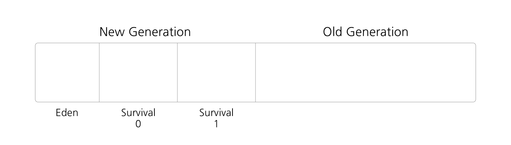

# [Java] JVM Garbage Collector

## JVM, 자바 가상 머신이란?

- Java Virtual Machine
    - 운영체제의 메모리 영역에 접근하여 메모리를 관리하는 프로그램
    - 메모리 관리, Garbage Collector 수행

## GC, Garbage Collector란?

`동적으로 할당한 메모리` 영역 중 사용하지 않는 영역을 탐지 및 해제 하는 기능

### Stack
- 정적으로 할당한 메모리 영역
- `primative` 타입의 데이터가 값과 함께 할당
- Heap 영역에 생성된 `Object` 타입의 데이터의 참조 값 할당

### Heap
- 동적으로 할당한 메모리 영역
- 모든 `Object` 타입의 데이터가 할당
- Heap 영역의 Object를 가리키는 참조 변수가 Stack에 할당

## GC 프로세스

1. `MARK` Stack의 모든 변수를 스캔하면서 참조하는 오브젝트(==Reachable)를 마킹
2. `MARK` Reachable 오브젝트가 참조하고 있는 오브젝트도 마킹
3. `SWEEP` 마킹되지 않은 객체를 Heap에서 제거

> Mark and Sweep

## GC 동작 시점

### Heap의 구조

<!-- [##_Image|kage@s8BlF/btq3SukJAOL/qigl2OQvHz05ENpKMRUJ5k/img.png|alignCenter|width="100%"|_##] -->

`Heap`은 위 그림과 같이 영역이 나누어져있다. 크게 `New Generation`과 `Old Generation`, 그리고 `New Generation`은 다시 `Eden`과 `Survival` 영역으로 나뉜다.

### Minor GC

`New Generation`에서 발생하는 GC를 `Minor GC`라고 부른다.

#### STEP 1 - 오브젝트 생성

1. 오브젝트 생성시 Eden 영역에 생성

#### STEP 2 - Eden 영역 Full

1. GC 실행
2. 살아남은 객체를 Survival 0으로 이동 
3. Eden 영역 객체 생성 및 GC 실행 반복(-> Survival 0)

#### STEP 3 - Survival 0 영역 Full

1. GC 실행
2. 살아남은 객체 Survival 1로 이동(age 증가) 
3. Eden 영역 객체 생성 및 GC 실행 반복(-> Survival 1)

#### STEP 4 - Survival 1 영역 Full

1. GC 실행
2. 살아남은 객체 Survival 0로 이동(age 증가)
3. 과정 반복

#### STEP 5 - age가 특정 값에 도달

1. 해당 객체를 `Old Generation`으로 이동
2. 과정 반복

### Major GC

`Old Generation`에서 발생하는 GC를 `Major GC`라고 부른다. `Minor GC`가 반복되며 `Old Generation`이 가득 차는 시점에서 수행한다.

> 간단 요약. 계속 내용 추가 예정.