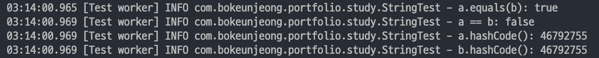
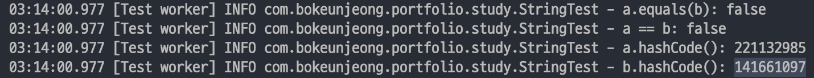

# [Java] String의 equals()와 hashcode()

## String 생성 방법

### 1. 리터럴
```java
String a = "12345;
```

### 2. new 연산자
```java
String b = new String("12345);
```

## 리터럴과 new 연산자 방식의 차이
- 리터럴로 생성된 객체는 `String Constant Pool` 영역에 존재
    - 리터럴은 내부적으로 String의 `intern()` 메소드를 호출.
    - `intern()`은 해당 문자열이 `String Constant Pool`에서 검색 후 주소값 반환 또는 생성
- new 연산자로 생성된 객체는 `Heap` 영역에 존재한다.

## equals()와 ==의 차이
- `.equals()`는 값 비교, `==`은 주소값을 비교한다.

## hashCode
- 각 객체의 주소값을 변환하여 생성한 고유의 주소값
- .equals()를 이용해서 두 객체가 같은지 판단하기 위해서는 .hashCode()가 동일한지 비교한다.


## String 테스트

```java
@Test
@DisplayName("String equals() && hashCode() 테스트")
public void _01_StringTest() {

    String a = "12345";
    String b = new String("12345");

    log.info("a.equals(b): {}", a.equals(b));       // true
    log.info("a == b: {}", a == b);                 // false
    log.info("a.hashCode(): {}", a.hashCode());     // 46792755
    log.info("b.hashCode(): {}", b.hashCode());     // 46792755

}
```

그럼 실제로 리터럴 방식과 new 연산자 방식으로 만든 두 오브젝트를 비교해보았다. 예상한대로 `equals()`는 `true`, `==`은 `false`를 반환한다. 그런데 `hashCode`는 같다. 정의대로라면 두 객체가 다르기 때문에 다른 값이 나와야 할 텐데. 이유는 String 클래스 내부에 있었다. 

#### 실제 로그


<!-- [##_Image|kage@qOmSu/btq4JwPi1eb/kM5xsyV6kz5KV2LfaikyJK/img.png|alignCenter|width="100%"|_##] -->

### String의 hashCode()

```java
public int hashCode() {
    int h = hash;
    if (h == 0 && value.length > 0) {
        hash = h = isLatin1() ? StringLatin1.hashCode(value)
                                : StringUTF16.hashCode(value);
    }
    return h;
}
```

String을 열어보니 hashCode()가 재정의 되어있었다. 자세히는 모르겠지만, 여튼 value를 기반으로 새로운 hash 값을 만든다. 그래서 hash 값는 항상 동일하다.

## 다른 클래스 테스트

```java
@Test
@DisplayName("MyObject equals() && hashCode() 테스트")
public void _02_StringTest() {

    MyObject a = new MyObject();
    MyObject b = new MyObject();

    log.info("a.equals(b): {}", a.equals(b));       // false
    log.info("a == b: {}", a == b);                 // false
    log.info("a.hashCode(): {}", a.hashCode());     // 221132985
    log.info("b.hashCode(): {}", b.hashCode());     // 141661097

}

static class MyObject {
    private Long id;
}
```

임의로 내부 클래스 `MyObject`를 만들고 똑같은 테스트를 해보았다. `equals()`와 `==` 모두 `false`를 반환하고, hashCode 값도 다른 것을 확인했다. 이유는 Object 클래스에서 확인할 수 있엇다.

#### 실제 로그


<!-- [##_Image|kage@bhzPb1/btq4OsYVwOh/MK5FG2NoQniGOfRUlViui1/img.png|alignCenter|width="100%"|_##] -->

### Object의 equals()

```java
@HotSpotIntrinsicCandidate
public native int hashCode();

public boolean equals(Object obj) {
    return this == obj;
}
```

`Object` 클래스에서 해당 부분만 가져왔다. `hashCode()`의 구현은 패스하고, `equals()`를 보면 `==`를 사용하는 것이 기본값임을 알 수 있었다.