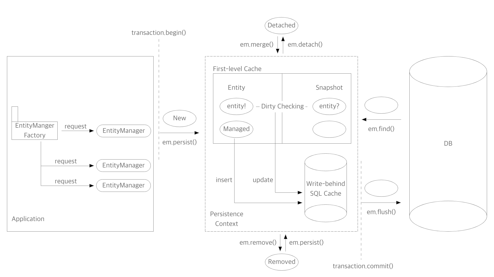
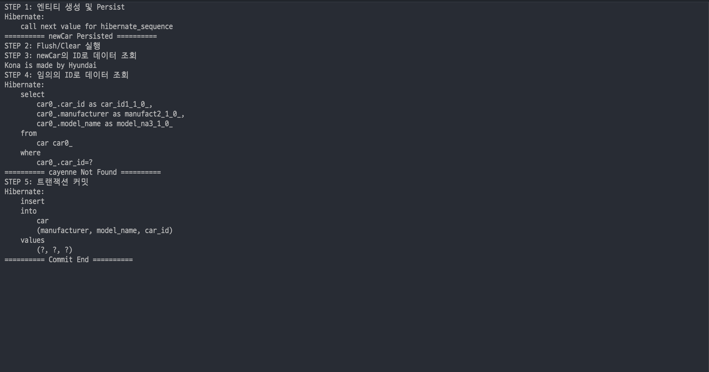
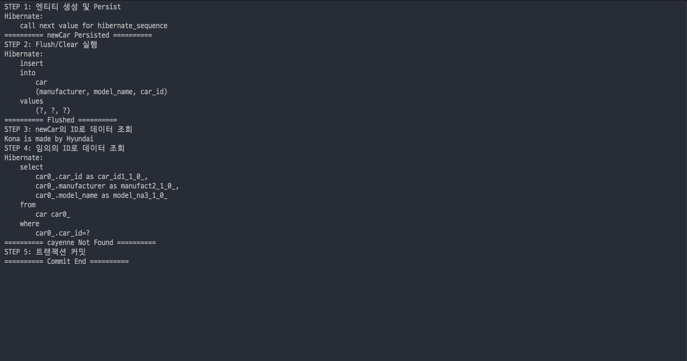
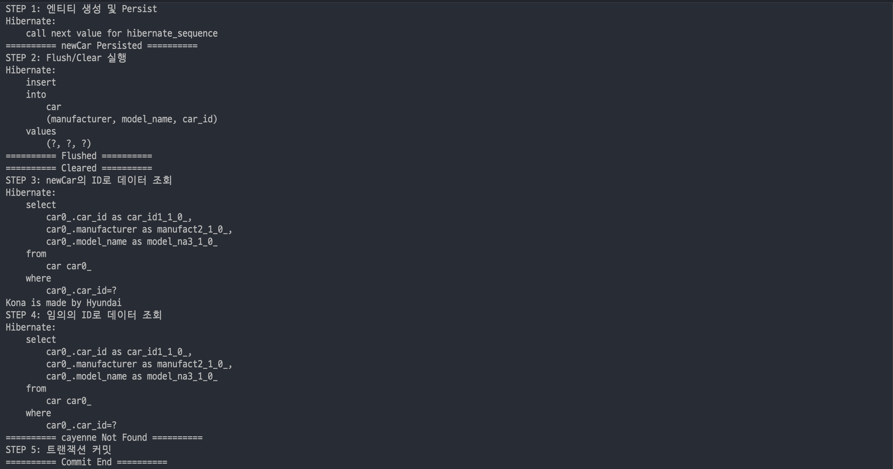

# [JPA] JPA의 영속성 컨텍스트 정리

---

## JPA란?

Java Persistence API의 약자. Java도 알겠고, API도 알겠다. 그런데 이 Persistence라는 건 뭘까?

persist는 지속된다, 계속된다는 의미이다. 명사형인 `Persistence`는 무언가가 지속되는 상태 정도라고 볼 수 있다. persistence를 구글링 하면 위키피디아를 연결해주는데,  위키피디아에서는 persistence를 이렇게 말한다.

> 프로세스가 생성했지만 **별개로 유지되는 상태**의 특징 중 한 가지. **별도의 기억 장치에 데이터를 보존**하는 목적. 이 특징으로 인해 저장 장치로부터 데이터를 전송하는 작업 및 자료구조 등을 이용해 데이터를 보존하는 것이 가능.

여기서 내 마음대로 중요하다고 생각되는 부분을 강조해봤다.

- 별개로 유지되는 상태
- 별도의 기억 장치에 데이터를 보존

이 두가지에 미루었을 때, `Java Persistence API`란

- Java에서
- 애플리케이션과는 분리된 환경에서 데이터를 보존할 수 있도록 하는
- API

정도의 의미를 가진다고 추론해볼 수 있을 것이다. 그리고 JPA를 사용하려면 이 Persistence의 개념에 대해 정확히 알고 있어야 한다고 생각할 수 있다.


## 영속성 컨텍스트

Persistence라는 단어는, 일반적으로 `영속성`이라고 번역된다. JPA에는 `Persistence Context`(영속성 컨텍스트)라는 개념이 등장하는데, 결론부터 얘기하자면, **JPA의 영속성 컨텍스트는 애플리케이션과는 별개로 분리되어 데이터를 관리하는 기능**을 한다.  JPA를 사용하는 자바 애플리케이션은 이 영속성 컨텍스트를 통해서 DB와 커뮤니케이션하게 된다. 이 때의 상호작용에 대해 한 눈에 살펴볼 수 있는 그림을 직접 그려보았다.


<!-- [##_Image|kage@bp0hlk/btrhTcjTR0C/kD0D3M1dBI6aphGIV7U2t1/img.png|alignCenter|width="100%"|_##] -->

### 엔티티와 엔티티 매니저

JPA에 의해 관리되는 객체는 `Entity`(엔티티)라고 부른다. 엔티티는 데이터베이스의 테이블을 객체처럼 사용할 수 있도록 해준다. 엔티티의 관리, 즉 CRUD는 `EntityManager`(엔티티 매니저)에 의해 수행되는데, 이는 모두 영속성 컨텍스트와 연관되어 이루어진다. 엔티티 매니저는 `EntityManagerFactory`(엔티티 매니저 팩토리)에 의해 요청(스레드)마다 생성된다. 엔티티 매니저 팩토리는 Thread-Safe하지만 생성 비용이 크기 때문이다. 각 요청마다 생성된 엔티티 매니저는 DB와 커넥션을 갖는다. 이후에 다시 짚고 넘어가겠지만, 엔티티 매니저의 모든 행위는 트랜잭션 내에서 이루어져야 한다.

```java
EntityManager em = emf.createEntityManager();

transaction.begin();

em.persist(entity);									// Create
em.find(Entity.class, entityId);		// Read 
entity.setField(newField);					// Update
em.remove(entity);									// Delete

// em.flush()
transaction.commit();
```


### 엔티티의 상태와 생명주기

엔티티의 상태는 아래처럼 나뉜다.

- `Managed`(영속)
  - 영속성 컨텍스트에서 관리하는 상태. Dirty Checking 등 JPA 제공 기능 적용.
- `Detached`(준영속)
  - 영속성 컨텍스트에 속해 있었으나, 더 이상 관리되지 않는 상태. 식별자는 가지고 있으나 Dirty Checking 등 사용 불가. 
- `New/Transient`(비영속)
  - 새로 만들어져 JPA에서 관리하고 있지 않음. `em.persist()`로 영속성 컨텍스트에 넣어준 이후 관리 시작.
- `Removed`(삭제)
  - 영속성 컨텍스트와 DB에서 삭제된 상태.

즉 엔티티를 만들기만 한다고 알아서 JPA에서 관리해주는 것은 아니다. `em.persist()`나 `em.merge()`를 이용해 영속성 컨텍스트에 넣어서, 관리할 엔티티라는 것을 알려줘야 한다.


### 영속성 컨텍스트의 장점

#### 1. 동일성 보장

- 자바는 기본적으로 두 객체가 같은 해시코드를 가질 때, 즉 같은 인스턴스일 때 동일하다고 본다. 따라서 식별자 필드에 같은 값을 갖고 있다하더라도, 단순히 `new`를 이용해 생성된 객체는 서로 다른 객체다. 영속성 컨텍스트에서 관리되는 객체는 식별자만 같으면 동일한 것으로 간주한다.

- `REPEATABLE READ` 수준의 트랜잭션 격리를 **애플리케이션 차원에서 제공**한다.

- ```java
  // 같은 ID를 가진 인스턴스를 각각 생성
  Car car1 = new Car();
  car1.setId(1L);
  Car car2 = new Car();
  car2.setId(1L);
  System.out.println(car1 == car2);    // false
  
  // 영속성 컨텍스트를 통해 같은 ID를 가진 2개의 변수
  Car car = new Car();
  em.persist(car);
  Car car3 = em.find(Car.class, car.getId());
  Car car4 = em.find(Car.class, car.getId());
  System.out.println(car3 == car4);    // true
  ```

#### 2. 1차 캐시(First-level Cache)

- 영속성 컨텍스트에 있는 엔티티는 조회시 우선 1차 캐시의 데이터를 찾는다. 데이터가 있으면 반환, 없으면 그 때 DB에서 조회해온다. 성능 이점이 있다고 하나, 상당히 복잡한 수준의 로직이 아니면 큰 의미는 없다고 한다.

- 1차 캐시는 각 엔티티 매니저마다, 즉 스레드 단위로 생성된다. 트랜잭션의 시작부터 종료까지만 유효하다.

- 전역적으로 사용되는 캐시는 2차 캐시라고 부른다.

- ```java
  Car car1 = new Car();
  em.persist(car1);
  
  em.find(Car.class, 1L);	// 1차 캐시에서 조회
  em.find(Car.class, 2L); // DB에서 조회
  ```

#### 3. 트랜잭션을 지원하는 쓰기 지연(Transactional Write-behind)

- JPA는 요청 즉시 쿼리를 실행시키지 않는다.

- 영속성 컨텍스트 내의 쓰기 지연 SQL 저장소에 쿼리를 저장해두었다가 특정 시점에 일괄 처리한다.

- 기본적으로 커밋 시에 쿼리가 수행되는만큼 트랜잭션은 필수.

  ```java
  // em.flush()를 주석 처리 했을 때와 안 했을 때, Insert 쿼리의 위치를 비교해보자
  Car car = new Car();
  System.out.println("포르쉐 사야되는데");
  car.setManufacturer("Hyundai")
  em.persist(car);
  // em.flush();
  System.out.println("언제 살 수 있으려나");
  ```

#### 4.변경 감지(Dirty Checking)

- 영속성 컨텍스트에서 관리되는 엔티티는 변경 사항이 생겨도 따로 Update 할 필요가 없다.

- 엔티티가 처음 영속성 컨텍스트에 들어올 때, Snapshot을 찍어둔다. 그리고 Snapshot과 현재 엔티티의 차이가 있다면, 알아서 UPDATE 쿼리를 만들어준다.

- ```java
  Car car = new Car();
  car.setManufacturer("Hyundai");
  em.persist(car);
  
  car.setManufacturer("Porsche");
  // DB에서 내 차가 포르쉐로 바뀐 것을 확인하자
  ```

#### 5. 지연 로딩

- 엔티티에 연관관계로 매핑되어 있는 다른 엔티티를 조회할 때 사용된다.
- 처음부터 Join을 통해 연관된 모든 엔티티를 불러오지 않고, Proxy를 담아둔다.
- 그리고 실제 엔티티는 조회 등 정말 필요한 시점에서 불러온다.


### 영속성에서의 Transaction과 Flush

JPA의 모든 작업은 트랜잭션 내부에서 이루어져야 한다. JPA는 요청 즉시 쿼리를 실행시키지 않고, 영속성 컨텍스트 내의 쓰기 지연 SQL 저장소에 쿼리를 저장해둔다. 그리고 특정 시점에 쿼리를 일괄 DB로 보내는데, 이것을 Flush라고 부른다.

Flush는 쿼리를 비워 DB와 영속성 컨텍스트를 동기화하는 행위이다. 영속성 컨텍스트 자체를 비우는 것이 아니라는 것을 알고 있어야 한다. `em.flush()`를 실행해도 여전히 1차 캐시에는 데이터가 남아있다. 1차 캐시를 비우는 행위는 `em.clear()`이다. Flush는 다음과 같은 경우에 수행된다.

- 트랜잭션이 커밋되는 시점
- `em.flush()`로 직접 수행
- JPQL 쿼리를 실행하기 직전

엔티티 매니저의 생명 주기가 트랜잭션과 같기 때문에, 커밋되는 시점에서 DB와 동기화 해야한다. 물론 개발자의 의도에 따라 직접 Flush를 수행해야 할 수도 있어야 한다. 그런데 JPQL 쿼리를 실행하기 전에는 왜 동기화가 이루어질까?

아주 단순한 예시로 한 트랜잭션 안에서 엔티티 A를 Persist하고, 다시 그 엔티티를 JPQL로 불러오는 로직이 있다고 해보자. Persist한 시점에서 엔티티 A의 Insert를 의도했지만, JPQL로 조회하는 시점에는 아직 실제로 DB에 Insert 되기 전이다. `em.find()`로 불러온다면 1차 캐시에서 A를 가져오겠지만, JPQL의 경우는 다르다. 그래서 A를 찾지 못하게 된다. 그렇다고 매 번 JPQL 사용 전마다 직접 `em.flush()`를 실행할 수는 없으니깐 JPQL 전 Flush하는 것을 기본값으로 갖는다.


## 테스트하며 직접 확인해 보기

정리한 내용들을 눈으로 확인해보기 위해, 간단한 테스트를 작성해보았다. 영속성 컨텍스트와 관련된 아래 개념들을 직접 확인해볼 생각이다.

- 1차 캐시에서의 데이터 조회
- 트랜잭션과 Flush를 이용한 DB 동기화 시점
- Flush와 Clear의 차이

아주 간단하게 상반되는 두가지 케이스를 둘 다 수행해보면서 로그를 통해 차이를 확인해볼 것이다. 테스트를 위한 코드는 다음과 같다.

### Entity

```java
@Getter
@Setter
@Entity(name = "car")
public class Car {

    @Id
    @GeneratedValue
    @Column(name = "car_id")
    private Long id;

    @Column(name = "manufacturer")
    private String manufacturer;

    @Column(name = "model_name")
    private String modelName;

}
```

정말 간단한 자동차 엔티티를 만들었다. 기본적인 식별자와, 제조업체명, 모델명을 컬럼으로 갖고 있는 테이블이다. ID는 Long 타입으로, 일단은 JPA가 알아서 생성하라고 했다. 내가 작성한 환경 하에서는 hibernate sequence를 통해 생성될 것이다.


### 테스트 시나리오

```java
@Test
public void _01_testJpa() throws Exception {
  EntityManager em = emf.createEntityManager();
  EntityTransaction tx = em.getTransaction();
  tx.begin();

  try {
    System.out.println("STEP 1: 엔티티 생성 및 Persist");
    Car newCar = new Car();
    newCar.setManufacturer("Hyundai");
    newCar.setModelName("Kona");
    em.persist(newCar);
    System.out.println("========== newCar Persisted ==========");

    System.out.println("STEP 2: Flush/Clear 실행");
    // em.flush(); System.out.println("========== Flushed ==========");
    // em.clear(); System.out.println("========== Cleared ==========");

    System.out.println("STEP 3: newCar의 ID로 데이터 조회");
    Car kona = em.find(Car.class, newCar.getId());
    System.out.println(kona.getModelName() + " is made by " + kona.getManufacturer());

    System.out.println("STEP 4: 임의의 ID로 데이터 조회");
    Car cayenne = em.find(Car.class, 100L);
    System.out.println("========== cayenne Not Found ==========");

    System.out.println("STEP 5: 트랜잭션 커밋");
    tx.commit();
    System.out.println("========== Commit End ==========");
  } catch (Exception e) {
    log.info(e.getMessage(), e);
    tx.rollback();
  } finally {
    em.close();
  }
}
```

1차 캐시, 트랜잭션, 그리고 영속성 컨텍스트와 DB의 동기화 시점을 확인할 수 있는 간단한 테스트 코드를 짜봤다. 우선 `try` 블록 바깥 부분은 엔티티 매니저와 트랜잭션 관련된 작업을 한다. 핵심 시나리오는 `try` 블록 내부인데, 총 5단계로 나누었고 각 단계의 시작과 종료시점에서 메시지를 출력해서 실행 흐름을 파악한다.

2단계를 보면  `em.flush()`와 `em.clear()`를 주석처리 해놓았다. 테스트 코드는 주석을 해제해가며 총 3번 실행할 것인데,  케이스는 다음과 같다.

- 둘 다 실행되지 않았을 때
- `em.flush()`만 실행했을 때
- 둘 다 실행했을 때

위 케이스를 각각 수행하고,  로그를 보며 JPA가 DB와 어떻게 상호작용하는지를 확인해볼 것이다. 코드의 흐름은 아래와 같이 5단계로 이루어져있다.

1. 새 자동차인 `newCar` 엔티티를 생성한 후 `em.persist`로 저장한다.
2. 하나씩 해제해가면서 실행하며 케이스를 각각 확인해보려고 한다. *"Flushed"*, *"Cleared"* 메시지를 통해서 각 메소드의 실행 여부를 확인할 것이다.
3. 앞서 생성한 엔티티의 아이디로 데이터를 조회한다. *"{모델명} is made by {제조업체}"* 라는 로그로 앞서 `newCar`와 같은 정보를 갖고 있는지 확인할 것이다.
4. 임의의 아이디를 가지고 다른 Car 엔티티를 조회한다. 직접 Persist하지도, 미리 데이터를 넣어놓지도 않았으므로 정보는 안 찍고 *"cayenne Not Found"* 메시지를 통해 수행 내역만 확인해볼 것이다.
5. 트랜잭션을 커밋한다. 시작 로그와 종료 로그 사이에서 커밋 동안 어떤 일들이 일어나는지 확인해볼 수 있다.


### [테스트 1] Flush/Clear 모두 실행하지 않았을 때


<!-- [##_Image|kage@caxOc2/btrhTR7O5qR/PD57fqEokTHxFVn7sDoN9K/img.png|alignCenter|width="100%"|_##] -->

1. `newCar`를 생성해서 Persist 했는데, Insert 쿼리는 보이지 않는다. *"call next value for hibernate_sequence"* 메시지 뿐이다. 
2. 모든 코드가 주석 처리되어있으므로 아무 메시지도 보여지지 않는다.
3. `em.find()`로 kona를 조회했는데, Select 쿼리는 찍히지 않았다. 그럼에도 *"Kona is made by Hyundai"*라고 로그는 정상적으로 찍힌다.
4. `em.find()`로 아이디가 100인 데이터 조회를 시도했다. 이번에는 3단계와 달리 Select 쿼리가 수행되었다.
5. Insert 쿼리가 출력되었다.

여기서 1차 캐시의 존재와 DB 동기화 시점을 확인할 수 있다. 1단계에서 Persist한 엔티티는 즉시 DB로 들어가지 않는다. 우선 영속성 컨텍스트 내에서만 존재하고 있다. 그리고 5단계인 커밋 시점에서야 DB로 Insert 되는 것이다. 다만 ID는 영속성 컨텍스트에 들어가는 시점에서 생성되기 때문에, 엔티티에 정의된 ID 생성 규칙에 따라 시퀀스 조회 로그가 출력된다.

데이터를 조회할 때에도, 영속성 컨텍스트에 있는 엔티티는 DB가 아닌 캐시에서 바로 가져오기 때문에, 3단계에서는 Select가 출력되지 않는다. 반면 임의의 ID로 조회할 때는 영속성 컨텍스트 내부에 없기 때문에 DB에서 가져온다. 그래서 4단계에서는 Select가 출력된다.


### [테스트 2] Flush만 실행했을 때


<!-- [##_Image|kage@UUHVX/btrhVrHkGMd/Mxe7FTi9fL6ODATbGU5OkK/img.png|alignCenter|width="100%"|_##] -->

1. 테스트 1과 같다.
2. 테스트 1과는 차이가 보여진다. Insert가 바로 수행되고, *"Flushed"* 메시지가 출력되었다. `em.flush()`를 호출하자 영속성 컨텍스트와 DB의 동기화를 위해 쓰기 지연 SQL 저장소에 있던 내용들을 내보낸 것이다.
3. 테스트 1과 같다. Flush 했다고 해서 캐시가 비워지는 것은 아니다. SQL 저장소의 내용은 모두 내보내졌지만, 캐시에는 엔티티가 그대로 남아있기 때문에 DB에서 Select 할 필요가 없다.
4. 테스트 1과 같다.
5. 앞서 2단계에서 Flush하며 쿼리가 모두 나간 후, 따로 Insert/Update 된 내용이 없었다. 따라서 커밋 시에는 아무 일도 일어나지 않는다. 만약 Flush 이후 조회 외의 작업이 있었다면, 그 내용이 DB로 보내졌을 것이다.


### [테스트 3] Flush와 Clear 모두 실행했을 때


<!-- [##_Image|kage@bOt2rf/btrhUkhDnLj/NDCNAul62WOgxXXuc2kzXk/img.png|alignCenter|width="100%"|_##] -->

1. 테스트 1, 2와 같다.
2. 테스트 2와 같이 Flush를 하며 Insert가 수행되었다. Clear 또한 수행되었으나 딱히 내용이 보이지는 않는다.
3. 테스트 1, 2와 차이가 있다. 이번에는 Select가 수행되었다. 2단계에서 Clear시 딱히 출력된 메시지는 없지만 1차 캐시가 비워지게 된 것이다. 지금 캐시에 아무 것도 없으므로, 데이터를 DB에서 조회해온다.
4. 테스트 1, 2와 같다.
5. 테스트 2와 같다.


이상으로 영속성 컨텍스트에 대해 정리해 보았다.
