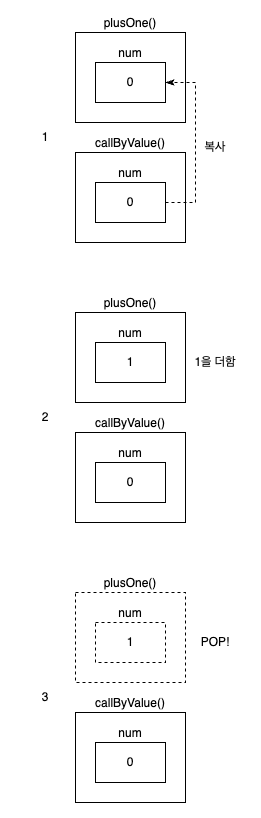
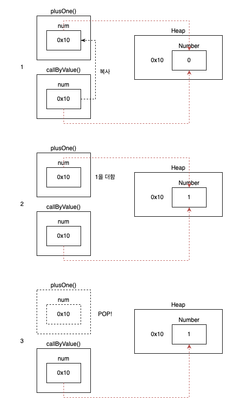
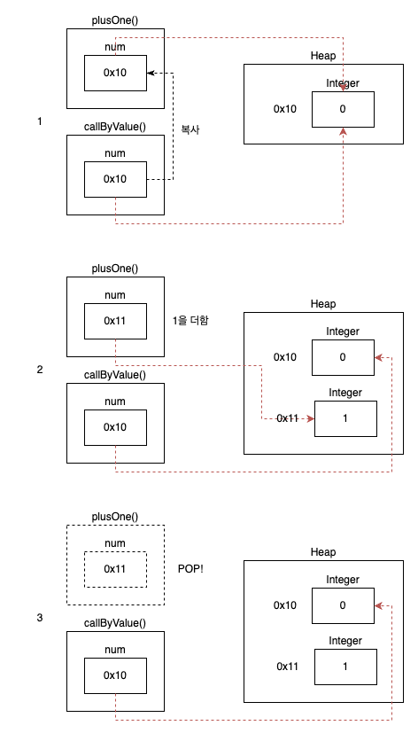

# [Java] Call by Value와 Call by Reference

프로그래밍 언어에는 Call by Value와 Call by Reference라는 개념이 있습니다.

함수, 또는 메소드에 파라미터를 넘겨주는 방식에 대한 개념인데요.

Call by Value는 값에 의한 호출, Call by Reference는 참조에 의한 호출이라고 번역됩니다.

<br>

그럼 각각은 어떤 차이가 있을까요?

<br>

## Call by Value

Call by Value는 메소드를 호출할 때, 인자로 넣어주는 변수의 값을 복사합니다.

plusOne()이라는 이름의 숫자 num을 받는 메소드가 있다고 하겠습니다.

인자로 들어온 num에 1을 더하는 기능을 합니다.

다음 코드와 같이 plusOne() 메소드를 호출하면 어떤 일이 일어날까요?

```java
@Test
void callByValueTest() {
    int num = 0;
    System.out.println("before num: " + num);
    plusOne(num);
    System.out.println("after num: " + num);
}

void plusOne(int num) {
    num += 1;
}
```

<br>

그림과 함께 순차적으로 따라가보도록 하겠습니다.


<!--[##_Image|kage@cpOLOB/btr3JZkvvMV/X8XCsfPj2VOD1v58pTZVoK/img.png|alignCenter|width="100%"|_##]-->

1. plusOne()이 호출되며 스택에 지역변수 num이 새롭게 생성되고, 그 안에 인자로 들어온 0의 값이 복사 됩니다.

2. plusOne()에서 지역변수 num에 1을 더하지만, 원래의 num은 다른 변수이기 때문에 영향이 없습니다.
3. plusOne() 메소드가 종료되며 스택에서 pop 되어 사라집니다.

<br>

결국 지역변수 num을 지지고 볶아도 원래의 num은 영향을 받지 않는다는 것을 알 수 있습니다.

위의 코드를 실행하면 아래와 같이 출력됩니다.

```
before num: 0
after num: 0
```

<br>

## Call by Reference

그럼 Call by Reference는 뭘까요?

메소드의 인자로 주소를 받아, 해당 주소에 위치한 데이터를 직접 바라봅니다.

다만 **자바는 포인터가 없기 때문에 Call by Reference를 사용할 수 없습니다.**

C에서는 가능하지만, 이것도 엄밀히 말하면 주소의 값을 복사해서 넘겨주는 것이기 때문에 Call by Address라고 부른다고 합니다.

다만 자바에서도 마치 Call by Reference를 쓰는 것과 같은 경우가 있는데요.

바로 인자로 인스턴스를 받을 때입니다.

코드로 바로 보시죠.

```java
@Test
void callByValueTest() {
    Number num = new Number(0);
    System.out.println("before num: " + num);
    plusOne(num);
    System.out.println("after num: " + num);
}

void plusOne(Number num) {
    num.value += 1;
}

@Data
@AllArgsConstructor
static class Number {
    private int value;
}
```

자체적으로 Number 클래스를 만들고, value 필드를 0으로 세팅했습니다.

plusOne()을 호출해서 num.value에 1을 더합니다.

메소드가 종료된 후 원래의 num을 출력해보면 어떻게 되어있을까요?

값을 복사해서 1을 더한 것이니 원래의 num은 그대로 0일까요?

```
before num: CallByValueReferenceTest.Number(value=0)
after num: CallByValueReferenceTest.Number(value=1)
```

출력 결과를 보면 callByValue()에서 생성한 num의 필드 값이 바뀌어져 있는 걸 볼 수 있습니다.

왜 그럴까요?

<br>

자바에서 인스턴스는 힙 영역에 생성되고, 스택 영역의 변수는 힙의 주소 값을 들고 있습니다.

즉 plusOne() 메모리를 생성할 때, 인스턴스의 주소의 값을 복사한거죠.

<br>

그림과 함께 볼까요?


<!--[##_Image|kage@bqIg59/btr3XzD1XLS/lu8M0rmUsC1lwYbOtaYPl0/img.png|alignCenter|width="100%"|_##]-->

1. 함수가 호출되고 지역변수 num이 생기는 것은 똑같으나, Heap에 생성된 Number 인스턴스의 주소 값을 복사하기 때문에 원래의 num과 지역변수 num은 같은 인스턴스를 바라봅니다.
2. 지역변수 num에 1을 더합니다. 즉 Heap의 Number 인스턴스에 1을 더합니다.
3. plusOne()이 종료되었지만, 원래의 num은 여전히 Heap의 Number 인스턴스를 바라봅니다.

<br>

이렇듯 상위 메소드나 하위 메소드나 같은 주소의 같은 인스턴스를 바라보고 있기 때문에, 마치 Call by Reference인 듯한 착각을 불러 일으키기 싶습니다.

<br>

## Wrapper 클래스

자바에는 Wrapper 클래스가 있습니다.

맨 처음 테스트에서는 primitive type인 int로 변수를 생성하고, 메소드의 파라미터도 int형으로 선언했습니다.

그럼 아래 코드처럼 int 대신 Integer를 사용하면 어떨까요?

```java
@Test
void callByValueTest() {
    Integer num = 0;
    System.out.println("before num: " + num);
    plusOne(num);
    System.out.println("after num: " + num);
}

void plusOne(Integer num) {
    num += 1;
}
```

이러면 앞서 자체 생성한 Number 클래스처럼 plusOne()의 결과가 원래의 num에도 반영될까요?

<br>

```
before num: 0
after num: 0
```

그렇지 않습니다.

Wrapper 클래스는 불변 객체이기 때문입니다.

<br>

역시 그림과 함께 봐보겠습니다.


<!--[##_Image|kage@2EJhu/btr3XzcYepu/eHDtojKHhIteKfluvDAiRK/img.png|alignCenter|width="100%"|_##]-->

1. 주소 값을 복사하는 것은 다른 클래스와 같습니다.
2. 1을 더할 때, 0x10 주소의 Integer 인스턴스의 값을 바꾸는 것이 아닌, 1을 더한 값인 1을 갖고 있는 0x11의 Integer 인스턴스의 주소로 변수의 내용이 바뀝니다.
3. 메소드가 종료되어도 원래의 num은 처음의 주소 값을 그대로 갖고 있습니다.

<br>

그럼 아래 코드로 한 번 직접 확인해보겠습니다.

```java
@Test
void callByValueTest() {
    Integer num = 0;
    System.out.println("1.callByValueTest# before num: " + System.identityHashCode(num));
    plusOne(num);
    System.out.println("4.callByValueTest# after num: " + System.identityHashCode(num));
}

void plusOne(Integer num) {
    System.out.println("2.plusOne# before num: " + System.identityHashCode(num));
    num += 1;
    System.out.println("3.plusOne# after num: " + System.identityHashCode(num));
    System.out.println("3-1.plusOne# after num: " + System.identityHashCode(1));
}
```

```
1.callByValueTest# before num: 689745064
2.plusOne# before num: 689745064
3.plusOne# after num: 1444635922
3-1.plusOne# after num: 1444635922
4.callByValueTest# after num: 689745064
```

상위 메소드와 하위 메소드에서 각각 num의 주소 값을 찍어보았습니다.

1~4번순으로 출력이 되고요.

1번 출력 후에 plusOne()을 호출하며 지역변수 num이 생기고, 그 안에 원래의 num이 갖고있던 주소 값을 복사해 넣어줍니다.

그래서 2번 출력에는 1번과 같은 값이 찍힙니다.

그리고 지역변수 num에 1을 더하는 로직을 수행합니다.

이 때, Integer는 불변 객체이기 때문에 689745064가 가리키는 인스턴스를 직접 수정하지 않습니다.

1이 더해진 값을 들고 있는 새 인스턴스, 혹은 기존에 존재하던 인스턴스의 주소값으로 지역변수 num의 값을 바꿉니다.

그래서 3번 출력에는 1444635922라는 다른 주소값이 나오게 되는거죠.

3-1 출력에는 1을 그대로 넣어보니, 지역변수 num과 같은 주소 값을 갖고 있는 것이 확인됩니다.

즉 지역변수 num이 바라보고 있는 인스턴스에 1을 더한 것이 아닌, 지역변수 num의 값을 0의 주소 값에서 1의 주소 값으로 바꾼 것입니다.

<br>

## 결론

자바는 Call by Value를 사용합니다.

하지만 인스턴스의 경우 그 주소 값을 변수에 갖고 있기 때문에 Call by Reference와 같은 현상이 발생합니다.

Integer, String 같은 불변 객체는 지역변수의 수정이 있을 경우 변수의 주소 값 자체가 바뀐다는 점을 주의해야 합니다.