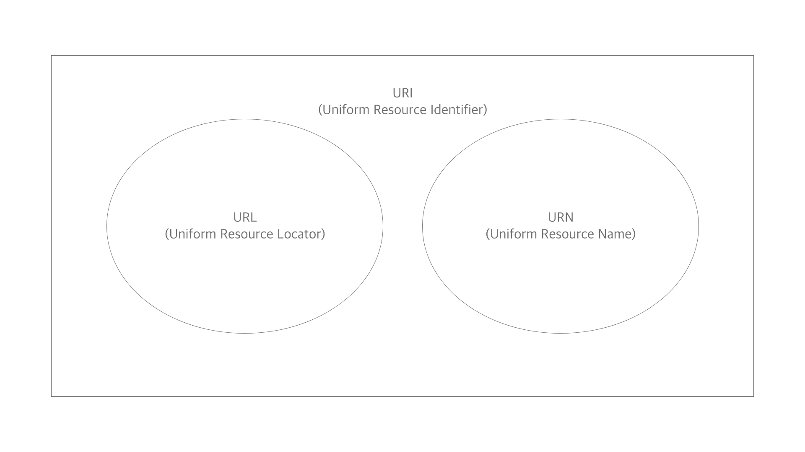

# [Network] URI vs URL vs URN

URI와 URI, URN의 개념 정리. 엄청 크리티컬한 내용은 아니지만, 알아두어서 나쁠 일은 없을 것 같다.


## URI? URL? URN?

보통 인터넷 브라우저에서 입력하는 주소를 URL이라고 부른다. 무슨 약자인지는 잘 몰랐으나, 개발을 배우기 전에는 그냥 그런 걸 URL이라고 하는구나 하고 살았다. 개발을 하다보니 URI라는 단어를 접하게 되었다. 뭐지 싶을 법도 했지만, 단어가 가리키는 것은 명확하게 내가 알고 있던 URL이란 것과 같은 형태를 하고 있었다. 

그럼 URI == URL일까? 혹은 비슷한 개념일까? 영문 위키피디아에는 아래와 같이 나와있다.

> A Uniform Resource Identifier (URI) is a **unique** sequence of characters that **identifies** ~~a logical or physica~~l **resource** used by web technologies.
>
> 통합 자원 식별자(URI)는 웹 기술에서 사용되는 논리적 또는 물리적 **자원을 식별**하는 **유일한** 문자의 일련이다.

여기서 내 마음대로 핵심이라고 생각되는 부분을 밑줄쳐봤다. 즉 URI는

- 자원을 식별할 수 있어야 한다.
- 유일해야 한다.

그렇다면 이 조건에 부합하는 '모든' 것은 URI라고 부를 수 있을 것이다. 대충 데이터베이스, 맵 등의 ID나 Key 같은 거라고 생각해도 무리없을 것 같다. 그리고 같은 문단에는 이런 내용이 있다.

> Some URIs provide a means of **locating and retrieving** information resources on a network
>
> ... (omitted) ... these are Uniform Resource Locators(URLs)
>
> 어떤 URI는 네트워크 상 정보 자원의 **위치를 찾고 검색**할 수 있는 수단을 제공하는데... (생략)... 이게 URL이다.

즉 자원을 식별하는데, 위치를 기반으로 그 자원을 표현한다면 그게 곧 URL이라고 할 수 있을 것이다. 다시 말하면 URL은 URI의 일종인데, 위치를 기반으로 한 식별자다. 그리고 역시 같은 문단에는 다음과 같이 나와있다.

> Other URIs provide only a unique name, **without a means of locating** or retrieving the resource or information about it, these are Uniform Resource Names(URNs).
>
> 다른 URI는 오직 **유일한 이름만** 제공하는데, **위치에 대한 정보는 없고**, 이게 URN이다.

그니깐 URN도 URI인데, 이건 **위치 없이** 이름만 주는 식별자라는 것이다. 위치가 없다는 점에서, URL != URN이 된다. 여태까지 나온 걸 그림으로 정리하면 이런 모양이 될 것이다.


<!--[##_Image|kage@mSJA0/btrhBLx5Mkk/DdK9QoQKyrsBIgzZa0Atd0/img.png|alignCenter|width="100%"|_##]-->

이제 좀 더 개념이 명확해졌다. 그럼 이제 질문에 답해보자.

- Q. https://google.com을 지칭하고 싶다. 뭐라고 불러야 할까?
  - A1. URL이라 부른다. 제일 정확하게 의미를 표현할 수 있다.
  - A2. URI라고 불러도 된다. 근데 근데 포괄적인 개념이기 때문에 듣는 사람 입장에선 그 구체적인 형태를 떠올리기 어렵다.
  - A3. 포괄적이라곤 하지만, URN은 사실상 사용하지 않는다. 현실적으로 URI라고 불러도 URL을 떠올릴 것으로 매우 보여진다.


### 정리

- **URI(Uniform Resource Identifier)**
  - Unifrom: 리소스 식별하는 통일된 방식
  - Resource: 자원, URI로 식별할 수 있는 모든 것(제한없음)
  - Identifier: 다른 항목과 구분하는데 필요한 정보

- **URL(Uniform Resource Locator)** 
  - `foo://example.com:8042/over/there?name=ferret#nose`
  - 리소스가 있는 위치를 지정
  - 위치는 변할 수 있다.

- **URN(Uniform Resource Name**
  - `example:animal:ferret:nose`
  - 리소스에 이름을 부여
  - 이름은 변하지 않는다 ex) 도서의 isbn
  - URN 이름 만으로 실제 리소스를 찾을 수 있는 방법이 보편화 되지 않음
  - 따라서 URI == URL이라고 봐도 거의 무방하다.


## URL

추가적으로 정리하는 URL의 구조와 구성

### 구조

```
scheme://[userinfo@]host[:port][/path][?query][#fragment]
```

ex) `https://www.google.com:443/search?q=hello&hl=ko`

#### Scheme(https)

- 주로 프로토몰 사용
- 프로토콜: 어떤 방식으로 자원에 접근할 것인가 하는 약속 규칙
  - ex) http, https, ftp
- http는 80 포트, https는 443 포트를 주로 사용, 포트는 ㅅ애략 가능
- https는 http에 보안 추가

#### User Info

- URL에 사용자 정보를 포함해서 인증
- 거의 사용하지 않음

#### Host(www.google.com)

- 호스트명
- 도메인명 또는 IP 주소를 직접 사용 가능

#### Port(:443)

- 접속 포트
- 일반적으로 생략, 생략시 http는 80, https는 443

#### Path(/search)

- 리소스 경로, 계층적 구조
- ex)
  - /home/file.jpg
  - /members
  - /members/100, /items/iphone12

#### Query((?q=hello&hl=ko))

- key=value 형태
- ?로 시작, &으로 연결 -> ?keyA=valueA&keyB=valueB
- query parameter, query string 등으로 불림.
- 웹서버에서 제공하는 파라미터
- 문자 형태

#### Fragment

- html 내부 북마크 등에 사용
- 서버에 전송하는 정보 아님