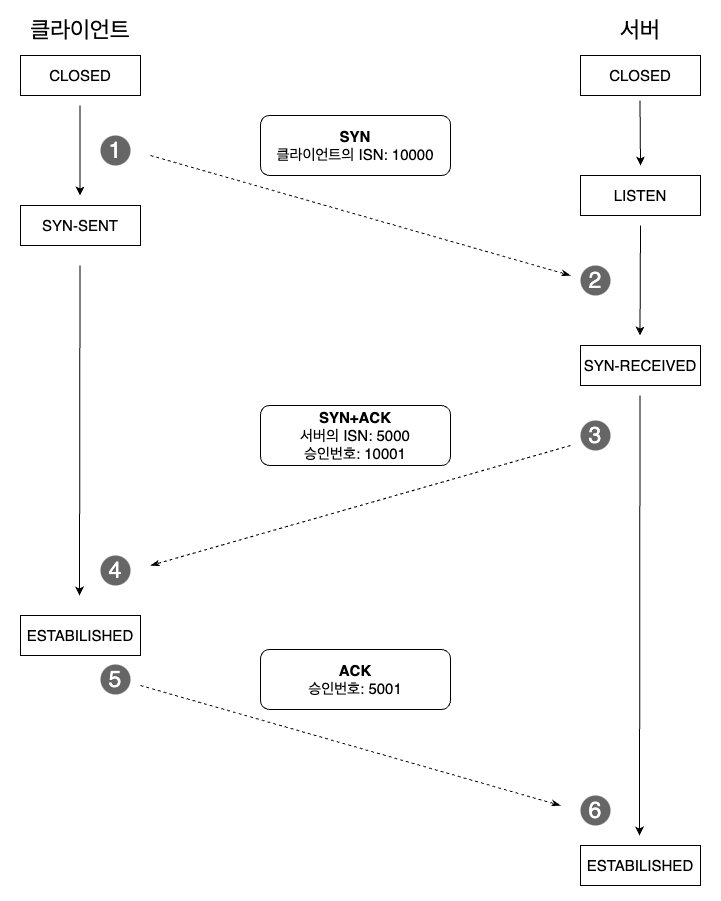
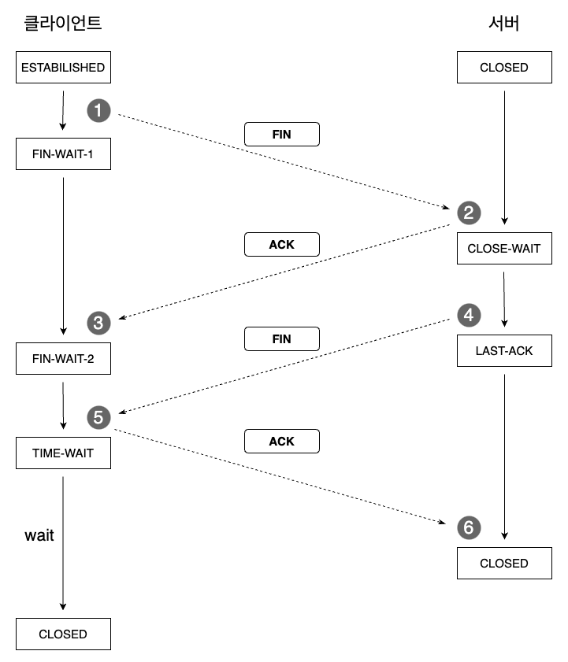

# [Network] TCP의 연결 성립과 해제 - 3 Way & 4 Way Handshake

TCP는 Transmission Control Protocol의 약자로,

전송 제어 프로토콜이라고 번역됩니다.

OSI 7 계층 중 4번째인 전송 계층에서 사용되는 프로토콜인데요.

일반적으로 IP와 엮어서 TCP/IP라고도 표현합니다.

 

TCP와 자주 비교되는 개념으로 UDP가 있는데요.

UDP와 비교하여 TCP의 특징 중 하나는 신뢰성입니다.

신뢰성은 구체적으로 다음 두 가지를 의미합니다.

- 전송하는 패킷들의 순서를 보장한다.
- 수신 여부를 확인한다.

이를 위해 TCP는 연결의 성립과 해제에 있어 각각 3 Way Handshake, 4 Way Handshake란 방식을 사용합니다.

 

## 연결 성립: 3 Way Handshake

TCP는 연결의 신뢰성을 위해 3 way handshake라는 방식을 사용합니다.

3 way handshake의 동작 방식은 아래 그림과 같습니다.

그림 아래 설명과 함께 번호대로 따라가보세요.

 

<!--[##_Image|kage@Q42Nu/btr4gTjfkFp/cOJQVP2vpzPeRTEly2sBo0/img.png|alignCenter|width="100%"|_##]-->

1. 클라이언트에서 서버로 SYN을 보냅니다. SYN에는 클라이언트의 ISN을 담습니다. ISN은 네트워크 연결에 할당된 고유 시퀀스 번호라고 이해하면 됩니다. SYN을 보낸 후 클라이언트의 상태는 SYN-SENT로 바뀝니다.

2. 서버는 클라이언트가 보낸 SYN을 받고 상태를 SYN-RECEIVED로 바꿉니다.

3. 서버는 자신이 연결 가능한 상태라는 걸 알리기 위해 서버로 SYN+ACK를 보냅니다. SYN은 서버의 ISN이고, ACK는 클라이언트가 보낸 SYN, 즉 클라이언트의 ISN에 1을 더한 값을 보냅니다.

4. 클라이언트는 SYN + ACK을 받습니다. 이 때 ACK이 값이 자신이 보낸 ISN에 1을 더한 값으로 제대로 연결이 되었음을 확인합니다. 연결이 확인되었으니 상태를 ESTABILISHED로 바꿉니다.

5. 그리고 서버가 보낸 SYN에 대해 ACK을 보냅니다. 클라이언트는 연결을 확인했지만, 서버에서는 자신의 응답을 클라이언트가 제대로 받았는지 알 수 없기 때문입니다.

6. 서버는 클라이언트의 ACK을 받습니다.마찬가지로 서버가 보낸 SYN에 1을 더한 값입니다. 자신이 보낸 SYN에 대한 ACK이 맞음을 확인하면 서버는 자신의 상태를 ESTABILILSHED로 바꿉니다.

 

3 Way Handshake의 원리는 한번씩 간단합니다.

클라이언트와 서버가 한번씩 일종의 요청과 응답을 주고 받았기 때문에 연결이 되어있다고 신뢰할 수 있습니다.

 

## 연결 해제: 4 Way Handshake

연결을 해제할 때는 4 Way Handshake 방식을 사용합니다.

 

<!--[##_Image|kage@LoTQ5/btr4kihPR7G/bAK2Dn6cmfvPUgScQDC26k/img.png|alignCenter|width="100%"|_##]-->

1. 클라이언트가 연결을 닫을 때 서버로 FIN을 보냅니다. 그리고 FIN-WAIT-1 상태로 들어가고 서버의 ACK을 기다립니다.

2. 서버는 클라이언트의 FIN을 받은 뒤, ACK을 보내고, CLOSE-WAIT 상태로 갑니다.

3. ACK을 받은 서버는 FIN-WAIT-2 상태로 들어갑니다.

4. CLOST-WAIT 상태로 들어간 서버는 일정 시간을 기다리고 클라이언트로 FIN을 보낸 뒤 LAST-ACK 상태로 갑니다.

5. 서버의 FIN을 받은 클라이언트는 ACK을 응답하고 TIME-WAIT 상태로 보냅니다. 이 TIME-WAIT 상태에서 일정 시간을 대기한 후 연결을 닫습니다.

6. ACK을 받은 서버는 연결을 해제합니다.

 

4 Way Handshake에서 특징적인 점은 TIME-WAIT 상태입니다.

굳이 일정 시간을 대기한 후 연결을 닫는 데에는 두가지 이유가 있습니다.

1. 지연 패킷의 가능성입니다. 늦게 들어오는 패킷을 위해 일정 시간을 대기합니다.
2. 확실한 연결 종료를 위해서입니다. 만약 서버가 ACK을 못 받을 경우 다시 FIN을 보내는데, 이 때 이미 종료된 클라이언트는 FIN을 받지 못하고 서버는 계속 LAST-ACK 상태로 남게 됩니다.

## 정리

결국 TCP는 클라이언트와 서버가 연결을 서로 주고받으면서 상대방이 통신 가능한 상태임을 논리적으로 확인합니다.

이 점에서 상대가 제대로 데이터를 전달받았음을 신뢰할 수 있습니다.

하지만 서로 상태를 확인하는 시간이 필요한만큼 이런 과정이 없는 UDP에 비해 느리다고 할 수 있습니다.

참고로 HTTP는 2까지는 TCP 방식이었으나 3부터는 UDP 방식으로 변경되었습니다.

