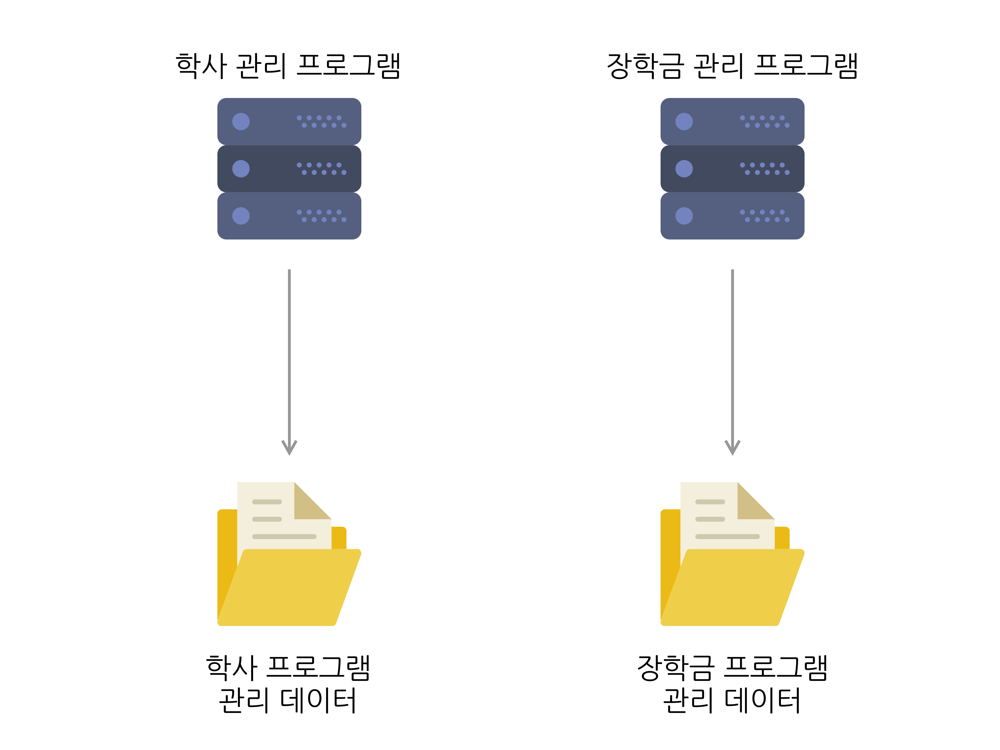
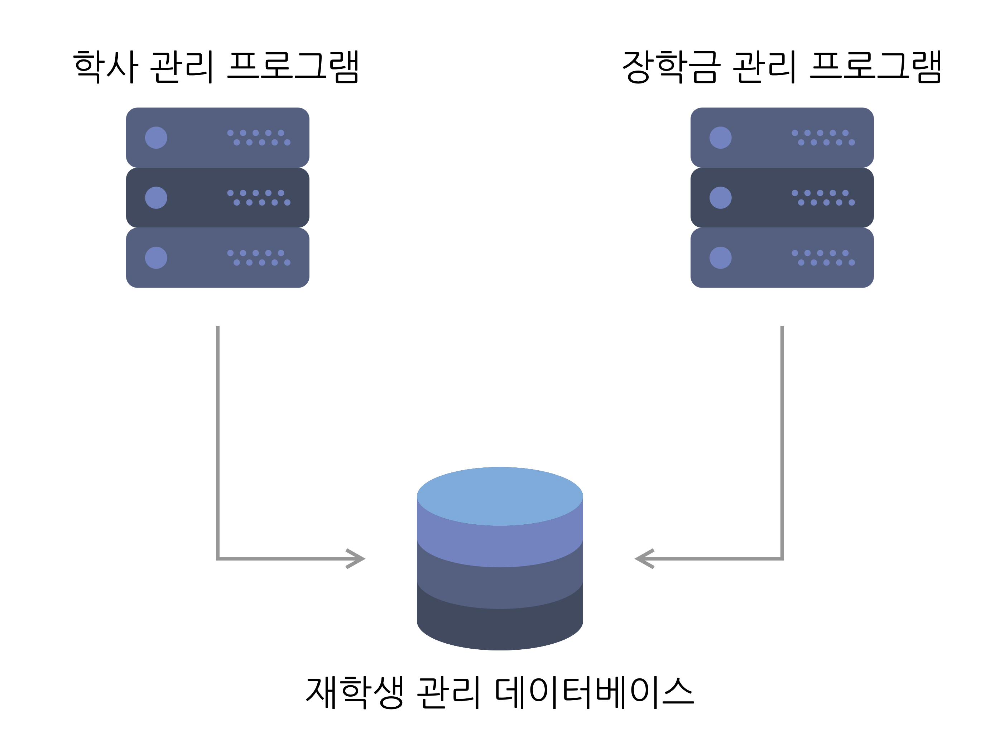

# \[Oracle\] 데이터베이스란?

### 데이터와 정보

-   Data(자료)
    -   필요에 의해 수집했지만 아직 특정 목적을 위해 평가하거나 정제하지 않은 값이나 사실
-   Information(정보)
    -   수집한 데이터를 특정 목적을 위해 분석하거나 가공하여 가치를 추가하거나 새로운 의미를 이끌어낸 결과


### 효율적인 데이터 관리

-   해당 조건을 만족하는 구조화된 데이터 집합을 데이터베이스라 부른다
    -   데이터 통합 관리
    -   일관된 방법으로 관리
    -   데이터 누락 및 중복 제거
    -   여러 사용자에 의한 실시간 사용 가능


### 파일 시스템 vs DBMS

**파일 시스템 방식**



-   각 응용 프로그램이 필요한 데이터를 각각 저장 및 관리
-   각 프로그램 간 데이터에 연관이 없고 중복 및 누락 발생 가능
-   Flat File Structure(단층 파일 구조)

```
학사 프로그램에서 학적 데이터 상의 A 학생을 졸업 처리한다면 A 학생은 장학금을 받을 수 없다. 하지만 장학금 프로그램에선 장학금 데이터의 A 학생에 대한 처리를 하지 않았기 때문에, 여전히 A 학생은 장학금 신청 가능 대상으로 남아있다.
```

**DBMS**



-   데이터를 데이터베이스에서 통합 관리
-   여러 응용 프로그램이 동일 데이터베이스를 사용
-   데이터 오류, 누락, 중복 문제 해결 가능

```
학사 프로그램에서 데이터베이스의 A 학생을 졸업 처리한다면 A 학생은 장학금을 받을 수 없다. 장학금 프로그램에서는 장학금 테이블과 학적 테이블을 조인하여, 졸업 상태인 학생을 제외하고 장학금 신청 가능 대상을 조회할 수 있다.
```


### 서비스의 역할 분담

-   응용프로그램의 목적
    -   특정 서비스 제공
-   점점 거대해지고 복잡해지는 데이터를 각 응용 프로그램이 직접 관리한다면?
    -   소모 시간과 자원 증가
    -   데이터 불일치로 인한 오류 발생 확률 증가
-   기능의 분리 필요
    -   데이터 영역: 자료의 저장 전담
    -   서비스 영역: 자료의 처리 전담


> 해당 포스팅은 학습을 위해 서적 \[오라클로 배우는 데이터베이스 입문\]의 내용을 요약 정리했습니다.
