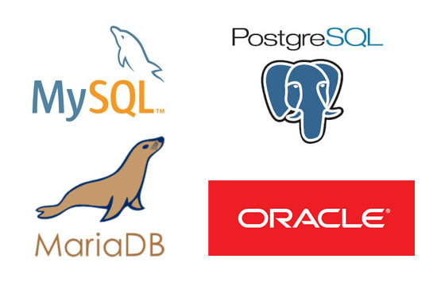

# \[Oracle\] 데이터 모델과 관계형 데이터베이스



## 데이터 모델

- 데이터를 저장하는 방식을 정의한 개념 모형
	- 계층형
	- 네트워크형
	- 객체지향형
	- 관계형

#### 계층형

- `트리(tree)` 구조
- 데이터 관련성을 계층별로 나누어 부모-자식 관계를 정의
- 1:N
- 제약: 하나의 부모가 여러 자식을 가질 수는 있지만, 자식이 여러 부모를 가진 경우 표현 불가

#### 네트워크형

- `그래프(graph)` 구조
- 계층형에서 불가능했던 자식이 여러 부모를 가진 경우 표현 가능

#### 객체지향형

- `객체` 개념 기반
- 데이터가 독립된 객체로 구성되어 `상속`, `오버라이드` 등 활용 가능
- 객체지향 개념을 데이터베이스에 완전히 적용하기는 어려움


---


## 관계형 데이터 모델

- 데이터 간 관계에 초점
- 관계형 데이터베이스의 바탕이 되는 모델

#### Example

한 방송국에서 섭외 가능한 아이돌의 `멤버`와 `그룹` 정보를 관리하기로 했다고 해보자.

1. 하나의 묶음으로 관리하는 경우
	| 번호 | 이름 | 출생년도 | 그룹명 | 소속사 | 
	| --- | --- | --- | --- | --- |
	| 001 | 랩몬스터 | 1994 | 방탄소년단 | 빅히트 |
	| 002 | 슬기 | 1994 | 레드벨벳 | SM |
	| 003 | 지수 | 1995 | 블랙핑크 | YG |
	| 004 | 뷔 | 1995 | 방탄소년단 | 빅히트 |

	```text
	다음과 같은 테이블에서 만약 빅히트 엔터테인먼트가 사명을 바꾼다면?
	> 총 7개의 데이터를 바꾸어야 한다.
	> 중복 발생
	```

2. 데이터의 독립 특성에 따라 묶음을 나누어 관리하는 경우
	
	| 번호 | 이름 | 출생년도 | 그룹코드 | 
	| --- | --- | --- | --- |
	| 001 | 랩몬스터 | 1994 | 10 |
	| 002 | 슬기 | 1994 | 20 |
	| 003 | 지수 | 1995 | 30 |
	| 004 | 뷔 | 1995 | 10 |
	
	| 그룹코드 | 그룹명 | 소속사 | 
	| --- | --- | --- |
	| 10 | 방탄소년단 | 빅히트 |
	| 20 | 레드벨벳 | SM |
	| 30 | 블랙핑크 | YG |

	```text
	별도의 특성을 갖는 멤버와 그룹을 분리하여 별개의 릴레이션으로 정의한 후, '그룹코드'로 연결한다.
	1번 방식에서 발생한 데이터의 중복을 제거할 수 있음.
	```

#### 관계형 데이터 모델의 핵심 구성요소
- 개체(entity): 데이터화하려는 *사물, 개념의 정보 단위*. RDBMS에서 `테이블` 개념과 대응.
- 속성(attribute): 개체를 구성하는 데이터의 가장 작은 *논리적 단위*. 데이터의 종류, 특성, 상태 등을 정의. RDBMS의 `컬럼`과 대응.
- 관계(relationship): *개체와 개체 또는 속성 간의 연관성*을 표현. RDBMS에서는 테이블 간 관계를 `외래키` 등으로 구현.

---


## 관계형 데이터베이스(RDBMS)

- 관계형 데이터 모델 개념을 바탕으로 데이터를 저장 및 관리하는 데이터베이스
	- Oracle
	- MS-SQL
	- MySQL
	- MariaDB
	- PostgreSQL
	- DB2


> [MEMO]
> 오라클은 관계형에 객체 개념을 도입한 객체 관계형 데이터베이스

---


## SQL

- Structured Query Language
- RDBMS에서 데이터 관리에 사용하는 데이터베이스 질의 언어
 
|종류|기능|
|---|---|
| DQL(Data Query Language) | 데이터 조회 |
| DML(Data Manaipulation Language) | 데이터 저장, 수정, 삭제|
| DCL(Data Control Language) | 데이터 사용 권한 |
| DDL(Data Definition Language) | 객체 생성, 수정, 삭제 |
| TCL(Transaction Control Language) | 트랜젝션 데이터의 영구 저장 취소 등 |

> 해당 포스팅은 학습을 위해 서적 \[오라클로 배우는 데이터베이스 입문\]의 내용을 요약 정리했습니다.
