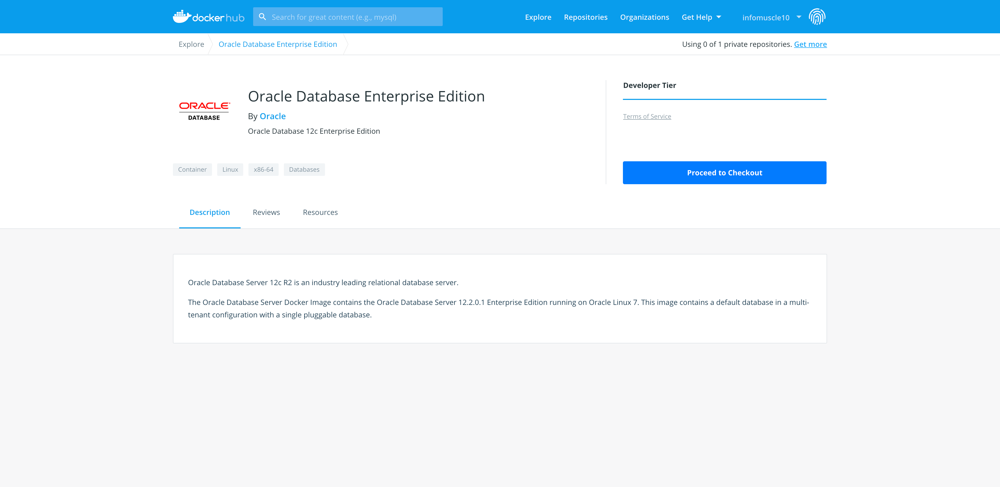
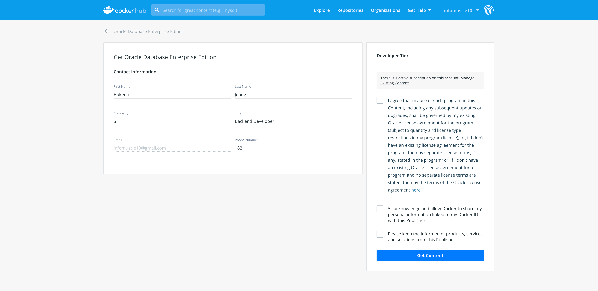
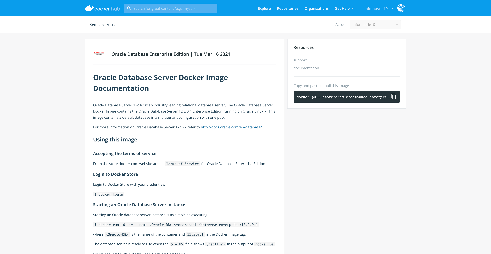
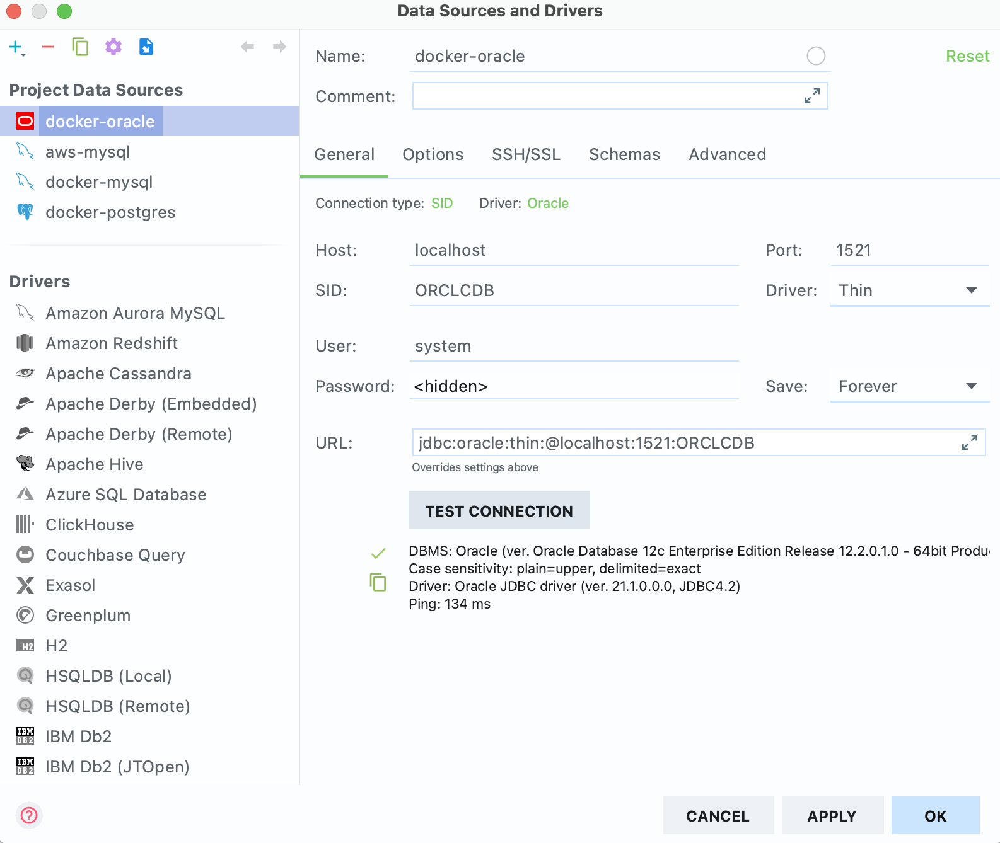
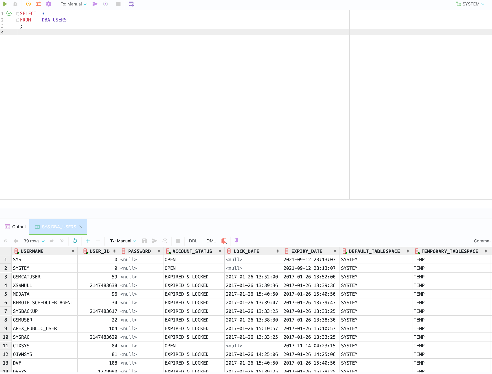

# [Oracle] mac OS에서 도커로 오라클 EE 12c 설치

맥 환경에서 도커를 활용하여 오라클 데이터베이스 설치 방법.
- 도커가 설치되어 있다고 전제한다.

> **TODO**  
> Homebrew로 Docker 설치 포스팅 후 링크 추가


## 1. 오라클 12c 도커 공식 문서 확인

### 1) Oracle Database Enterprise Edition 도커 Hub로 이동


<!-- [##_Image|kage@pcUxd/btq0iWSHXaf/kTPOkCk4N9y26YTam6ZX6K/img.png|alignCenter|width="100%"|_##] -->

https://hub.docker.com/_/oracle-database-enterprise-edition

위 링크에 접속해서 우측 `Proceed to Checkout` 버튼 클릭

### 2) 정보 입력 후 약관 동의


<!-- [##_Image|kage@bx6qJn/btq0kEqsMZX/875e8pZMI5oCh8d98kB9K1/img.png|alignCenter|width="100%"|_##] -->


이름, 회사, 연락처 등 정보를 입력하고 약관에 동의한다.

### 3) 도커 이미지 문서 확인


<!-- [##_Image|kage@dTyHsE/btq0kDd3rq4/pOVKKf6xQ202WM2SkVmVw0/img.png|alignCenter|width="100%"|_##] -->

오라클 DB 도커 이미지 가이드 문서를 확인한다.

## 2. 터미널에서 도커 이미지 Pull

위 가이드 문서에서 우측을 보면 빠르게 커맨드를 복사해서 터미널에 붙여넣을 수 있다. 그런데 오라클 이미지 용량이 상당하다. 그래서 여기서는 일부 기능을 없앤 슬림 버전을 사용하겠다. 가이드 문서의 맨 하단에서도 확인할 수 있다. 풀 버전 이미지는 약 3.5GB, 슬림 버전 이미지는 약 2.1GB다.

 `pull` 커맨드로 원하는 버전의 도커 이미지를 가져온다.

```bash
# Slim 버전 이미지
$ docker pull store/oracle/database-enterprise:12.2.0.1-slim

# Full 버전 이미지 
$ docker pull store/oracle/database-enterprise:12.2.0.1
```

도커 이미지 다운로드가 실행될 것이다. 다운로드과 완료되면 `images` 커맨드로 이미지를 확인할 수 있다.

```bash
$ docker images

REPOSITORY                         TAG             IMAGE ID       CREATED        SIZE
store/oracle/database-enterprise   12.2.0.1-slim   27c9559d36ec   3 years ago    2.08GB
```

## 3. 도커 컨테이너 생성 

`run` 커맨드로 컨테이너를 실행한다. `<Oracle-DB>` 부분은 컨테이너 이름을 입력한다. 각 옵션의 기능은 아래와 같다.

```bash
$ docker run -d -it --name <Oracle-DB> -p 1521:1521 -e "TZ=Asia/Seoul" store/oracle/database-enterprise:12.2.0.1-slim
```

- 도커 실행 옵션
    - `-d`: 컨테이너를 detached(백그라운드)로 실행
    - `-it`: 표준 입력 활성화 && TTY 모드 사용
    - `--name <Oracle-DB>`: 컨테이너 이름을 \<Oracle-DB\>로 지정
    - `-p 1521:1521`: 로컬포트:컨테이너포트를 연결. 1521은 오라클 포트.
    - `-e "TZ=Asia/Seoul"`: Time Zone을 Asia/Seoul로 설정 
    - `store/oracle/database-enterprise:12.2.0.1-slim`: 실행할 이미지명:태그명
    - `-v`: volume 설정. 여기선 패스하고 뒤에 docker-compose에서 세팅.

컨테이너가 실행되면 `ps` 커맨드로 실행 중인 컨테이너를 확인할 수 있다.

```bash
$ docker ps

CONTAINER ID   IMAGE                                            COMMAND                  CREATED         STATUS                            PORTS                              NAMES
c6b7bfe0ab73   store/oracle/database-enterprise:12.2.0.1-slim   "/bin/sh -c '/bin/ba…"   3 seconds ago   Up 2 seconds (health: starting)   0.0.0.0:1521->1521/tcp, 5500/tcp   oracle-slim
```

### Tip. 도커 이미지 이름 변경

오라클 기본 이미지 이름과 태그가 너무 길다. 그래서 이미지 이름을 변경 후, 변경한 이미지 이름으로 실행하고 이미지를 도커 Hub에 푸시했다.

```bash
$ docker image tag store/oracle/database-enterprise:12.2.0.1-slim infomuscle10/oracle-ee-12c-slim

$ docker run -d -it --name oracle-ee-12c-slim -p 1521:1521 -e "TZ=Asia/Seoul" infomuscle10/oracle-ee-12c-slim 

$ docker push infomuscle10/oracle-ee-12c-slim
```

## 4. SQLPlus 접속

실행 중인 컨테이너의 SQLPlus의 system 계정에 접속한다. 

```bash
$ docker exec -it oracle-ee-12c-slim bash
[oracle@4e8847d675d0 /]$ sqlplus sys/Oradoc_db1@ORCLCDB as sysdba

SQL*Plus: Release 12.2.0.1.0 Production on Tue Mar 16 23:13:49 2021

Copyright (c) 1982, 2016, Oracle.  All rights reserved.


Connected to:
Oracle Database 12c Enterprise Edition Release 12.2.0.1.0 - 64bit Production
```

## 5. Datagrip 접속

데이터그립을 실행한 후 Database 탭 -> Data Source -> Oracle을 실행한다.


<!-- [##_Image|kage@blnMKG/btq0oKiWcrw/jVDKd80sAu67Fi0LMKQdd1/img.png|alignCenter|width="100%"|_##] -->

위 창이 뜨면 기본 설정값들을 입력한 후 접속한다.

- `Host`: localhost
- `Port`: 1521
- `SID`: ORCLCDB
- `User`: system
- `Password`: Oradoc_db1

> [MEMO]  
> 가이드에 나와있는 그 외 기본 설정값  
> DB_PDB: ORCLPDB1  
> DB_DOMAIN: localdomain

테스트를 위해 아래와 같이 커맨드 입력 후 `CMD` + `Return`을 누른다. 

```sql
SELECT  *
FROM    DBA_USERS
;
```


<!-- [##_Image|kage@bPMfLP/btq0qz826ry/aX5XC07bGYUpE98jyhBAGk/img.png|alignCenter|width="100%"|_##] -->

위와 같이 사용자 목록이 뜨는 것을 확인할 수 있다.

## 6. Docker Compose 설정

컨테이너 실행을 쉽게 하기 위해 Docker Compose를 구성한다. `docker-compose.yml`이란 파일을 만들고 아래와 같이 세팅한다. `volumes`는 로컬의 `./oracle` 컨테이너의 `/opt/oracle/oradata`를 연결해준다.

```yml
version: "2"

services:
  oracle-ee-12c-slim:
    image: infomuscle10/oracle-ee-12c-slim
    container_name: oracle-ee-12c-slim
    ports:
      - "1521:1521"
    environment:
      - TZ=Asia/Seoul
    volumes:
      - ./oracle:/opt/oracle/oradata
```

터미널에서 해당 파일이 있는 곳으로 가 아래 커맨드로 서비스를 실행시킨다. 
```bash
$ docker-compose up -d
```

> 학습 중인 책에서는 oracle 11g를 사용하는데, 오라클에서 제공하는 공식 이미지는 12c 밖에 없어서 12c로 설치를 진행하며 포스팅을 작성했었다. 그런데 12c에는 학습용 SCOTT 계정이 없고, 만드는 방법도 모르겠다. 포스팅은 아까우니 그대로 남겨두고, 11g 설치 후 SCOTT 계정 활성화까지 다시 포스팅할 예정.