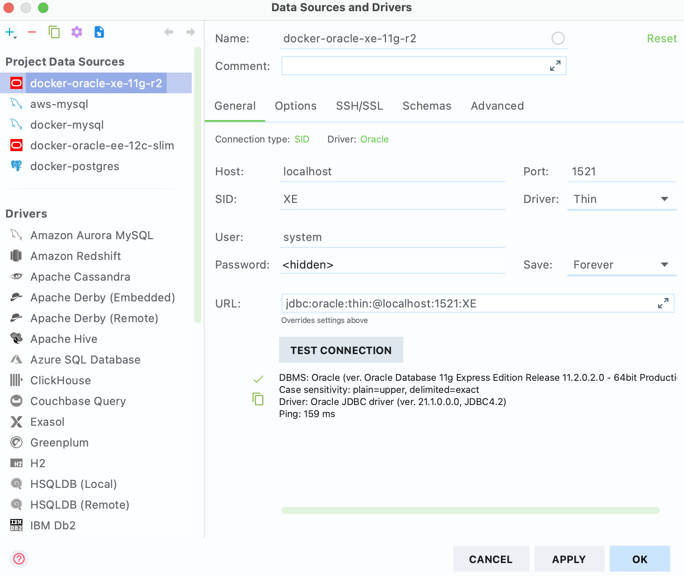
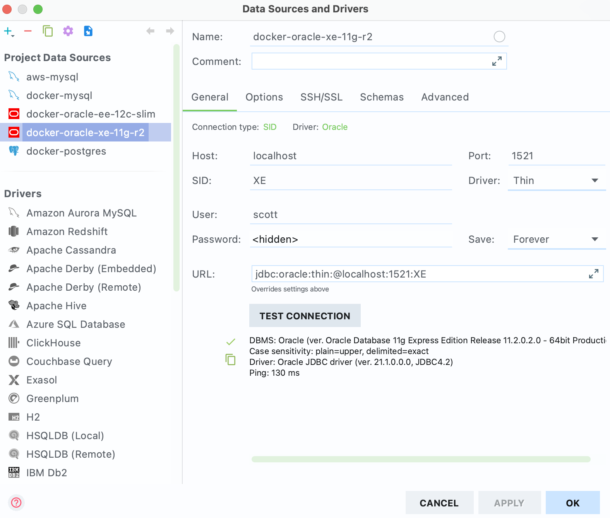

# [Oracle] mac OS에서 도커로 오라클 XE 11g 설치

- 오라클 데이터베이스 학습을 위한 XE 11g 버전 설치
- SCOTT 계정 생성
- 도커 설치 전제

> **TODO**  
> Homebrew로 Docker 설치 포스팅 후 링크 추가


## 1. 도커 이미지 pull

터미널에서 도커 이미지를 검색한다. 몇가지 이미지가 뜬다.

```bash
$ docker search oracle

NAME                                DESCRIPTION                                     STARS     OFFICIAL   AUTOMATED
oracleinanutshell/oracle-xe-11g                                                     143                  
wnameless/oracle-xe-11g-r2          Oracle Express Edition 11g Release 2 on Ubun…   58                   
orangehrm/oracle-xe-11g              docker container with Oracle Express Editio…   15                   [OK]
christophesurmont/oracle-xe-11g     Clone of the wnameless/oracle-xe-11g.           6                    
ukhomeofficedigital/oracle-xe-11g   Oracle Database Express Edition 11g Container   4                    [OK]
jaspeen/oracle-xe-11g               Fork from sath89/docker-oracle-xe-11g - smal…   3                    [OK]
```

이 중에서 star 수도 적당히 있고, 현재 학습 중인 책에서 사용하는 것과 동일한 버전인 `wnameless/oracle-xe-11g-r2` 이미지로 컨테이너를 실행하겠다.

```bash
$ docker pull wnameless/oracle-xe-11g-r2
```

프로세스가 완료되면 `images` 커맨드로 이미지를 확인한다.

```bash
$ docker images

REPOSITORY                        TAG       IMAGE ID       CREATED         SIZE
wnameless/oracle-xe-11g-r2        latest    0d19fd2e072e   17 months ago   2.1GB
```

꼭 필요한 작업은 아닌데, 이미지 관리를 편하게 하려고 이미지 이름을 바꾸고 도커 Hub에 푸시해두겠다. 이후로는 바뀐 이미지명이 기준이 된다.

```bash
$ docker image tag wnameless/oracle-xe-11g-r2 infomuscle10/oracle-xe-11g-r2
$ docker push infomuscle10/oracle-xe-11g-r2
```


## 2. 도커 컨테이너 실행

`run` 커맨드로 컨테이너를 실행한다. 각 옵션의 기능은 아래와 같다.

```bash
$ docker run -d -it --name oracle-xe-11g-r2 -p 1521:1521 -e "TZ=Asia/Seoul" infomuscle10/oracle-xe-11g-r2
```

- 도커 실행 옵션
    - `-d`: 컨테이너를 detached(백그라운드)로 실행
    - `-it`: 표준 입력 활성화 && TTY 모드 사용
    - `--name <Oracle-DB>`: 컨테이너 이름을 \<Oracle-DB\>로 지정
    - `-p 1521:1521`: 로컬포트:컨테이너포트를 연결. 1521은 오라클 포트.
    - `-e "TZ=Asia/Seoul"`: Time Zone을 Asia/Seoul로 설정 
    - `infomuscle10/oracle-xe-11g-r2:latest`: 실행할 이미지명:태그명(생략)
    - `-v`: volume 설정. 여기선 패스하고 뒤에 docker-compose에서 세팅.

`ps` 커맨드로 실행 중인 컨테이너를 확인한다.

```bash
$ docker ps
CONTAINER ID   IMAGE                             COMMAND                  CREATED              STATUS              PORTS                                      NAMES
345529e24e11   infomuscle10/oracle-xe-11g-r2   "/bin/sh -c '/usr/sb…"   About a minute ago   Up About a minute   22/tcp, 8080/tcp, 0.0.0.0:1521->1521/tcp   oracle-xe-11g-r2
```

### Tip. Docker Compose 세팅

Docker Compose로 컨테이너 실행을 쉽게 할 수 있다. 먼저 `docker-compose.yml` 파일을 생성한 후 아래 값을 세팅한다.

```yml
version: "2"

services:
  oracle-xe-11g-r2:
    image: infomuscle10/oracle-xe-11g-r2
    container_name: oracle-xe-11g-r2
    ports:
      - "1521:1521"
    environment:
      - TZ=Asia/Seoul
    volumes:
      - ./oracle-xe-11g-r2:/opt/oracle/oradata
```

해당 파일이 있는 디렉토리에서 아래 커맨드로 서비스를 실행한다. 

```bash
$ docker-compose up -d
```

## 3. SQLPlus 접속

SQLPlus
```bash
$ docker exec -it oracle-xe-11g-r2 bash                                                                                                           126 ↵
root@345529e24e11:/# sqlplus system/oracle

SQL*Plus: Release 11.2.0.2.0 Production on Thu Mar 18 04:21:04 2021

Copyright (c) 1982, 2011, Oracle.  All rights reserved.


Connected to:
Oracle Database 11g Express Edition Release 11.2.0.2.0 - 64bit Production
```


## 4. Datagrip 접속

어찌 된 일인지 이렇게 생성된 오라클 컨테이너의 DBA_USERS 테이블을 살펴보면 SCOTT 계정이 없다. 다른 이미지도 받아보고, 열심히 알아봤지만 그냥 SCOTT 계정을 직접 생성하는 게 낫다고 판단했다. 작업을 쉽게 하기 위해 우선 Datagrip에 접속한다.



Database 탭 -> + 버튼 -> Data Source -> Oracle을 실행한다. 다른 건 다 기본값이고, `User`와 `Password`만 입력해주면 된다. `OK` 버튼을 누르면 자동으로 쿼리 콘솔이 나온다.

- `User`: system
- `Password`: oracle


## 5. SCOTT 게정 생성

쿼리 콘솔에서 아래 쿼리로 SCOTT 계정을 생성하고, 권한을 부여한다.

```sql
CREATE USER scott
IDENTIFIED BY tiger
DEFAULT TABLESPACE users
TEMPORARY TABLESPACE temp;

GRANT CONNECT, RESOURCE, DBA TO scott;
```



그리고 위 그림처럼 SCOTT 계정으로 접속한 후 아래 쿼리로 SCOTT 계정 데이터를 세팅한다.

- `User`: scott
- `Password`: tiger

```sql
-- DROP TABLE EMP;
-- DROP TABLE DEPT;
-- DROP TABLE BONUS;
-- DROP TABLE SALGRADE;
-- DROP TABLE DUMMY;

CREATE TABLE EMP
       (EMPNO NUMBER(4) NOT NULL,
        ENAME VARCHAR2(10),
        JOB VARCHAR2(9),
        MGR NUMBER(4),
        HIREDATE DATE,
        SAL NUMBER(7, 2),
        COMM NUMBER(7, 2),
        DEPTNO NUMBER(2));

INSERT INTO EMP VALUES
        (7369, 'SMITH',  'CLERK',     7902,
        sysdate,  800, NULL, 20);

INSERT INTO EMP VALUES
        (7499, 'ALLEN',  'SALESMAN',  7698,
        sysdate, 1600,  300, 30);

INSERT INTO EMP VALUES
        (7521, 'WARD',   'SALESMAN',  7698,
        sysdate, 1250,  500, 30);

INSERT INTO EMP VALUES
        (7566, 'JONES',  'MANAGER',   7839,
        sysdate,  2975, NULL, 20);

INSERT INTO EMP VALUES
        (7654, 'MARTIN', 'SALESMAN',  7698,
        sysdate, 1250, 1400, 30);

INSERT INTO EMP VALUES
        (7698, 'BLAKE',  'MANAGER',   7839,
        sysdate,  2850, NULL, 30);

INSERT INTO EMP VALUES
        (7782, 'CLARK',  'MANAGER',   7839,
        sysdate,  2450, NULL, 10);
INSERT INTO EMP VALUES
        (7788, 'SCOTT',  'ANALYST',   7566,
        sysdate, 3000, NULL, 20);

INSERT INTO EMP VALUES
        (7839, 'KING',   'PRESIDENT', NULL,
        sysdate, 5000, NULL, 10);

INSERT INTO EMP VALUES
        (7844, 'TURNER', 'SALESMAN',  7698,
        sysdate,  1500,    0, 30);

INSERT INTO EMP VALUES
        (7876, 'ADAMS',  'CLERK',     7788,
        sysdate, 1100, NULL, 20);

INSERT INTO EMP VALUES
        (7900, 'JAMES',  'CLERK',     7698,
        sysdate,   950, NULL, 30);

INSERT INTO EMP VALUES
        (7902, 'FORD',   'ANALYST',   7566,
        sysdate,  3000, NULL, 20);

INSERT INTO EMP VALUES
        (7934, 'MILLER', 'CLERK',     7782,
        sysdate, 1300, NULL, 10);

CREATE TABLE DEPT
       (DEPTNO NUMBER(2),
        DNAME VARCHAR2(14),
        LOC VARCHAR2(13) );

INSERT INTO DEPT VALUES (10, 'ACCOUNTING', 'NEW YORK');
INSERT INTO DEPT VALUES (20, 'RESEARCH',   'DALLAS');
INSERT INTO DEPT VALUES (30, 'SALES',      'CHICAGO');
INSERT INTO DEPT VALUES (40, 'OPERATIONS', 'BOSTON');

CREATE TABLE BONUS
        (ENAME VARCHAR2(10),
         JOB   VARCHAR2(9),
         SAL   NUMBER,
         COMM  NUMBER);

CREATE TABLE SALGRADE
        (GRADE NUMBER,
         LOSAL NUMBER,
         HISAL NUMBER);

INSERT INTO SALGRADE VALUES (1,  700, 1200);
INSERT INTO SALGRADE VALUES (2, 1201, 1400);
INSERT INTO SALGRADE VALUES (3, 1401, 2000);
INSERT INTO SALGRADE VALUES (4, 2001, 3000);
INSERT INTO SALGRADE VALUES (5, 3001, 9999);

CREATE TABLE DUMMY
        (DUMMY NUMBER);

INSERT INTO DUMMY VALUES (0);

COMMIT;
```

`SELECT`문으로 정상적으로 테이블 및 데이터가 생성되었는지 확인할 수 있다.

```sql
SELECT  *
FROM    EMP;
```