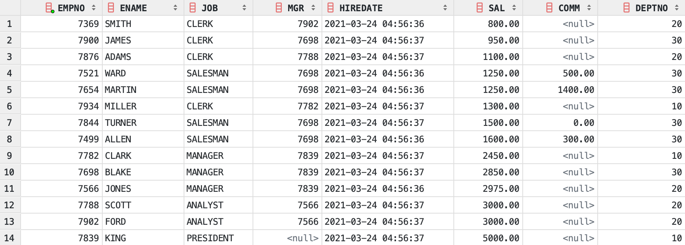
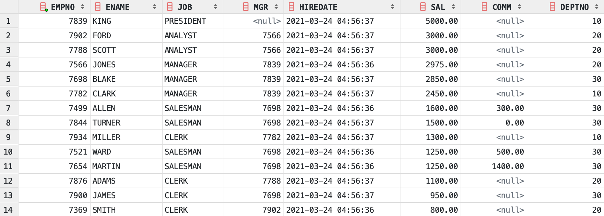
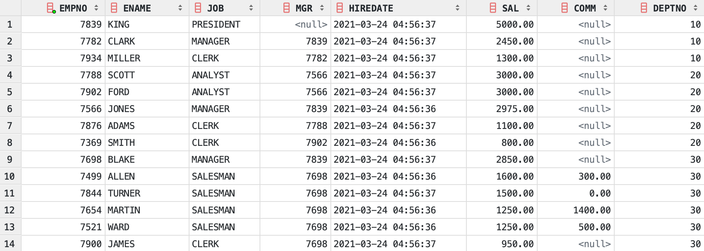

# [Oracle] SELECT로 데이터 조회하기


## 셀렉션, 프로젝션, 조인

데이터베이스의 데이터 조회는 3가지 차원으로 나눌 수 있다.
- 셀렉션: `행 단위`로 데이터 조회
- 프로젝션: `열 단위`로 데이터 조회
- 조인: 두 개 이상의 `테이블을 연결`하여 데이터 조회

데이터를 조회하기 위한 `SELECT`문을 사용해서, 적절하게 셀렉션, 프로젝션, 조인을 할 수 있다.


## SELECT 정리

### DESC, DESCRIBE

테이블 정보를 살펴볼 수 있다. `DESC`를 사용하여 학습에 사용할 `SCOTT`의 테이블들을 살펴보겠다.

```bash
SQL> DESC EMP;
 Name					   Null?    Type
 ----------------------------------------- -------- ----------------------------
 EMPNO					   NOT NULL NUMBER(4)
 ENAME						        VARCHAR2(10)
 JOB				    		    VARCHAR2(9)
 MGR				    		    NUMBER(4)
 HIREDATE			    		    DATE
 SAL						        NUMBER(7,2)
 COMM						        NUMBER(7,2)
 DEPTNO 					        NUMBER(2)

SQL> DESC DEPT;    
 Name					   Null?    Type
 ----------------------------------------- -------- ----------------------------
 DEPTNO     					    NUMBER(2)
 DNAME		    				    VARCHAR2(14)
 LOC				    		    VARCHAR2(13)

SQL> DESC SALGRADE;
 Name					   Null?    Type
 ----------------------------------------- -------- ----------------------------
 GRADE  						    NUMBER
 LOSAL  						    NUMBER
 HISAL  						    NUMBER
```

`DESC`를 사용해서 `EMP`, `DEPT`, `SALGRADE`의 테이블 정보를 조회했다. 테이블을 구성하는 컬럼과 컬럼의 간략한 정보를 볼 수 있다.

> [TODO]  
> 오라클 자료형 정리 후 링크 추가

> [MEMO]  
> DESC는 SQLPlus에서 지원된다. 다른 툴도 지원하는 경우가 있지만, 필수는 아니기 때문에 DESC 명령어를 사용할 수 없다면 SQLPlus에 접속해서 사용한다.


### SELECT, FROM - 기본 조회

SELECT문의 기본 구성은 다음과 같다. 

```sql
SELECT  [열1]
      , [열2]
      , ...
      , [열N]
FROM    [테이블]
;
```

#### 전체 열 출력하기

`*`를 이용해서 모든 열을 조회할 수 있다. 

```sql
SELECT  *
FROM    EMP
;
```


<!-- [##_Image|kage@bbqdGm/btq0XqriDEQ/Sjcp59u3LCTlYVlctS7Bv0/img.png|alignCenter|width="100%"|_##] -->

#### 특정 열만 출력하기

조회할 컬럼 이름을 지정하면 해당 컬럼들만 조회할 수 있다.

```sql
SELECT  EMPNO
      , ENAME
      , DEPTNO
FROM    EMP
;
```


<!-- [##_Image|kage@cFXUs2/btq0SFXgaG6/6YII0B5qAMt7UCoxGDkUvk/img.png|alignCenter|width="100%"|_##] -->

> [MEMO]  
> SQL은 대소문자를 구분하지 않으나 다른 프로그래밍 언어와 구분하기 위해 대문자로 표기하는 것이 권장된다.


### DISTINCT, ALL - 중복 제거

`SELECT` 다음에 `DISTINCT`를 붙여 조회한 데이터의 중복을 제거할 수 있다.

```sql
SELECT DISTINCT DEPTNO
FROM            EMP
음
```


<!-- [##_Image|kage@bkU328/btq0Tu2jKo4/5JhLrtKAmX16ufP5vqQIUK/img.png|alignCenter|width="100%"|_##] -->

#### 중복의 기준 

조회하는 열이 여러 개일 경우, 모든 열의 데이터가 같을 때 중복으로 간주한다.

```sql
SELECT DISTINCT JOB 
              , DEPTNO
FROM            EMP
;
```


<!-- [##_Image|kage@rfSBn/btq0Xo737Ln/pjK6LHRC6GWrbEwRXS6uhK/img.png|alignCenter|width="100%"|_##] -->

#### 중복 제거 없음

`ALL`은 중복 제거 없이 모든 데이터를 출력한다. 기본값이기 때문에 `SELECT`만 사용해도 같은 결과를 볼 수 있다.

```sql
SELECT ALL DEPTNO
FROM       EMP
;
```


<!-- [##_Image|kage@00FYO/btq0ZKI6q6b/sIK4alFjk2USHjv0SejhKk/img.png|alignCenter|width="100%"|_##] -->


### AS - 별칭 지정

`SELECT`문을 사용할 경우, 입력한 컬럼값이 조회 결과 최상단에 보여진다. 이 때 보여지는 열 이름을 임의로 변경한 이름을 `별칭(Alias)`이라고 부른다. 컬럼명 옆에 `AS`를 붙여서 지정할 수 있다. 

#### 연산식

SQL은 데이터를 단순 불러올 뿐만 아니라, 연산을 적용한 결과를 보여줄 수도 있다. 아래와 같이 SQL을 작성할 경우 각 행마다 `SAL` 값에 12를 곱하고 `COMM` 값을 더한 값을 보여주는 열이 생성된다. 

```sql
SELECT  ENAME
      , SAL
      , SAL*12+COMM
      , COMM
FROM    EMP
;
```


<!-- [##_Image|kage@brtYaF/btq01qwQ7jO/HjrbHHSJGUrBhVfAz5whRK/img.png|alignCenter|width="100%"|_##] -->

#### 별칭 지정하기

위 쿼리의 결과를 보면 컬럼명이 `SAL*12+COMM`으로 되어있음을 알 수 있다. 예제에서는 비교적 간단하지만, 실무에서는 연산이 훨씬 복잡하고 길어질 수 있다. 또는 의미를 명확히 하거나, 해당 값이 어떤 연산식을 거쳤는지 비밀에 부쳐야할 수도 있다. 이런 경우를 위해 아래와 같이 AS를 사용하여 컬럼명을 바꿀 수 있다.

```sql
SELECT  ENAME
      , SAL
      , SAL*12+COMM AS ANNSAL
      , COMM
FROM    EMP
;
```


<!-- [##_Image|kage@8Iutg/btq0XP5qWPY/UfksIK99anBbKRDkpIeh4K/img.png|alignCenter|width="100%"|_##] -->

#### 별칭을 지정하는 여러가지 방법

`AS`는 생략 가능하고, 별칭을 따옴표로 구분할 수도 있다. 즉 총 4가지 방식으로 표현 가능하다. 일반적으로 3번을 가장 선호한다.     
1. SAL\*12+COMM ANNSAL  
2. SAL\*12+COMM "ANNSAL"  
3. SAL\*12+COMM AS ANNSAL  
4. SAL\*12+COMM AS "ANNSAL"  

`AS`로 어떤 단어가 별칭인지 구분하는 것이 편하고, `"`를 사용할 경우에는 프로그래밍 언어와 SQL을 같이 사용할 경우 문자열의 구분에서 혼란을 일으킬 수 있기 때문이다.


### ORDER BY - 정렬

`SELECT`문은 기본적으로 정렬 순서를 보장하지 않는다. 그래서 `ORDER BY`를 가장 마지막에 붙여 정렬 순서를 지정할 수 있다.

```sql
SELECT      *
FROM        EMP
ORDER BY    SAL
;
```


<!-- [##_Image|kage@bMEP2n/btq0Vn9pPjB/GCulVJ2h1x4sYQC4YmMHO0/img.png|alignCenter|width="100%"|_##] -->

#### DESC, ASC

`ORDER BY`의 기본값은 오름차순이다. 내림차순을 원할 경우 `DESC`를 컬럼명 뒤에 붙인다. `ASC`를 붙여 오름차순임을 명시할 수도 있다. 

```sql
SELECT      *
FROM        EMP
ORDER BY    SAL DESC
;
```


<!-- [##_Image|kage@c1q0Vd/btq0Tt966Sp/geU1oi8CGqp6kQgOVekfHk/img.png|alignCenter|width="100%"|_##] -->

#### 정렬 기준이 여러개일 경우

정렬 기준을 여러개 주고 싶을 경우, 우선순위에 맞게 컬럼명을 명시하면 된다.

```sql
SELECT      *
FROM        EMP
ORDER BY    DEPTNO ASC, SAL DESC
;
```


<!-- [##_Image|kage@WprNT/btq0SG9G139/hicPlZiMCOYM0zoXKMk3ak/img.png|alignCenter|width="100%"|_##] -->

> [MEMO]  
> 정렬은 상당한 비용을 소모할 수 있기 때문에 꼭 필요한 경우에만 사용한다.

> 해당 포스팅은 학습을 위해 서적 \[오라클로 배우는 데이터베이스 입문\]의 내용을 요약 정리했습니다.