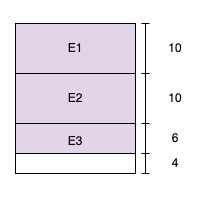

# [운영체제] 메모리 단편화와 페이징

## 메모리 단편화란?

RAM에서 메모리의 공간이 조각나서, 사용 가능한 메모리가 총합은 충분하지만 프로세스의 할당이 불가능한 상태를 의미합니다.

이 개념을 이해하기 위해선 우선 CPU가 어떻게 메모리에 프로세스를 할당하는지 알아야할 필요가 있습니다.

## 연속 메모리 할당

메모리를 할당하는 방법 중 가장 기본적으로 떠올릴 수 있는 방법입니다.

100만큼의 크기를 갖고 있는 메모리와 프로세스 A, B, C 각각 10, 20, 30만큼의 크기를 갖고 있다고 가정해봅시다.

A를 0~9까지, B를 10~29까지, C를 30~59까지 할당할 수 있습니다.

결과적으로 메모리에는 다음 그림과 같이 프로세스가 적재됩니다.

<!--[##_Image|kage@skk6x/btr3J3Mf0bz/gKidOhofJ2YCb1gccF765K/img.png|alignCenter|width="100%"|_##]-->

이 방식은 문제가 있습니다.

프로세스 B가 가장 먼저 실행이 중단됐다고 가정해봅니다.

메모리의 사용 상태는 아래 그림과 같겠죠.

<!--[##_Image|kage@daIzDT/btr3LFqO4oN/78NHcvSs1KPk8yTHamKPf0/img.png|alignCenter|width="100%"|_##]-->

그럼 전체 100의 공간 중에 B가 있던 20, 원래 비어있던 40을 합쳐 총 60의 여유 공간이 생깁니다.

그리고 이제 50의 메모리가 필요한 프로세스 D를 실행시켜달라는 요청이 들어왔습니다.

하지만 D는 실행될 수 없습니다.

총 60의 여유 공간이 있음에도 50의 연속적인 공간에 프로세스를 할당할 수 없기 때문입니다.

이것이 외부 단편화입니다.

## 외부 단편화

외부 단편화를 정의하자면 다음과 같습니다.

 

> 메모리의 할당 및 해제가 반복될 때 중간중간 빈 메모리가 존재. 빈 메모리의 총합은 충분하지만, 각 메모리의 최대치가 작아 프로세스를 할당할 수 없는 상태.

 

그럼 이 외부 단편화는 어떤 방법으로 해결할 수 있을까요?

첫번째로는 압축입니다.

윈도우 98 쯤을 사용하던 어린 시절에 컴퓨터가 느려지면 아버지가 디스크 조각 모음이란 걸 해줬던 기억이 있는데요.

이 디스크 조각 모음이 바로 압축으로 단편화를 제거하는 방법입니다.

<!--[##_Image|kage@cA058y/btr3vPITl57/NWkndmEkzb0aEkJm1UMeAK/img.png|alignCenter|width="100%"|_##]-->

위 그림처럼, 프로세스 C를 B가 있던 공간에 재할당합니다.

그럼 연속된 60의 공간이 생기고, 이제 50 크기의 D를 할당할 수 있습니다.

하지만 이 방법은 문제가 있습니다.

압축을 진행하는 동안은 다른 작업을 진행할 수가 없고, 많은 오버헤드를 발생시킵니다.

그만큼 시간도 오래 걸립니다.

디스크 조각 모음을 하는 동안 컴퓨터를 못 쓰고 한참을 기다렸던 기억이 나네요.

그래서 등장한 것이 가상 메모리를 활용한 페이징 기법입니다.

## 페이징

페이징은 가상 메모리 기술 중 한 방법입니다.

가상 메모리란 실행하고자 하는 프로그램을 일부만 메모리에 올리는 것인데요.

이 경우 외부 단편화를 해결할 수 있을 뿐만 아니라, 전체 메모리 크기보다 큰 프로세스를 실행시킬 수도 있습니다.

페이징 기법에서는 프로세스의 논리 주소 공간과 메모리의 물리 주소 공간이 분리됩니다.

각각을 일정한 크기로 분할한 것을 페이징과 프레임이라고 합니다.

앞서 프로세스 A, B, C를 실행시키는 상황으로 돌아가보면, 각 페이지와 프레임을 10으로 나눌 수 있습니다.

<!--[##_Image|kage@bug5AF/btr3BvpMWzs/gDVxS5fOluZ3k12e5YwJUK/img.png|alignCenter|width="100%"|_##]-->

위와 같은 그림으로 페이지와 프레임을 표현할 수 있습니다.

그림에선 페이지와 프레임이 순서대로 대응하지만, 각 페이지가 가리키는 프레임 주소만 알고 있다면 매핑이 가능하겠죠?

매핑을 위해 페이지 테이블을 사용합니다.

그럼 아래 그림처럼 각 페이지가 불연속적으로 프레임에 할당되어도 문제가 없습니다.

<!--[##_Image|kage@bWiy6p/btr3JYKWWtn/QuQiVklmTLGKtfrbmTzoKk/img.png|alignCenter|width="100%"|_##]-->

이 경우 B가 종료되고 50 크기의 D를 할당하는 것도 가능합니다.

D를 10 크기만큼 5개 페이지로 쪼개어 각각 10 크기의 빈 프레임 5개에 할당하면 됩니다.

## 내부 단편화

그럼 모든 문제가 해결됐을까요?

여전히 내부 단편화의 문제가 발생합니다.

내부 단편화는 프로세스의 크기가 페이지의 배수가 아니어서 발생합니다.

앞서 편의를 위해 페이지를 10씩 나누고, 프로세스의 크기도 10의 배수였지만, 26 크기의 프로세스 E가 있다면 어떻게 될까요?

<!--[##_Image|kage@b5LTpq/btr3HRMm9vq/nSYqJwZtO06JdXDfSJpzLk/img.png|alignCenter|width="100%"|_##]-->

이 경우 그림과 같이 총 3개의 페이지로 나눠지겠지만, 마지막 페이지는 4만큼의 공간이 활용하지 못하는 메모리로 남게 됩니다.

이것이 내부 단편화입니다.

물론 페이지 크기를 작게 하면 내부 단편화는 해결이 됩니다.

하지만 그만큼 페이지 매핑을 위한 테이블 크기도 커져서 오히려 비효율적일 수 있습니다.

## 마무리

대부분의 현대 운영체제는 페이징 기법을 사용하고, 이 포스팅의 목적은 '단편화'를 이해하는 것인만큼 여기서 마무리하도록 하겠습니다.

페이징 외의 메모리 관리 기법인 세그멘테이션과 메모리 풀은 간단하게 요약해놓으니 추가로 공부해보는 것도 좋을 것 같습니다.

- 세그멘테이션
  - 가상 메모리 사용. 
  - 세그먼트: 서로 크기가 다른 가상 메모리 블록.
  - 크기가 다르기 때문에 미리 분할할 수 없고, 메모리에 적제될 때 빈 공간을 찾아 할당.
  - 각 세그먼트는 연속적인 공간에 저장.
  - 세그먼트 테이블에는 시작 물리 주소와 세그먼트의 길이를 저장.
  - 내부 단편화 해결. 외부 단편화 존재.

- 메모리 풀
  - 필요한 메모리 공간의 크기와 개수를 사용자가 직접 지정하여 할당받아놓고, 필요할 때마다 사용하고 반납.
  - 알고리즘에 의한 할당 및 해제와 달리 미리 공간을 할당해 사용하고 반납하기 때문에 외부 단편화 발생 X.
  - 필요한 크기만큼 할당하기 때문에 내부 단편화 X.
  - 메모리 단편화로 인한 메모리 낭비 > 메모리풀을 쓰지 않을 때의 메모리양일 경우 사용하지 않아야 함.
  - 메모리의 할당 및 해제가 잦은 경우 효과적.
  - 메모리 누수 존재.