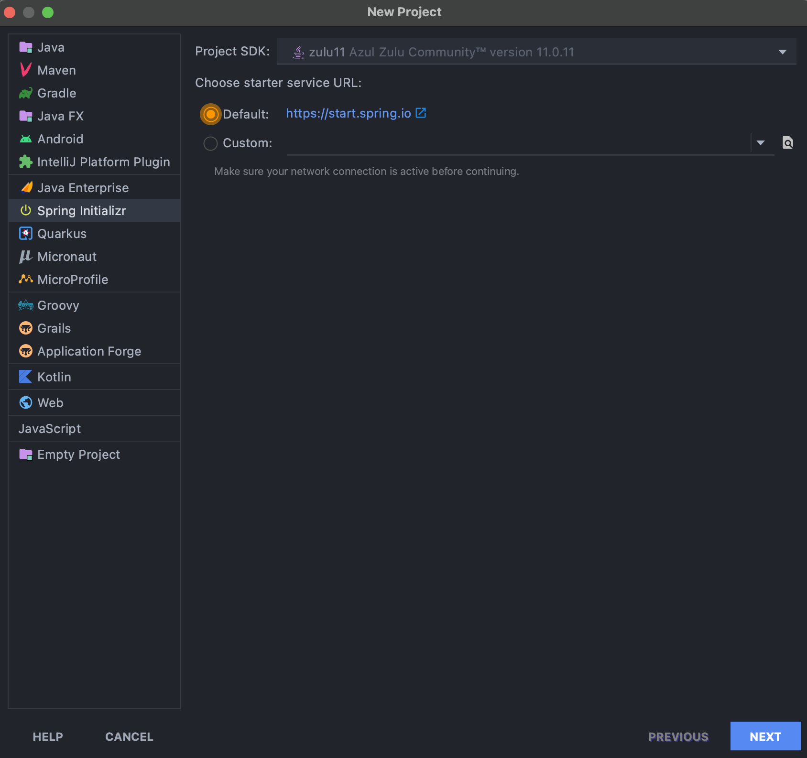
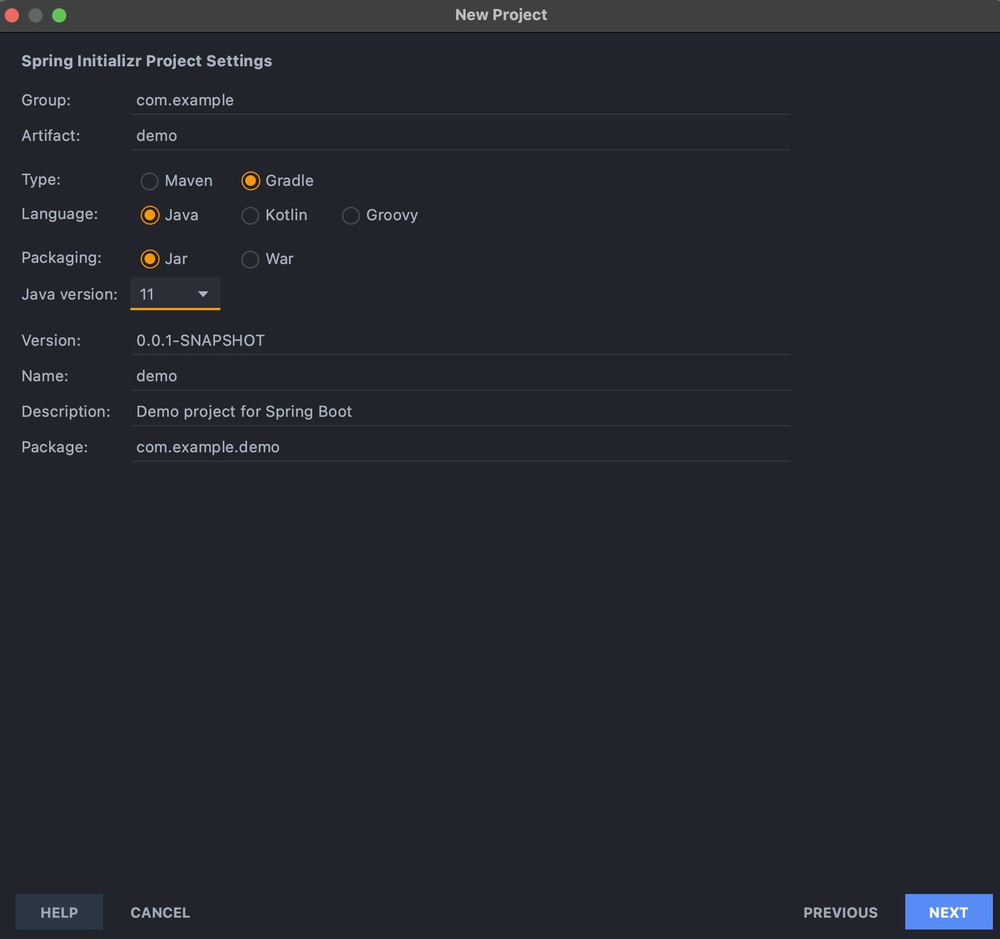
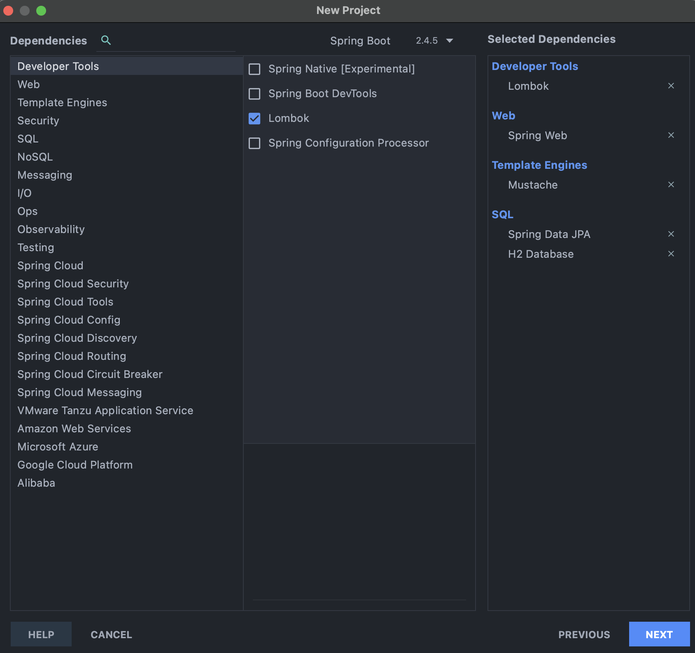
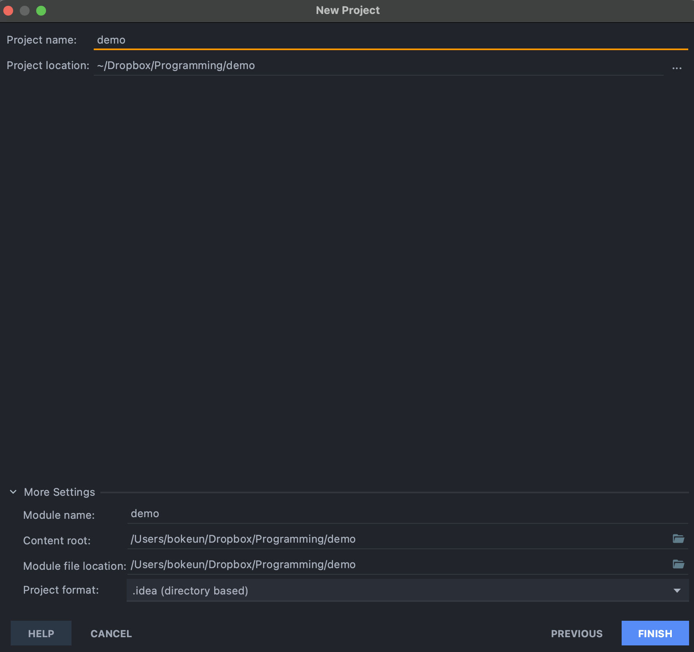

# [Spring Boot] IntelliJ IDEA에서 Spring Boot 프로젝트 생성

- 가볍게 정리해두는 인텔리제이 스프링부트 프로젝트 생성 방법

## STEP 1: 시작 화면

<!-- [##_Image|kage@cHpGIo/btq31bdWuFI/nLoQD8t1PWBiFyaqAW9VP1/img.png|alignCenter|width="100%"|_##] -->

- 인텔리제이 열기
- `NEW PROJECT` 버튼 클릭

## STEP 2: Project SDK 세팅

<!-- [##_Image|kage@wFTRs/btq3YLT4ZrI/DqBnKmn49keutQgF9fZP90/img.png|alignCenter|width="100%"|_##] -->

- 좌측 탭에서 `Spring Initializr` 선택
- `Project SDK`에서 원하는 버전 선택
- Default 선택 후 `NEXT` 버튼 클릭

## STEP 3: 프로젝트 세팅

<!-- [##_Image|kage@ArhZ7/btq35DnpUUQ/xmzaL6rtYphkJH4vTsIhlK/img.png|alignCenter|width="100%"|_##] -->

- Group
- Artifact
- Maven || **Gradle** 선택
- **Java** || Kotlin || Groovy 선택
- **Jar** || War 선택

> [MEMO]
> Jar와 War의 차이  
> JAR: 스프링부트의 내장 톰캣을 이용  
> WAR: 외부 톰캣을 이용

## STEP 4: Dependencies 세팅

<!-- [##_Image|kage@c9pdmu/btq33bEJdYX/esN4Ht56Irz4LnyruOcszk/img.png|alignCenter|width="100%"|_##] -->

- 필요한 디펜던시 선택
- 예시
    - Lombok
    - Spring Web
    - Mustache
    - Spring Data JPA
    - H2 Database

## STEP 5: 프로젝트 경로 지정

<!-- [##_Image|kage@tvgeI/btq30Gyuggq/VVmY2TmKDL7gzQhMSKNBK1/img.png|alignCenter|width="100%"|_##] -->

- 프로젝트 이름 및 경로 세팅
- `FINISH` 버튼 클릭
