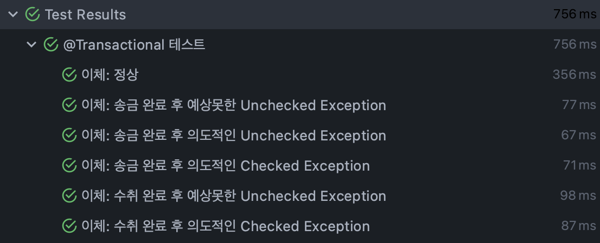
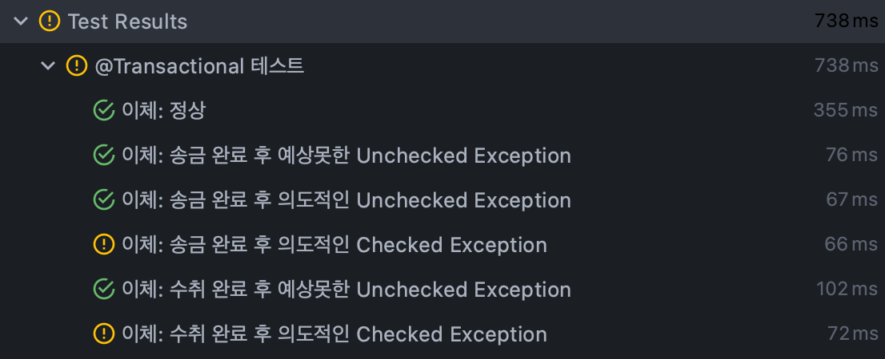

# [Spring Boot] @Transactional 어노테이션의 롤백 테스트

스프링의 `@Transactional` 어노테이션, 언제 커밋이 되고 롤백이 되는가. 중요한 것도 알고 개념도 알겠는데 와닿지가 않아서 직접 테스트 후 정리해봤다.

## Checked vs Unchecked

- Throwable
    - Exception
        - Checked Exception
        - **Unchecked Exception** 
    - **Error**

이 포스팅의 목적은 `@Transactional`이 롤백 수행을 직접 확인해보기 위함이다. 따라서 익셉션의 종류에 대한 설명은 생략한다.

결론만 얘기하면
- `@Transactional`로 묶인 메소드는 기본적으로 `Unchecked Exception`과 `Error`가 발생하면 DB 작업 내역을 롤백한다.
- 별도의 설정을 통해 롤백 기준을 관리할 수 있다.

## 테스트

트랜잭션에 대한 내용을 찾아볼 때 가장 흔히 드는 예시가 은행 업무다. 돈만큼 정확해야 하고 오류가 나면 안 되는 케이스도 잘 없기 때문. 오직 어떤 경우에 DB에 커밋이 되고, 롤백이 되는지 확인하기 위한 아주 간단한 서비스를 만들어보았다. 3개의 클래스로 이루어져있다.

1. `AccountService`
    - 계좌 생성, 계좌 조회, 이체 로직이 아주 심플하게 구현되어 있다.
        - 계좌 생성: openAccount()
        - 계좌 조회: getAccount()
        - 계좌 이체: transfer()
            1. send()
            2. receive()
2. `Account`
    - 아이디: Long id
    - 잔액: Long amount
3. `AccountRepository`
    - JPARepository<Account, Long>

각 클래스의 코드는 아래와 같다.

### AccountService

#### 계좌 생성 && 계좌 조회

```java
/**
 * 신규 계좌 생성
 */
public Account openAccount(Account account) {
    return accountRepository.save(account);
}

/**
 * 계좌 조회
 */
public Account getAccount(Long accountId) {
    return accountRepository.findById(accountId).get();
}
```

계좌 생성은 `Account` 객체를 `ACCOUNT` 테이블에 삽입한다. 중복 체크 등은 생략했다. 계좌 조회는 계좌 아이디로 객체를 가져온다. 마찬가지로 Null 체크 등은 생략했다.

#### 이체

```java
/**
 * 이체
 */
@Transactional
public Map<String, Account> transfer(Long senderId, Long receiverId, Long amount) throws Exception {

    Map<String, Account> result = new HashMap<String, Account>();
    result.put("sender", send(senderId, amount));
    result.put("receiver", receive(receiverId, amount));
    log.info("Transfer Result: {}", result);

    if (receiverId == 333L) {
        String statement = null;
        log.info("Transaction Statement: {}", statement.toString());
    }

    if (receiverId == 222L) {
        throw new Exception("Intentional Checked Exception");
    }

    return result;
}
```

이체도 아주 단순하게 구현되어 있다. 먼저 송금인 계좌에서 요청 금액만큼 잔액을 차감한다. 그리고 수취인 계좌에 요청 금액만큼 잔액을 더한다. 변경된 상태의 계좌 정보를 맵에 담에 반환한다.

여기서 이체는 DB의 상태가 변경된다. 그리고 처리 결과는 항상 정확해야 한다. 그래서 `@Transactional`로 묶어줘야 한다. 근데 여기서 궁금증이 생긴다.

- `CASE 1` ***송금 전***에 예외가 발생한다면?
    - DB에는 아무 일도 발생하지 않을테니 문제가 없다.
- `CASE 2` ***송금 완료 후 수취 완료 전***에 예외가 발생한다면?
    - 송금 작업 내역 또한 무효가 되어야 한다.
    - 안 그러면 돈 보낸 사람은 있는데, 받은 사람은 없는 상황이 발생한다.
- `CASE 3` ***수취까지 완료된 후 결과를 리턴하기 전***에 예외가 발생한다면?
    - 예를 들어 각각의 송금, 수취 내용을 바탕으로 이체 결과를 따로 기록하는 테이블이 있다고 해보자.
    - 보내고 받고 다 했어도 기록이 없으면 나중에 문제 소지가 있다.

#### 송금 && 수취
```java
/**
 * 송금
 */
private Account send(Long senderId, Long amount) throws Exception {

    log.info("Sender ID: {}", senderId.toString());

    Optional<Account> sender = accountRepository.findById(senderId);
    sender.ifPresentOrElse(s -> {
        s.setAmount(s.getAmount() - amount);
        s = accountRepository.save(s);
    }, () -> {
        throw new RuntimeException("No Sender Found");
    });

    return sender.get();
}

/**
 * 수취
 */
private Account receive(Long receiverId, Long amount) throws Exception {

    log.info("Receiver ID: {}", receiverId.toString());

    if (receiverId == 777L) {
        throw new RuntimeException("Intentional RuntimeException");
    }

    if (receiverId == 555L) {
        throw new ClassNotFoundException("Intentional ClassNotFoundException");
    }

    if (receiverId == 333L || receiverId == 222L) {
        return accountRepository.save(new Account(receiverId, amount));
    }

    Optional<Account> receiver = accountRepository.findById(receiverId);
    receiver.ifPresentOrElse(r -> {
        r.setAmount(r.getAmount() + amount);
        r = accountRepository.save(r);
    }, () -> {
        throw new RuntimeException("No Receiver Found");
    });

    return receiver.get();
}
```

각각 송금인 아이디와 수취인 아이디, 그리고 요청 금액을 받는다. 아이디로 계좌를 조회하고, 요청 금액만큼 잔액을 가감한 후 DB를 업데이트 한다. 조회 결과가 없으면 예외를 리턴한다. 그런데 수취인 처리 메소드는 테스트 목적으로 몇 줄 더 추가했다. 어떤 케이스를 위한건지는 주석 참조.

### Account && AccountRepository

-  `Account`는 Long 자료형의 `id`와 `amount` 필드를 가지고 있다. 
- `AccountRepository`는 JpaRepository<Account, Long>을 상속하는 인터페이스다.

### 테스트 코드

테스트 코드의 기본 로직은 다음과 같다.
- 매 테스트 메소드 전에 신규 계좌 2개를 생성한다. 송금 계좌는 10만원, 수취 계좌는 0원의 초기값을 가지고 있다.
- 매 번 송금 계좌에서 수취 계좌로 5만원을 이체한다. 
- 적절한 예외 발생을 위해 수취 계좌 아이디를 다르게 설정한다.잋
- 정상 수행의 경우 잔액을, 예외 발생 테스트의 경우 예외와 잔액을 확인한다.

```java
private Account sender;
private Account receiver;

@BeforeEach
public void beforeEach() {
    sender = accountService.openAccount(new Account(100000L));
    receiver = accountService.openAccount(new Account(0L));
}

@Test
@DisplayName("이체: 정상")
public void _11_testTransferTransaction() throws Exception {

    Map<String, Account> result = accountService.transfer(sender.getId(), receiver.getId(), 50000L);

    assertThat(result.get("sender").getAmount()).isEqualTo(50000L);
    assertThat(result.get("receiver").getAmount()).isEqualTo(50000L);
}

@Test
@DisplayName("이체: 송금 완료 후 예상못한 Unchecked Exception")
public void _12_testTransferTransaction2() {

    Exception e = assertThrows(Exception.class, () -> {
        accountService.transfer(sender.getId(), null, 50000L);
    });

    assertThat(e.getClass().getSimpleName()).isEqualTo("NullPointerException");
    assertThat(accountService.getAccount(sender.getId()).getAmount()).isEqualTo(100000L);
    assertThat(accountService.getAccount(receiver.getId()).getAmount()).isEqualTo(0L);
}

@Test
@DisplayName("이체: 송금 완료 후 의도적인 Unchecked Exception")
public void _13_testTransferTransaction3() {

    Exception e = assertThrows(Exception.class, () -> {
        accountService.transfer(sender.getId(), 777L, 50000L);
    });

    assertThat(e.getMessage()).isEqualTo("Intentional RuntimeException");
    assertThat(accountService.getAccount(sender.getId()).getAmount()).isEqualTo(100000L);
    assertThat(accountService.getAccount(receiver.getId()).getAmount()).isEqualTo(0L);
}

@Test
@DisplayName("이체: 송금 완료 후 의도적인 Checked Exception")
public void _14_testTransferTransaction4() {

    Exception e = assertThrows(Exception.class, () -> {
        accountService.transfer(sender.getId(), 555L, 50000L);
    });

    assertThat(e.getMessage()).isEqualTo("Intentional ClassNotFoundException");
    assertThat(accountService.getAccount(sender.getId()).getAmount()).isEqualTo(50000L);
    assertThat(accountService.getAccount(receiver.getId()).getAmount()).isEqualTo(0L);
}

@Test
@DisplayName("이체: 수취 완료 후 예상못한 Unchecked Exception")
public void _15_testTransferTransaction5() {

    Exception e = assertThrows(Exception.class, () -> {
        accountService.transfer(sender.getId(), 333L, 50000L);
    });

    assertThat(e.getClass().getSimpleName()).isEqualTo("NullPointerException");
    assertThat(accountService.getAccount(sender.getId()).getAmount()).isEqualTo(100000L);
    assertThat(accountService.getAccount(receiver.getId()).getAmount()).isEqualTo(0L);
}

@Test
@DisplayName("이체: 수취 완료 후 의도적인 Checked Exception")
public void _16_testTransferTransaction6() {

    Exception e = assertThrows(Exception.class, () -> {
        accountService.transfer(sender.getId(), 222L, 50000L);
    });

    assertThat(e.getMessage()).isEqualTo("Intentional Checked Exception");
    assertThat(accountService.getAccount(sender.getId()).getAmount()).isEqualTo(50000L);
    assertThat(accountService.getAccount(receiver.getId()).getAmount()).isEqualTo(0L);
}
```

테스트는 다음 4가지 상황을 구현했다.

1. 정상적으로 이체 완료
2. 송금 완료 후 예상치 못하게 발생한 Unchecked Exception 
    - null.toString()을 수행하도록 유도되어 있다.
3. 송금 완료 후 의도적으로 발생시킨 Unchecked Exception
    - 수취인 ID가 777일 때 발생하도록 했다.
4. 송금 완료 후 의도적으로 발생시킨 Checked Exception
    - 수취인 ID가 555일 때 발생하도록 했다.
5. 수취 완료 후 예상치 못하게 발생한 Unchecked Exception
    - 수취인 ID가 333일 때 발생하도록 했다.
6. 송금 완료 후 의도적으로 발생시킨 Checked Exception
    - 수취인 ID가 222일 때 발생하도록 했다.

### 수행 결과

각 케이스의 비즈니스적 기대 결과와 실제 수행 결과는 아래와 같다.

|번호|예외 종류|논리적 기대 결과|실제 수행 기대 결과|
|---|---|---|---|
|1|정상 수행|송금인 5만원, 수취인 5만원|송금인 5만원, 수취인 5만원|
|2|Unchecked|송금인 10만원, 수취인 0원|송금인 10만원, 수취인 0원|
|3|Unchecked|송금인 10만원, 수취인 0원|송금인 10만원, 수취인 0원|
|***4***|***Checked***|***송금인 10만원, 수취인 0원***|***송금인 5만원, 수취인 0원***|
|5|Unchecked|송금인 10만원, 수취인 0원|송금인 5만원, 수취인 0원|
|***6***|***Checked***|***송금인 10만원, 수취인 0원***|***송금인 5만원, 수취인 0원***|

그리고 테스트 코드를 돌려보았다.


<!-- [##_Image|kage@b4fpzN/btq4MgE0hBV/9VPkSCRGY1RdoMNlJ8JhIK/img.png|alignCenter|width="100%"|_##] -->

테스트 코드가 모두 통과되었다. 수행 기대 결과대로 4, 6번 `Checked Exception`이 발생한 경우는 롤백되지 않음을 확인할 수 있었다.

### rollbackFor 파라미터

그렇다면 모든 예외에 대해서 롤백을 수행하고 싶다면 어떻게 해야될까?

```java
@Transactional(rollbackFor = {Exception.class})
public Map<String, Account> transfer(Long senderId, Long receiverId, Long amount) throws Exception {

    Map<String, Account> result = new HashMap<String, Account>();
    result.put("sender", send(senderId, amount));
    result.put("receiver", receive(receiverId, amount));
    log.info("Transfer Result: {}", result);

    if (receiverId == 333L) {
        String statement = null;
        log.info("Transaction Statement: {}", statement.toString());
    }

    if (receiverId == 222L) {
        throw new Exception("Intentional Checked Exception");
    }

    return result;
}
```

위와 같이, `@Transactional` 어노테이션에 `rollbackFor` 파라미터를 지정해주고, `Exception.class`를 넣어줬다. 그리고 다시 테스트 코드를 돌려봤다.


<!-- [##_Image|kage@bpkdsX/btq4NLc9MmH/SPXamjOlQxFwaTuF0gudr1/img.png|alignCenter|width="100%"|_##] -->

4번과 6번 테스트가 통과하지 못했다. 롤백이 되지 않으니 송금인 5만원, 수취인 0원의 잔액이 있을 것이라고 테스트 코드에 작성했는데 롤백이 되어 10만원, 0원의 잔액이 확인된 것이다.


> 테스트 만들고 글 쓰는데까지 상당히 시간이 많이 소요됐지만, @Transactional 어노테이션이 좀 더 와닿는 시간이었다.