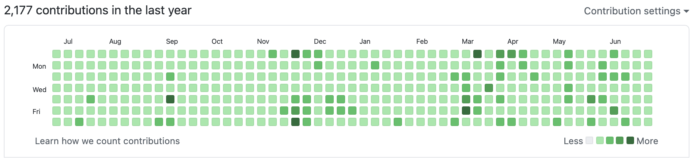

# 365일간의 1일 1커밋 회고

who, what, where, when, why, how

## Who

### 1일 1커밋을 시작하는 시점에서의 나는?

- 부서 배치 후 13개월이 지난 주니어 백엔드 개발자
- 회사에서는 자바, 스프링, 오라클을 주로 사용했다
- 주문/클레임 개발 팀에서 제휴 API를 담당하고 있었다.
- 경제학 전공, 유학동양학을 복수전공한 비전공 출신 개발자

## Why

2020년에는 서른살이 됐다. 그래도 서른이 되어도 별 느낌이 없을 줄 알았는데 생각보다 생각이 많았다. 앞으로 무엇을 해야하나에 대한 생각이 계속 들었다. 그래서 자연스럽게 난 지금까지 무엇을 해왔나, 지난 20대를 쭉 곱씹어보고, 돌이켜보는 시간을 계속 가졌다.

> 난 무엇을 할 때 가장 즐거웠을까?
나는 무엇을 했는가, 무엇을 할 때 즐거웠고, 지금 가장 의미있었던 시간으로 남는가. 내가 해야지 하고 했던 것, 해야지 하고 하지 못했던 것.

20살이 될 때부터, 난 취직 뭐 그런 건 잘 모르겠고 일단 최대한 많은 경험을 하는 게 목표였었다. 나름 적지 않은 경험을 했던 것 같고, 그 기억들을 계속 돌려보고 돌려봤다.

결론적으로 이제 와서 나한테 재밌게 살았다고 기억에 남는 시간들은 가장 바쁘고 열심히 살았을 때였다.

해가 뜰 즈음에 집에서 나와서 막차를 타고 집에 들어오던 날들. 밤새 작업하다가 아침 수업 가던 날들. 무언가 목표를 가지고, 그 목표를 위해서 매진하던 날들이 나한테는 20대의 가장 좋은 기억으로 남아버렸다. 반면에 마냥 놀면서 편하게 지냈던 날들도 있다. 매일 같이 술 먹고, 놀러가고 별 걱정없이 편하게 지냈던 시기들. 보통 그런 시기들을 재밌었다고 얘기하고, 나도 그 당시 재밌게 지내긴 한 것 같은데 이제 와서 돌이켜보니 별로 재밌었단 느낌이 안 든다.

그리고 내가 앞으로 무엇을, 어떻게 하며 살아야할까 결론을 내릴 수 있었다. 일단 목표는 

- 1일 1커밋
- 주 3회 크로스핏

### 1일 1커밋이 어떤 의미가 있을까?

왜 했냐고 물었을 때, 그냥 해보고 싶어서라고 답할 수 밖에 없다. 원래 나의 모든 행동에 큰 의미나 이유를 두고 하지는 않는다. '그냥 해보고 싶어서'가 내가 해왔던 많은 경험들의 큰 동기였고, 그렇게 했던 모든 경험들에서 어떤 교훈을 얻어왔었다. 일단 해보고, 거기서 배우기.

## What

### 무엇을 커밋했는가.

#### 1. 알고리즘 문제풀이

지난 1년간 커밋에서 상당한 비중을 차지하고 있다. 일단 매일 무언가를 커밋할만큼 대단한 사이드 프로젝트를 하고 있거나, 아이디어가 있지도 않았다. 그리고 

#### 2. 사이드 프로젝트

이것저것 사이드 프로젝트를 많이 벌렸었다. 많이 벌린 이유는 커밋할 거리를 만들기 위해서가 컸다. 단지 알고리즘만 주구장창 풀어서 커밋하기에는 1일 1커밋 프로젝트에서 얻을 수 있는 것이 적다고 생각했기 때문이다.

#### 3. 블로그 포스팅

프로젝트를 시작한지 10개월쯤 된 시점에서 시작했다. 계기는 흔히 말하는 네카라쿠배 중 한 회사의 면접이었다. 그동안 막연히 CS의 중요성에 대해서 생각하면서도, 일단 커밋을 하기 위해 무언가 '코딩'을 할 필요가 있었다. 프로젝트의 본질은 '학습'이었는데, 학습의 여러 방법 중 하나인 '코딩'에만 집중해 있었던 것이다.

이제는 CS 공부를 시작해야할 때라고 생각했고, 한동안 멈췄던 티스토리 블로그를 다시 시작했다. 그리고 마크다운으로 포스팅을 작성하고, 깃허브에 저장하기로 했다.

 - `티스토리에 쓴 컨텐츠`가 아니라 '내가 작성한 컨텐츠'로서, 블로그 플랫폼에 발행하고 끝이 아니라 지속적으로 내용을 업데이트 하는 나의 지적 자산이 되어야 한다고 생각했다.
 - 깃허브 페이지, 벨로그 등 개발자가 주로 쓰는 블로그 플랫폼은 마크다운을 지원하기 때문에 향후 블로그 이전을 원할 때 쉽게 옮길 수 있을 것이라 생각했다.

### 무엇을 얻었는가.

이 포스팅에서 가장 중요한 문단인 것 같다.

나는 습관이 중요하다고 생각하는 사람이다.

강성태의 66일 공부법

## Where

## When

2020년 5월 17일 ~ 2021년 5월 16일

## How

1일 1커밋은 사실 2020년 5월 17일에 땡! 하고 시작했던 것은 아니다. 2018년에 처음 깃허브를 사용해보고, 같이 공부하던 친구한테 잔디밭이 무엇인지 설명을 들었을 때부터 이거 꽉 채워보면 좋겠다고 생각했었다. 그런데 쉽지 않았다! 2018년에는 정말 무엇을 커밋해야 할지 몰라서였고, 2019년에는 정말 꾸준히 하는 게 어려워서 실패했다. 2020년이 되면서부터 다시 도전해봤는데, 1~3월까지 뭔가 꾸준히 하긴 했는데, 계속 하루씩 빼먹는 날이 생겼었다.

그리고 내가 정신적, 신체적으로 매우 지쳐있다고 생각했었다. 그래서 4월 중순부터 딱 1달간만 아무 개발도 안 하고 쉬기로 했다. 정확히 31일을 쉬고, 새 잔디밭 컬럼이 시작하는 일요일부터 프로젝트를 재개했다

(2월에 빈 건 관리 안 하는 레포지토리를 삭제해서 그렇다.)