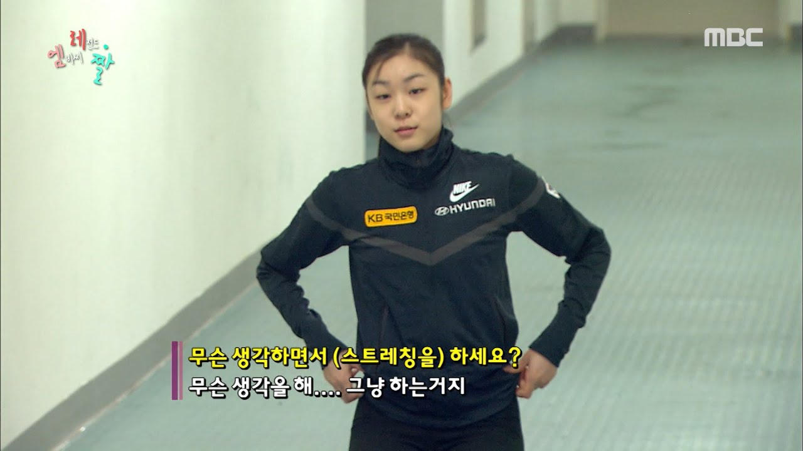

# [Github] 398일간의 1일 1커밋 회고

### 빈틈없이 잘 가꿔진 잔디밭 만들기

2018년에 깃허브의 '잔디밭'이라는 걸 처음 들었을 때부터 한 번 해보고 싶었다. 몇 번 시도해봤지만 쉽지는 않았다. 그러나 결국 성공했고, 1년하고 한 달만에 프로젝트(?)를 종료하게 되었다. 그리고 정리해보는 회고록. 

## When

<!-- [##_Image|kage@pVuaJ/btq9gAGLcYi/6oVsklyPKjF5KJQwHGSRWK/img.png|alignCenter|width="100%"|_##] -->

2020년 6월 7일 ~ 2021년 7월 9일

정확히 398일. 위 이미지는 2021년 7월 3일에 찍었다.

## Who

### 1일 1커밋을 시작하는 시점에서의 나는?

- 14개월 경력의 주니어 백엔드 개발자.
- 업무적으로 자바, 스프링, 오라클을 주로 사용했다.
- 주문개발팀에서 제휴 API를 담당하고 있었다.
- 경제학 전공, 유학동양학을 복수전공한 비전공 출신 개발자.

### 1일 1커밋을 종료한 시점에서의 나는?

- 27개월 경력의 주니어 백엔드 개발자. 주니어급이긴 하지만, 다른 신규 입사자분의 멘토(?) 역할을 하는 중.
- 여전히 자바, 스프링이 메인. 그러나 MSA가 진행되면서 DB를 기존 메인 오라클에서 포스트그레로 변경 중.
- 주문개발팀은 제휴서비스팀으로 분리. 제휴 API 업무는 똑같으나 담당하는 업체가 늘어났다.
- 사이드 프로젝트로 구글/애플 스토어에 게임을 출시했다.

정리를 해보니 지난 1년간 발전이 있긴 했던 것 같다. 회사에서는 이젠 담당 영역에서 메인 개발자로 일하고 있다. 내 이름을 걸고 서비스 출시도 했다. 따로 적진 않았지만 2~5월에는 흔히 말하는 네카라쿠배 중 3곳에서 면접을 봤고, 내가 무엇이 부족했는지, 앞으로 어떤 방향으로 나아가야할지도 다시 한 번 생각해볼 수 있었다.

## Why

사실 1일 1커밋 자체가 무언가 엄청난 걸 보여주는 것은 아니다. 그래서 별로 쓸모없다고 생각하는 의견도 많다고 알고 있다. 그럼에도 내가 이걸 해야겠다 생각한 이유는?

2020년에는 서른이 됐다. 서른이 되어도 별 느낌 없을 줄 알았다. 생각보다 생각이 많았다.

> 앞으로 무엇을 해야하나  
> 어떻게 살아야 하나

위와 같이 30대를 어떻게 보내야 하나에 대한 생각을 제일 많이 했다. 자연스럽게 지금까지의 내 삶을 돌아보는 시간을 많이 가졌다.

> 난 지금까지 무엇을 했지?  
> 어떻게 살아왔지?

결론은 **나는 죽어라 바쁘게 지내고 무언가에 매진할 때 가장 즐거웠다**. 20대의 85퍼센트를 차지하는 대학생활 동안 가장 기억에 남는 시간들을 생각해보니, 공통적으로 아침 해 뜰 때 나가서 밤 막차 타고 들어오던 나날들이었다. 마냥 늘어져라 퍼자고, 오후에 일어나서 술 먹으러 나가고 새벽에 들어오던 날들도 있었다. 그럴 때가 더 재밌는 시기일 것 같은 이미지가 있는데, 정작 나한테 **아 이 때 좋았지**라고 기억에 남은 시간은 무언가 바쁘게 열심히 할 때였다.

그래서 앞으로 어떻게 살아야할지에 대한 결론을 내릴 수 있었다. 그래서 우선 작은, 하지만 쉽지는 않은 목표를 세우기로 했다. 

- 1일 1커밋
- 주3회 이상 크로스핏

무언가를 성실하게 꾸준히 하는 것은 굉장히 중요한 능력이라고 생각한다.

## How

<!-- [##_Image|kage@V6HLV/btq9nDBxwW9/FyKGTesxkaDwaFkO5vqhk0/img.jpg|alignCenter|width="100%"|_##] -->

그냥 퇴근하고 집에 바로 안 들어가고 운동 끝나고 카페로 갔다. 거리두기 이전에는 매일 밤 11시-12시 정도에 집에 들어왔다.

원래 1일 1커밋 프로젝트 시작은 2월말이었다. 그 때는 크로스핏을 집 근처에 해서 우선 퇴근하고 집에 왔었다. 집에서 저녁을 먹으니 자연스럽게 침대에서 약간 쉬게 됐다. 그리고 그대로 잠들고 12시가 넘어버린다거나 하는 불상사가 종종 발생했다.

<!-- [##_Image|kage@51TzK/btq9gBeDp8A/KcGfdjMdQi6vQ3t1sFKzF0/img.png|alignCenter|width="100%"|_##] -->

그리고 내가 좀 지친 것 같단 생각도 계속 있었다. 쉴 땐 확실히 쉬어줘야 한다고 생각한다. 처음부터 운동, 개발 둘 다 잡으려고 하니 버거운 것 같기도 했다. 4월 중순쯤부터 그냥 한달을 확 쉬어버리기로 했다. 회사에 있는 시간을 제외하고는 컴퓨터 건드리지도 않기. 

5월 중순까지 4주반을 푹 쉬고 놀고 먹고 하다가, 프로젝트를 재개했다. 크로스핏 3개월 등록기간도 마침 끝나서 회사 근처로 박스를 옮겼다. 퇴근하자마자 운동부터 하고, 밥은 사먹고, 집에 안 들어가고 카페에서 노트북을 펴고 작업을 시작했다. 그렇게 그냥 아무 생각없이 쭉 했다. 

## Where

주로 서울 어딘가의 카페. 작년 12월에 모니터를 산 뒤로는 집에서도 한다. 근데 책상이랑 의자가 불편해서 어깨가 너무 아프다. 넓은 집으로 이사 가서 작업 환경을 갖춰두고 싶은 욕심이 생겼다.  

## What

### 무엇을 커밋했나

크게 3가지로 나눌 수 있을 것 같다.

- 알고리즘 문제풀이
- 사이드 프로젝트
- 블로그 포스팅

#### 1. 알고리즘 문제풀이

프로그래머스와 리트코드 문제의 솔루션 레포지토리를 팠다. 어쨌든 알고리즘은 꾸준히 계속 풀어야 한다고 생각했으니깐. 매일매일 의미있는 난이도의 문제를 푼 건 아니었다. 하지만 레벨 1의 문제라도 약간의 의미는 있었다고 생각한다. 나중에 솔루션을 다시 보니 스트림을 써서 가독성을 높일걸 for문으로 길게 늘여썼다거나, 하는 식으로 문제 풀이법 외적인 것들에 대해서도 발전이 있었음을 느꼈다.ㄴ 

#### 2. 사이드 프로젝트

2개의 사이드 프로젝트를 완료했다. 1번은 가벼운 개인 웹사이트. 이력서 겸 포트폴리오 겸 셀프 브랜딩 겸 학습용 테스트 코드 등등 여러 목적으로 사용할 프로젝트였다. 처음에는 이거 만들면서 코틀린을 학습해보려고 했다가, 자바로 하는 게 더 활용도가 높을 것 같아서 중간에 갈아 엎었다. 회사에선 쓸 일 없는 Docker랑 AWS도 한 번 건드려볼 수 있었고, AWS 메모리 부족으로 내리긴 했는데 카프카도 좀 막연했는데 직접 좀 해보면서 이해도를 높일 수 있었다. 프리티어 끝나고 돈을 내야할 때가 오면 카프카랑 젠킨스를 적용해서 개선을 좀 시켜봐야겠다. 

2번은 냥극탐험 게임. 혼자 유니티를 건드려본지 1년만에, 디자이너랑 같이 첫 작업을 시작한지 딱 6개월만에 구글 플레이와 애플 앱스토어에 게임을 출시할 수 있었다. 업무랑 직접적으로 관련은 없긴 하다. 업무 관점에서 보면 비효율적이긴 했다. 그래도 일단 재미있었다! 그리고 게임을 개발하며 객체지향에 대한 이해가 좀 더 높아졌던 것 같다.

#### 3. 블로그 포스팅

이건 비교적 최근에 시작했다. CS 공부의 필요성을 느끼면서도 일단 '커밋'을 매일 해야해서 제대로 시작을 못하고 있었다. 프로젝트으 본질은 '학습'이었는데, 학습의 여러 방법 중 하나인 '코딩'에만 집중하고 있었던 것이다. 그래서 블로그를 다시 시작하고, 마크다운으로 포스팅을 하기로 했다. 깃허브에 각 컨텐츠를 저장함으로써, 블로그에 비해 컨텐츠를 다시 보고 업데이트기가 더 편해졌다고 생각한다. 많은 개발 블로그 플랫폼들이 마크다운을 지원하기 때문에 블로그를 옮길 때 더욱 쉽게 옮길 수도 있을 것이다.

### 무엇을 얻었나.

명확한 인과관계는 없다. 다만 유의미한 상관관계가 있다고 생각한다. 무언가를 매일 한다는 건 결코 아무 의미가 없지 않다고 생각한다. 물론 아무 의미없는, 예를 들어 주석 한 줄 달아두는 커밋을 1년간 하는 건 의미가 없긴 하겠다. 근데 뭐 내가 그런 식으로 한 건 아니니깐.

#### 1. 2개의 프로젝트 완결

어쨌든 나는 2개의 사이드 프로젝트를 완성했다. 항상 시작보다 끝맺음을 잘하는 게 어렵다. 물론 종료라고 완전 종료는 아니고 계속 업데이트할 프로젝트들이긴 하지만, 1.0 버전을 공개된 장소에 올려두었다는 것 자체가 큰 의미가 있다고 생각한다.

#### 2. 개발 습관

노력은 습관이라고 생각한다. 시간은 생각보다 금방 간다. 내일 해야지, 오늘 하루 쯤 미뤄도 돼 하다보면 몇날며칠이 훌쩍 갔던 것 같다. 작게라도 오늘 하고 별 의미가 없는 일이라도 오늘 하다보면 하루쯤은 크고 의미가 없는 일을 할 것이다. 이렇게라도 매일 하는 경우가, 그렇지 않은 경우보다 의미 있는 일을 하는 횟수가 더 많을 것이라고 나는 생각한다.

### 3. 자신감

어쨌든 난 무엇을 해도 할 것 같다. 20대 초반까지 계속 이런 생각을 하면서 살았었다. 근데 30대가 되니깐 그런 생각이 들었다. 나는 입만 산 놈은 아닐까. 말만 하고 행동은 하지 않는 사람. 주변에서 쉽게 볼 수 있는데, 나도 그런 사람들 중 한 명은 아니었을까. 성공하든 실패하든, 어쨌든 나는 내가 무언가를 하는 사람이라는 건 증명한 것 같다.  

<!-- [##_Image|kage@c6q50j/btq9ml2cHMh/svQPkaglkN6YRkQke2S9hK/img.gif|alignCenter|width="100%"|_##] -->

개발 외적으로 또 다른 목표였던 머슬업은 불과 6개월만에 성공했다.

### 앞으로 무엇을 할까

원래는 딱 1년 커밋을 이어가고 회고록을 작성하려고 했었다. 그런데 6월은 게임 출시 준비가 한창이라 바빴다. 그래서 일단 관성을 유지했다. 7월 1일 게임을 출시하고 초반 업데이트 작업을 하며 7월 8일에 1.2 버전을 출시하며 당장 해야할 일들을 마쳤다.

6월 쯤부턴가 내내 생각하기를, 아무래도 번아웃이 왔던 것 같다. 그래서 다시 작년 4-5월처럼 푹 쉬어주기로 결정했다. 8월말까지 여름방학을 가질 생각. 마침 실리콘밸리 시즌 5,6이 왓챠에 올라왔다. 일단 이걸 좀 봐야겠다. 물론 작년처럼 아예 아무 것도 안 하지는 못할 것 같다. 게임 업데이트가 있을 수도 있고, 공부나 블로그 포스팅도 좀 틈틈이 하긴 하겠지만, 약간은 널널하게 살아봐야겠다.