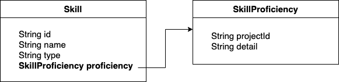

# [JPA] N+1 문제 해결


개인 이력서 웹사이트 JPA N+1 문제 해결


## 기

이력서 목적으로 웹사이트를 하나 띄워서 운영하고 있다.

오버스펙일 순 있겠지만 컨텐츠는 DB로 별도 분리해서 관리하고 있다.

처음 만들 당시에는 회사에서 JPA를 쓸 일이 없어 JPA로 만들어 봤는데,

딱히 공부를 했다기보단 이렇게 하니깐 CRUD가 되는군, 참 쉽다 요 정도로 사용만 했었다.


그리고 최근에 간만에 이력서 업데이트 겸 프로젝트 업데이트도 했는데 테스트 중에 문제를 발견했다.


컨트롤러 한 번 호출했는데, 쿼리가 몇 개가 나가는거지.

지금이야 JPA 공부를 한 번 해둔 상태라, 어떤 문제인지 바로 알 수 있었다.

JPA를 조금만 찾아봐도 들어봤을 N+1 문제였다.


## 승

### N+1이란?

이건 사실 1+N 문제라고 하는 편이 정확하다.

N+1이라 하면, N개 조회를 하는데 1개가 더 나간다는 어감이다.

사실은 1번만 나가면 될 쿼리인데, 불필요한 쿼리가 N번 더 나간다는 의미이다.

1:N 관계의 테이블에서 1 쪽을 먼저 불러왔는데, 연관된 N 쪽의 데이터도 불러오기 위해 N번 쿼리가 나가는 것이다.

N:1 관계의 경우도 마찬가지인데, 이건 N+M이라 하는 게 더 정확할 것도 같다.

불러온 N개 데이터에서 참조하는 데이터가 M개면 M번 불러와야 하니깐.

어쨌든 핵심은 필요 이상의 DB 요청을 한다는 것이다.


### 언제 발생하지?

N+1은 1:N, 혹은 N:1 관계의 데이터를 조회할 때 발생한다.

그냥 Join으로 한 번에 가져올 수 있는 걸 여러 번에 걸쳐 가져온다고 이해해도 무방할 것 같다.


위 로그 이미지를 다시 봐보자.

1번은 내가 수행한 프로젝트 리스트를 조회하는 쿼리이다.

그럼 `PROJECT` 테이블에는 프로젝트의 개요 데이터 들어가 있는데, 여기서 조건에 맞는 걸 모두 불러온다.

근데 이력서는 프로젝트 개요만으로는 부족하다.

 프로젝트의 상세 설명이 있어야 내가 기여한 내역을 글만으로 더 잘 전달할 수 있을 것이다.

그래서 프로젝트에서 내가 진행한 구체적인 업무를 적은 `PROJECT_DETAIL`이란 테이블이 있다.

프론트에서는 이렇게 가져온 각 프로젝트 개요와 매핑된 상세 내용을 목록으로 보여주도록 되어있다.


그림으로 표현하면 다음과 같은 구조다.

컬럼은 일부 생략했다.


반면에 엔티티간의 관계, 즉 객체 관계는 다음 그림과 같다.


테이블에서는 `PROJECT_DETAIL`이 `PROJECT`의 ID를 외래키로 갖고 있다.

반면 엔티티는 `Project`가 여러개의 `ProjectDetail`을 리스트로 갖고 있다는 차이가 있다.


`Project`를 조회한다고 해보자.

JPA는 먼저 `PROJECT` 테이블에서 `Project` 엔티티를 가져온다.

그리고 가져온 `Project`의 수만큼 `PROJECT_DETAIL`을 또 찔러서, 각 `Project`에 매핑된 `ProjectDetail` 리스트를 채워넣는다.


즉 위 로그 이미지에서 1번 쿼리는 `PROJECT`를 조회하는 `select * from PROJECT` 쿼리이다.

그리고 화살표 친 박스의 쿼리들은 조회된 각 `PROJECT` 데이터와 연결된 `PROJECT_DETAIL`의 데이터를 조회하는,

 `select * from PROJECT_DETAIL where PROJECT_ID = #{id} `이다.

여기서 박스 안에 7개의 쿼리가 있으니깐 `select * from PROJECT`는 7개의 데이터를 가져왔다는 것을 알 수 있다.


2번은 N:1의 경우다.

내가 경험해본 기술들을 `SKILL` 테이블에서 조회하는 쿼리다.

근데 내가 각 기술을 알고있는 수준을 설명하기 위해 `SKILL_PROFICIENCY`라는 테이블을 별도로 만들었다.

각 `SKILL` 데이터는 `SKILL_PROFICIENCY`의 `ID`만 들고 있고, 숙련도의 상세 내용은 `SKILL_PROFICIENCY`에서 조인으로 가져온다.

테이블과 객체 관계는 아래와 같다.




그럼 2번 쿼리는 `SKILL` 테이블에서 데이터를 불러오는 쿼리고,

화살표 친 3개의 쿼리는 `SKILL_PROFICIENCY`에서 데이터를 불러오는 쿼리임을 알 수 있다.


다만 이 경우는 `SKILL`에서  `SKILL_PROFOCENCY` 조회를 3번만 했다고 할 수는 없다.

예를 들어서 내 기술(숙련도)가 자바(3), 오라클(2), PostgreSQL(2), JPA(3), Kafka(1)이라고 가정해보자.

5개의 데이터를 불러왔고, 각 데이터에 매핑된 숙련도를 가져와야 한다.


하지만 JPA의 영속성 컨텍스트는 한 번 가져온 데이터에 대해서는 또 쿼리를 날리지 않게 해준다.

즉 자바에 매핑된 숙련도 `select * from SKILL_PROFICIENCY where ID = 3`으로 한 번 `SkillProficiency`를 조회한 다음에,

JPA의 숙련도를 조회할 때는 DB를 거치지 않고 영속성 컨텍스트에서 바로 같은 엔티티를 가져오는 것이다.

여기서 숙련도는 1, 2, 3 세개기 때문에 박스 안의 쿼리는 3번만 날라간 것을 확인할 수 있다.

만약 영속성 컨텍스트가 없다면, 5개 기술을 조회했으니깐 쿼리도 5번 날라갈 것이다.


### 왜 발생하지?

그럼 N+1은 대체 왜 발생할까?

결론만 얘기하면 JPA가 처음부터 연관된 엔티티까지 모두 조인해서 가져오지 않고, 연결된 엔티티를 사용할 때 가져오기 때문이다.

이걸 **JPA가 SQL을 만들 때는 글로벌 페치 전략을 참고하지 않고 JPQL만 사용한다**라고 표현한다.


이게 무슨 말이냐, 

`findProject()`를 호출하면, 뭐 Join 이런 거 상관을 안 한다. 

그냥 `select p from Project p`라는 JPQL로 `select * form Project`라는 SQL을 만든다.

그래서 `Project`를 가져왔다.

근데 여기에 연관된 `ProjectDetail`이 있네?

그럼 다시 `select pd from ProjectDetail pd`라는 JPQL로 `select * from PROJECT_DETAIL`을 만든다.

그걸 각각의 모든 `Project`에 대해 수행하는 것이다.


이 때 `Project`를 가져오자마자 바로 `ProjectDetail`을 가져오느냐, 아니면 나중에 가져오느냐가 바로 페치 전략이다.

즉시로딩, 또는 지연로딩이 있는데 이건 뒤에서 따로 정리한다.

어쨌든 중요한 건, SQL을 만들기 전에는 그런 거 신경 안 쓴다는 것이다.


JPA가 그냥 그렇게 만들어져 있다.

처음부터 한 번에 가져오면 되지 왜 이렇게 하나?

이건 결론에 다시 한 번 정리한다.


어쨌든 이 경우는 `List<Project>`를 먼저 가져오고,

각각 한번씩 `getDetails()` 함수를 호출하기 때문에,

총 7번의 `PROJECT_DETAIL` 조회 쿼리가 나간다는 것이 핵심이다.

JPA가 그렇게 되어있다.


## 전

### 어떻게 해결하지?


#### 1) 즉시로딩과 지연로딩

기본적으로 1:N, 혹은 N:1 관계를 설정할 때,

즉 JPA의 `@OneToMany`나 `@ManyToMany` 어노테이션을 사용할 때, 즉시로딩 대신 지연로딩으로 설정하도록 권장한다.


즉시로딩은 말 그대로 엔티티를 조회할 때 **즉시** 연관된 엔티티를 모두 조회하는 것이다.

반대로 지연로딩은 일단 지금 조회하는 엔티티의 쿼리만 날리고, 연관된 엔티티는 그걸 실제로 사용할 때 쿼리를 날리도록 **지연**시킨다.


좀 더 구체적으로 설명하면 즉시로딩은 `Project` 를 가져오자마자 연관된 `ProjectDetail`를 모두 가져와서 `details` 필드를 채워넣는다.

반면에 지연로딩은 `Project`만 가져온다.

안에 `ProjectDetail`이 묶여있어도 그냥 냅둔다.

그리고 `details` 필드는 프록시를 대신 채워넣는다.

이후 `getDetails()` 메소드를 호출하는 등 실제로 엔티티를 사용할 때가 되어서야 연관된 `ProjectDetail`을 가져오는 것이다.


따라서 즉시로딩 대신 지연로딩을 사용하면, 내가 따로 `details` 필드를 건드리지 않는 한 쿼리는 1개만 나간다.

하지만 결국 `details`를 사용한다면, `details`를 사용하는 `Project` 엔티티 수만큼 N개 쿼리가 더 나간다.

근본적인 해결책은 안 되는 것이다.

발생 빈도를 줄이고, 지연시킬 뿐이다.


내 경우 아래처럼 `FetchType.LAZY`로 지연로딩 설정을 해두었지만 N+1이 발생한 게 좋은 예시다. 

```java
@Getter
@Entity(name = "PROJECT")
public class Project {

    @Id
    @Column(name = "ID")
    private String id;
		
		...

    @OneToMany(mappedBy = "projectId", fetch = FetchType.LAZY)
    private List<ProjectDetail> details;
}
```

```java
@Getter
@Entity(name = "SKILL")
public class Skill {

    @Id
    @Column(name = "ID")
    private String id;

  	...

    @ManyToOne(fetch = FetchType.LAZY)
    @JoinColumn(name = "PROFICIENCY", insertable = false, updatable = false)
    private SkillProficiency skillProficiency;
}
```


#### 2) Fetch Join 사용하기

그럼 어떻게 이 문제를 근본적으로 해결할 수 있을까?

결론부터 얘기하면 Fetch Join을 사용하도록 JPQL을 직접 작성해주면 된다.

나는 아래처럼 Repository 코드를 수정했다.

```java
@Repository
public interface PortfolioProjectRepository extends JpaRepository<Project, String> {

  	// 기존 find 메소드
    // List<Project> findAllByDisplayOrderByIdDesc(Boolean display);

  	// JPQL을 직접 작성한 신규 find 메소드
    @Query("select distinct p from Project p left join fetch p.details where display=true order by id desc")
    List<Project> findAllToDisplay();
}
```

```java
@Repository
public interface PortfolioSkillRepository extends JpaRepository<Skill, String> {

  	// 기존 find 메소드
  	// public List<Skill> findAllByDisplay(Boolean display);
  
  	// JPQL을 직접 작성한 신규 find 메소드
    @Query("select s from Skill s join fetch s.skillProficiency where s.display=true")
    public List<Skill> findAllToDisplay();
}
```


그리고 다시 컨트롤러를 호출해보면..

이미지

쿼리 수가 확연하게 줄어드는 걸 알 수 있다.

원래는 `Project` 1번 조회하고 `ProjectDetail` 7번 조회하고, `Skill` 1번 조회하고 `SkillProficiency` 3번 조회,

총 12번 나가는 쿼리였었다. 

그러나 Fetch Join을 사용한 JPQL문을 직접 작성해주니,

 `Project` + `ProjectDetail` 묶어서 1번, `Skill` + `SkillProficiency`묶어서 1번,

총 2번 쿼리가 나가도록 개선되었다.


이외에도 **Batch SIze**나 **EntityGraph**로 개선이 가능하다.

Batch Size의 경우 1+N이 발생할 걸 1+1 정도로 줄여주는 역할을 한다.

EntityGraph도 그닥 추천하는 방법은 아니라고 해서, 더 자세히 알아보지는 않겠다.


## 결

### Fetch Join의 한계

그럼 반드시 Fech Join을 사용하는 것이 더 낫다고 할 수 있을까?

Fetch Join도 만능은 아니다.

한계점이 있다.


#### 1) 컬렉션의 경우 페이징을 하면 안 된다.

`PROJECT`와 `PROJECT_DETAIL`을 조인했을 때 다음 표와 같다고 해보자.

| ID   | NAME                 | PROJECT_ID | SEQ  | DETAIL             |
| ---- | -------------------- | ---------- | ---- | ------------------ |
| P001 | 주문 개발 프로젝트   | P001       | 1    | 장바구니 기능 개발 |
| P001 | 주문 개발 프로젝트   | P001       | 2    | 주문서 기능 개발   |
| P002 | 클레임 개발 프로젝트 | P002       | 1    | 반품 기능 개발     |
| P002 | 클레임 개발 프로젝트 | P002       | 2    | 교환 기능 개발     |

근데 페이징을 했는데, 사이즈가 3이다.

`P001`이야 문제가 없겠으니, `P002`는 `ProjectDetail`이 1개만 포함될 것이다.

실제로는 2개인데.

문제가 된다.

그래서 하이버네이트는 전체 데이터를 조회하고, 메모리에서 페이징 처리를 한다.

물론 이건 매우 비효율적이고 위험하기까지 하다.

쓰면 안 된다.


#### 2) 둘 이상의 컬렉션을 Fetch 할 수 없다.

1:N의 관계에서도 데이터가 상당히 늘어날 수 있다.

1:N:M의 관계는 더욱 위험하다.


#### 3) 리포지토리 계층이 뷰 계층에 강하게 결합한다.

나 같은 경우는 한 페이지에서 프로젝트 개요와 그 상세 내용을 모두 보여주도록 되어있었다.

만약에, 프로젝트 상세가 별도 페이지로 분리되어 있다면?

사용자가 나의 모든 프로젝트 상세를 다 열어볼지, 한두개만 열어볼지, 아니면 열어보지 않을지 모를 일이다.

이 경우는 지연로딩을 사용하는 편이 나을 것이다.

메인 페이지에서는 `Project`만 조회해서 리스트로 뿌리고,

링크를 눌러서 프로젝트 상세 페이지로 들어갈 때 해당 `Project`에 묶인 `ProjectDetail`만 불러오는거다.


어쨌든 내 화면에서는 JPQL로 Fetch Join을 사용해야 하는데, 이건 오직 이 화면을 위한 것이다.

만약 나중에 프로젝트 상세 페이지를 만들게 된다면?

더 이상 필요없다.

재사용이 불가능한 것이다.

즉 리포지토리가 뷰에 강하게 의존한다고 할 수 있다.


그리고 비슷한 경우가 많아질 때마다 특정 케이스를 위한 리포지토리 메소드가 점점 늘어날 것이다.


### 마무리: 기승전 트레이드오프

결국 N+1 문제는 무조건 나쁘다기보단,

항상 혹은 대개 N개를 불러와야 하는 경우에 비효율적이라고 할 수 있겠다.

그리고 Fetch Join이 항상 최적의 선택이라고 할 수도 없다.


그게 JPA가  **SQL을 만들 때 글로벌 페치 전략을 참고하지 않고 JPQL만 사용하는** 이유인 것 같다.

*이게 문제가 된다면 그걸 해결할 다른 방법은 있다.*

*우린 일단 이걸 기본으로 제공하고, 주어진 상황에서 좀 더 나은, 아니면 덜 나쁜 방법을 선택하는 트레이드오프는 개발자가 고민해라,*

이런 의도가 아니었을까 싶다.
