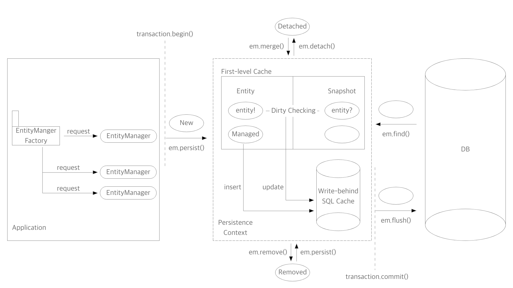

# [JPA] JPA의 영속성 컨텍스트 정리

---

## JPA란?

Java Persistence API의 약자. Java도 알겠고, API도 알겠다. 그런데 이 Persistence라는 건 뭘까?

persist는 지속된다, 계속된다는 의미이다. 명사형인 Persistence는 무언가가 지속되는 상태 정도라고 볼 수 있다. persistence를 구글링 하면 위키피디아를 연결해주는데,  위키피디아에서는 persistence를 이렇게 말한다.

> 프로세스가 생성했지만 **별개로 유지되는 상태**의 특징 중 한 가지. **별도의 기억 장치에 데이터를 보존**하는 목적. 이 특징으로 인해 저장 장치로부터 데이터를 전송하는 작업 및 자료구조 등을 이용해 데이터를 보존하는 것이 가능.

여기서 내 마음대로 중요하다고 생각되는 부분을 강조해봤다.

- 별개로 유지되는 상태
- 별도의 기억 장치에 데이터를 보존

이 두가지에 미루었을 때, Java Persistence API란, Java에서, 애플리케이션과는 별도로 분리된 환경에서, 데이터를 보존할 수 있도록 설계되어 있을 것이라고 추론할 수 있다.


## 영속성 컨텍스트

우선 Persistence라는 단어는, 일반적으로 '영속성'이라고 번역된다. JPA는 Persistence Context, 즉 영속성 컨텍스트라는 개념이 등장하는데, 결론부터 얘기하자면, JPA의 영속성 컨텍스트는 애플리케이션과는 별개로 분리되어 데이터를 관리하는 기능을 한다.  JPA를 사용하는 자바 애플리케이션은 이 영속성 컨텍스트를 통해서 DB와 커뮤니케이션하게 된다.



### 엔티티와 엔티티 매니저

JPA에 의해 관리되는 객체는 엔티티(Entity)라고 부른다. 엔티티는 데이터베이스의 테이블을 객체처럼 사용할 수 있도록 해준다. 엔티티의 관리, 즉 CRUD는 EntityManager에 의해 수행되는데, 이는 모두 영속성 컨텍스트와 연관되어 이루어진다. EntityManager는 EntityManagerFactory에 의해 요청(스레드)마다 생성된다. EntityManagerFactory는 Thread-Safe하지만 생성 비용이 크기 때문이다. 각 요청마다 생성된 EntityManager는 DB와 커넥션을 갖는다. 이후에 다시 짚고 넘어가겠지만, EntityManager의 모든 행위는 트랜잭션 내에서 이루어져야 한다.

```java
EntityManager em = emf.createEntityManager();

transaction.begin();

em.persist(entity);									// Create
em.find(Entity.class, entityId);		// Read 
entity.setField(newField);					// Update
em.remove(entity);									// Delete

// em.flush()
transaction.commit();
```


### 엔티티의 상태와 생명주기

엔티티의 상태는 아래처럼 나뉜다.

- 영속(managed)
  - 영속성 컨텍스트에서 관리하는 상태. Dirty Checking 적용.
- 준영속(detached)
  - 영속성 컨텍스트에 속해 있었으나, 더 이상 관리되지 않는 상태. 식별자는 가지고 있으나 Dirty Checking 등 기능 사용 불가.
- 비영속(new/transient)
  - 새로 만들어져 JPA에서 관리하고 있지 않음. `em.persist()`로 영속성 컨텍스트에 넣어준 이후 관리 시작.
- 삭제(removed)
  - 영속성 컨텍스트와 DB에서 삭제된 상태.

즉 엔티티를 만들기만 한다고 알아서 JPA에서 관리해주는 것은 아니다. `persist()`나 `merge()`를 이용해 영속성 컨텍스트에 넣어서, 관리할 엔티티라는 것을 알려줘야 한다.


### 영속성과 트랜잭션

JPA의 모든 작업은 트랜잭션 내부에서 이루어져야 한다. JPA는 요청 즉시 쿼리를 실행시키지 않고, 영속성 컨텍스트 내의 쓰기 지연 SQL 저장소에 쿼리를 저장해둔다. 그리고 쿼리는 트랜잭션이 종료되는 시점에서 DB로 일괄 요청된다. 과정을 눈으로 보기 위해, 간단한 엔티티와 레포지토리, 그리고 엔티지매니저를 직접 사용하여 테스트를 작성해보려고 한다.

```

@Transactional


```


### 영속성 컨텍스트의 장점

1. 동일성 보장

   - 자바는 기본적으로 두 객체가 같은 해시코드를 가질 때, 즉 같은 인스턴스일 때 동일하다고 본다. 따라서 식별자 필드에 같은 값을 갖고 있다하더라도, 단순히 `new`를 이용해 생성된 객체는 서로 다른 객체다. 영속성 컨텍스트에서 관리되는 객체는 식별자만 같으면 동일한 것으로 간주한다.

   - ```java
     // car1과 car2
     
     Car car1 = new Car();
     car1.setId(1L);
     
     Car car2 = new Car();
     car2.setId(1L)
     ```

2. 1차 캐시

   - 영속성 컨텍스트에 있는 엔티티는 조회시 우선 1차 캐시의 데이터를 찾는다. 데이터가 있으면 반환, 없으면 그 때 DB에서 조회해온다. 아주 약간의 성능 이점이 있다고 하나, 큰 의미는 없다고 함.

   - ```java
     Car car1 = new Car();
     em.persist(car1);
     
     em.find(Car.class, 1L);	// 1차 캐시에서 조회
     em.find(Car.class, 2L); // DB에서 조회
     ```

3. 트랜잭션을 지원하는 쓰기 지연

   - 트랜잭션의 내용 추가

   - ```java
     //em.flush()를 주석 처리 했을 때와 안 했을 때, insert 쿼리의 위치를 비교해보자
     Car car = new Car();
     System.out.println("포르쉐 사야되는데");
     car.setManufacturer("Hyundai")
     em.persist(car);
     // em.flush();
     System.out.println("언제 살 수 있으려나");
     ```

4. 변경 감지

   - 쓰기 지연과 연관되는 기능이다. 엔티티는 `persist()`한 시점에서 바로 INSERT 되지 않고

   - ```java
     Car car = new Car();
     car.setManufacturer("Hyundai");
     em.persist(car);
     
     car.setManufacturer("Porsche");
     // DB에서 내 차가 포르쉐로 바뀐 것을 확인하자.
     ```

5. 지연 로딩


### Entity

```java
@Getter
@Setter
@Entity(name = "car")
public class Car {

    @Id
    @GeneratedValue
    @Column(name = "car_id")
    private Long id;

    @Column(name = "manufacturer")
    private String manufacturer;

    @Column(name = "model_name")
    private String modelName;

}
```


### Repository

```java

```


### Test

```java
```

