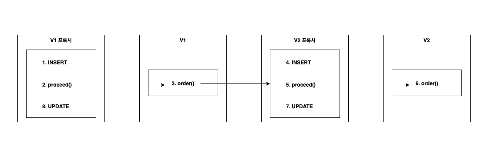

# [Spring] 스프링 컨트롤러 인터페이스 저장 방식 개선

*예시 코드는 단순화된 코드입니다.*

*스프링 컨트롤러에서 들어오는 모든 요청/응답의 HTTP 바디 메시지를 예외없이 DB에 저장하는 과정 기록.*


우리 팀은 업무 특성상 들어오는 모든 요청과 응답 인터페이스 내용을 DB에 저장하도록 되어있다. 인터페이스 테이블은 `인터페이스 ID`, `요청 전문`, `응답 전문`, 그리고 그 외 `HTTP 헤더 정보` 중 필요한 것들을 저장한다. 혹시 모를 유실을 방지하기 위해 일단 들어오자마자 요청 정보를 인서트 하고, 모든 처리가 완료된 후 클라이언트로 주는 응답 결과를 업데이트 하는 방식이다. 다음 내용은 단계별로 어떤 문제점이 있었고, 어떻게 개선해나갔는지로 이어진다.


## [1] 서비스 로직 수행 중 예외 발생시 업데이트 불가
처음 개발할 때는 컨트롤러에서 인터페이스 인서트/업데이트를 구현했다. 대략 아래와 같은 로직이었다.

```java
@Controller
public class Controller {
    public ApiWrapper order(String orderNo, OrderRequest orderRequest, HttpServletRequest httpRequest) {
        try {
            //요청 정보 기반으로 Interface 엔티티 생성하여 저장
            Interface interface = repository.save(Interface.of(orderNo, orderRequest, httpRequest));
            
            // 주문번호로 유효성 검증 후 주문 데이터 생성
            Order order = saveValidOrder(orderNo, orderRequest);
            order.init(interface.getInterfaceId());

            // 주문상품별 연동 로직 수행
            Result result = service.order(order);

            // Interface에 응답 전문 업데이트 -> 위에서 예외가 던져지면 수행되지 않는다.
            interface.updateResult(result);
            repositroy.save(interface);

            // 서비스 수행 결과 반환
            return new ApiWrapper<>(result);
        } catch (Exception e) {
            // 예외 발생시 로그 출력 후 예외 기반 응답 결과 반환
            log.error(e.getMessage(), e);
            return new ApiWrapper<>(new Result(e));
        }
    }
}
```

지금 생각하면 너무 초보적인 실수다. **서비스단에서 예외가 던져지면 인터페이스 결과 업데이트는 수행되지 않는다.** 오픈 직후 문제를 알았지만 다행히도 운영상 문제될 점은 전혀 없었다. 이슈가 생길 경우 도메인 데이터나 나가는 인터페이스 데이터에서 다 해결이 됐기 때문이다. 보다 중요한 일들이 넘쳐나서 개선은 미뤄졌다.


## [2] 주요 관심사와 횡단 관심사의 혼재, 코드 중복
그리고 최근 API를 V2로 업그레이드 하게 되었다. 그 동안 쌓인 기술부채들을 개선할 기회였다. 인터페이스 저장 관련해서 가장 큰 문제점은 핸들링하지 못하는 얘외가 발생할 경우, 클라이언트한테는 제대로 응답이 갔음에도 DB에는 남지 않았다는 점이었다. 가장 간단한 해결책은 아래처럼 `finally`를 추가하는 것이었다.

```java
@Controller
public class Controller {
    public ApiWrapper order(String orderNo, OrderRequest orderRequest, HttpServletRequest httpRequest) {
        Interface interface = null;
        Result result = null;
        try {
            //요청 정보 기반으로 Interface 엔티티 생성하여 저장
            interface = repository.save(Interface.of(orderNo, orderRequest, httpRequest));
            
            // 주문번호로 유효성 검증 후 주문 데이터 생성
            Order order = saveValidOrder(orderNo, orderRequest);
            order.init(interface.getInterfaceId());

            // 주문상품별 연동 로직 수행
            result = service.order(order)
        } catch (Exception e) {
            // 예외 발생시 로그 출력 후 예외 기반 응답 결과 생성
            log.error(e.getMessage(), e);
            result = new Result(e);
        } finally {
            // Interface에 응답 전문 업데이트
            interface.updateResult(result);
            repositroy.save(interface);
        }

        // 결과 반환
        return new ApiWrapper<>(result);
    }
}
```

이렇게 할 경우 예외가 발생해도 `catch`에서 `Result`를 생성한다. 그리고 `finally`에서 `Result`를 인터페이스에 업데이트 할 수 있다. 크게 나쁘다고 할 수는 없을 것 같다. 하지만 좋은 구조는 아니라고 생각했다. 이유는 다음과 같다.

1. **인터페이스 저장은 메소드의 주요 관심사가 아니다.**
  컨트롤러의 목적은 요청을 받아서 검증하고, 서비스 로직을 수행하는 것이다. 특히 DB와 관련해선 주문번호를 검증해서 신규 주문 데이터를 생성하거나 기존 주문 데이터를 가져오는 것이 주요 역할이다. 인터페이스 관련 처리는, 물론 할 수도 있지만, 가능하면 한 가지 DB 작업에 집중했으면 했다. 그러자면 주문 관련 작업이 주 기능이고 인터페이스 관련 작업은 부가 기능임이 명백했다.

2. **코드의 중복**.
  예제 코드에선 `order()` 메소드만 있지만, 같은 구조로 `cancel()`, `resend()`, `status()` 라는 메소드가 더 있다. 그리고 앞으로 `exchange()`, `extend()` 같은 메소드까지 추가될 수 있다. 사실 컨트롤러에서는 구조가 거의 같다. 인터페이스를 저장하고, 주문번호로 유효성을 검증해서 주문을 생성하거나 기존 주문을 가져오고, 서비스 로직을 호출한다. 위처럼 코드를 짤 경우 변경 사항이 생길 때마다 모든 메소드를 똑같이 작업해줘야 한다. 예를 들어 예외 발생시 `Sentry`로 추적하기로 했다고 해보자. 4개, 어쩌면 6개의 메소드의 `catch` 안에 `Sentry.captureException(e)` 코드를 추가해줘야 한다.


## [3] Controller에서 Aspect로 중복 문제 이관
앞선두 문제를 해결하기 위해 스프링 AOP를 사용하는 것이 좋겠다고 생각했다. 아래와 같이 소스코드를 개선했다.

```java
@Controller
public class Controller {
    public ApiWrapper order(String orderNo, OrderRequest orderRequest, HttpServletRequest httpRequest) {
        // 주문번호로 유효성 검증 후 주문 데이터 생성
        Order order = saveValidOrder(orderNo, orderRequest);
        order.init((String) httpRequest.getAttribute("interfaceId"));

        // 주문상품별 연동 로직 수행
        Result result = service.order(order);

        return new ApiWrapper<>(result);
    }
}

@Aspect
@Component
public class Aspect {
    @Around(value = "execution(orderPointCut()) && args(orderNo, orderRequest, httpRequest)")
    public Object aroundOrder(ProceedingJoinPoint pjp, String orderNo, OrderRequest orderRequest, HttpServletRequest httpRequest) throws Throwable {
        //요청 정보 기반으로 Interface 엔티티 생성하여 저장
        Interface interface = repository.save(Interface.of(orderNo, orderRequest, httpRequest));

        // 주문 로직에 필요한 인터페이스 ID를 컨트롤러에 전달
        httpRequest.setAttribute("interfaceId", interface.getInterfaceId());

        // 컨트롤러 메소드 수행과 예외 핸들링
      	Object proceed = null;
        try {
            // 컨트롤러 메소드 수행
            proceed = pjp.proceed();
        } catch (Exception e) {
            // 예외 발생시 예외 기반 응답 생성
            proceed = new Result(e);
        } finally {
            // 정상/예외 수행 결과 업데이트
            interface.updateResult((Result) proceed);
            repository.save(interface);
        }
      
        return proceed;
    }
}
```

스프링 AOP로 간편하게 컨트롤러 전/후 처리를 조작할 수 있었다. **주 기능과 부가 기능의 분리 목적은 달성했다.** 비즈니스 로직과 연관된 주문 처리는 `Controller.order()`에서, 인터페이스 관련 처리는 `Aspect.aroundOrder()`에서 각각 나눠서 담당하게 됐다. 4개 메소드에서 `try ~ catch ~ finally`가 사라지며 컨트롤러 로직이 굉장히 간소화 되었다. 중복의 문제도 해결된걸까?

아쉽게도, **컨트롤러에서 중복의 문제는 사라졌지만 AOP로 이관되었을 뿐이다.** 위 `Aspect` 코드를 보면 `aroundOrder()`에서 `order()` 메소드의 인자를 받고 있다. 안타깝게도 다른 메소드들은 다른 인자를 받는다. 인자는 `ProceedingJoinPoint`로 통일하고, 여기서 메소드 인자를 받아올까 고민도 했다. 이럴 경우 가독성도 해칠 뿐더러 단일 책임의 원칙도 위배된다. 나중에 수정도 더 어려울 게 명백했다. 인자를 다르게 받는 `aroundCancel()`, `aroundResend()`, `aroundStatus()`로 분리하고 같은 로직을 처리하는 편이 낫다고 판단했다. 중복이 존재하지만, 수정이 잦은 코드는 아니니 어느 정도 타협점이 될 수 있다고 생각했기 때문이다.


## [4] 프록시에서 프록시 호출시 Advice 중복 수행

컨트롤러 V2를 만드려니 문제가 생겼다. 기존 API는 수행 결과를 `ApiWrapper` 클래스로 한 번 감싸서 보내는 구조였다. `ApiWrapper`에는 `data`와 `error` 필드가 있다. `data` 필드에는 정상 수행이나 핸들링한 예외 발생의 처리 결과가 들어간다. 핸들링 하지 못한 예외 발생시에는 `error` 필드에 예외 정보를 넣는다. 그 때는 그게 좋다고 생각했다.

막상 운영을 해보니 API 사용하기에 너무 불편했고, 기대한만큼의 효용도 없었다. 현재는 `Sentry`도 적용한만큼 V2에서는 `ApiWrapper`를 없애기로 했다. V2 컨트롤러를 새로 만들었다. 근데 주문의 경우 V1과 V2가 명백히 큰 차이가 있었지만, 나머지 기능들은 `ApiWrapper` 유무 차이였고 로직은 똑같이 돌아야 했다. 그러기 위해서 V1과 V2 코드를 똑같이 유지시켜야 했다. 차라리 V1 컨트롤러가 V2 컨트롤러를 의존하고, 대응하는 메소드를 그대로 호출하는 게 낫겠다 생각했다.

```java
@Controller
public class ControllerV1 {
    public ApiWrapper cancel(String orderNo, CancelRequest cancelRequest, HttpServletRequest httpRequest) {
        return controllerV2.cancel(orderNo, cancelRequest, httpRequest);
    }
}

public class ControllerV2 {
    public ApiWrapper cancel(String orderNo, CancelRequest cancelRequest, HttpServletRequest httpRequest) {
        // 주문번호로 유효성 검증 후 주문 데이터 업데이트 및 조회
        Order order = saveIfClaimValid(orderNo, cancelRequest);
        order.init((String) httpRequest.getAttribute("interfaceId"));

        // 연동 로직 수행
        return service.cancel(order);
    }
}
```

컨트롤러에서 컨트롤러를 호출하는 게 좋은가. 이 문제는 아직 답은 못 내렸다. 어쩌면 리다이렉트가 나을 수도 있겠다. 다만 구글링을 좀 해본 결과 그렇게 하면 안 된다는 얘기도 찾지 못했다. 우선은 해보았다. 기능적으로 문제는 없어보였다.

근데 이 경우는 또 문제가 있었다. **V1 호출시 인터페이스가 두 개가 남는다.** 스프링 AOP는 프록시를 사용한다. V1 컨트롤러의 프록시에서 일단 인터페이스를 저장하고, 실제 컨트롤러에서 V2 컨트롤러를 호출한다. 근데 그 V2 컨트롤러도 사실 프록시다. 그럼 프록시가 또 인터페이스를 저장한다. 결국 한 요청에서 인터페이스 두 개가 저장된다. 대략 아래 그림과 같은 구조다. 이건 내가 원하던 게 아니다.




## [5] 심화된 코드 중복과 버전 업그레이드에 따른 확장성 확보 어려움
일단 인터페이스 중복 저장 문제만 해결한다고 할 때, 간단한 해결 방법이 있긴 했다. `Aspect`도 V1과 V2로 분리한다. 그리고 V2 `Aspect`에서는 `HttpServletRequest`에서 `URI`를 가져와, `v2` 키워드를 포함하고 있지 않으면 바로 `proceed()` 하는 것이다. V1에서 호출한 거라면, V2 프록시는 인터페이스 저장을 하지 않고 바로 로직을 수행할 것이다.

```java
@Aspect
@Component
public class Aspect {
    @Around(value = "execution(orderPointCut()) && args(orderNo, orderRequest, httpRequest)")
    public Object aroundOrder(ProceedingJoinPoint pjp, String orderNo, OrderRequest orderRequest, HttpServletRequest httpRequest) throws Throwable {
        // URL로 v2를 판단하고, 아니면 바로 로직 수행
      	if (!httpRequest.getRequestURI().contains("v2")) {
            return pjp.proceed();
        }
        //요청 정보 기반으로 Interface 엔티티 생성하여 저장
        Interface interface = repository.save(Interface.of(orderNo, orderRequest, httpRequest));

        // 주문 로직에 필요한 인터페이스 ID를 컨트롤러에 전달
        httpRequest.setAttribute("interfaceId", interface.getInterfaceId());
      
        // 컨트롤러 메소드 수행과 예외 핸들링
      	Object proceed = null;
        try {
            // 컨트롤러 메소드 수행
            proceed = pjp.proceed();
        } catch (Exception e) {
            // 예외 발생시 예외 기반 응답 생성
            proceed = new Result(e);
        } finally {
            // 정상/예외 수행 결과 업데이트
            interface.updateResult((Result) proceed);
            repository.save(interface);
        }
      
        return proceed;
    }
}
```

당연히 많은 문제가 생긴다. 

1. **코드 중복의 심화**

   아까 `aroundOrder()`, `aroundCancel()`, `aroundResend()`, `aroundStatus()`의 중복도 겨우 타협했었는데, 이젠 `aroundOrderV2()`, `aroundCancelV2()`, `aroundResendV2()`, `aroundStatusV2()`까지 필요하다. 8개 메소드의 로직은 거의 중복이다.

2. **확장성 확보 실패**

   나중에 V3, V4가 추가되면? 그 때마다 인터페이스 처리하는 `Aspect`를 만들어줘야 할까? 그 때의 요구사항에 따라 현재 `Aspect`로 통합할 수도 있겠지만, 아닐 수도 있다. `aroundOrderV3()`, `aroundCancelV3()`, `aroundResendV3()`, `aroundStatusV3()`, `aroundOrderV4()`, `aroundCancelV4()`, `aroundResendV4()`, `aroundStatusV4()`... 버전 업그레이드 때마다 계속 추가해줘야 할 수도 있다.


## [6] ContentCachingRequestWrapper 버그?
결국 AOP를 버리고 그보다 앞단으로 가기로 했다. `Interceptor`를 구현했다. 사실 설정하는 게 귀찮아서 AOP로 해보려고 했는데 돌아왔다. 그래도 무의미한 건 아니었던 게, 프록시에 대해 다시 한 번 생각해볼 수 있었다.


```java
@Component
public class Interceptor implements HandlerInterceptor {

    @Override
    public boolean preHandle(HttpServletRequest request, HttpServletResponse response, Object handler) throws Exception {
        // InputStream 문제를 해결하기 위해 ContentCachingRequestWrapper로 캐스팅
        ContentCachingRequestWrapper wrappingRequest = new ContentCachingRequestWrapper(request);
      
        // 배열이 비어있다. afterCompletion()에선 똑같이 처리해도 데이터가 있다.
        byte[] contentByteArray = wrappingRequest.getContentAsByteArray();

        // 인터페이스 저장을 해야하나, 어차피 데이터가 없어 소용이 없다.
        Interface interface = repository.save(Interface.of(request));
        request.setAttribute("interface", interface);

        return true;
    }

    @Override
    public void afterCompletion(HttpServletRequest request, HttpServletResponse response, Object handler, Exception ex) throws Exception {
      	// 여기선 별 문제가 없다.
        ContentCachingResponseWrapper wrappingResponse = new ContentCachingResponseWrapper(response);
        byte[] contentByteArray = wrappingResponse.getContentAsByteArray()
          
        // 응답 바디 메시지를 String으로 변환
        String response = objectMapper.readTree(contentByteArray).get("data").toString();
      
        // 업데이트도 정상 수행 가능
        Interface interface = (Interface) request.getAttribute("interface");
        interface.updateResult(response);
        repository.save(interface);
    }
}
```

인터셉터에서는 이런 구조로 가려고 했었다. `afterCompletion()`은 에러가 나도 반드시 호출되기 때문에 일반적인 경우 여기서 요청/응답을 다 저장해도 문제가 없을 것이다. 그런데 나는 로직 중간에 인터페이스 ID 저장이 필요했기 때문에, `preHandle()`에서 우선 인터페이스 저장을 한 후 `afterCompletion()`에서 결과를 업데이트 해야 했다. 

1. **`HttpServlertRequest`의 `InputStram`은 일회용이다.**

   HTTP 바디 메시지는 `HttpServlertRequest`의 `getInputStream()`으로 가져올 수 있는데, 스트림이라 일회용이다. 여기서 써버리면 컨트롤러까지 전달이 안 됐다.

2. **`ContentCachingRequestWrapper`가 의도한대로 동작하지 않았다.**

   `ContentCachingRequestWrapper`로 변환 후 `getContentAsByteArray()`로 가져오려고 했는데, 빈 배열이 들어왔다. 뭔가 잘못됐나? 싶었지만 `InputStream`에는 값이 잘 들어있었다. 이런저런 테스트를 해보는데 또 `afterCompletion()`에서는 제대로 배열이 보였다. 원인이 감이 잘 안 잡혔다. 지난번 Feign에서 Multipart 처리 버그 경험으로, 일단 버그이겠거니 싶어 넘어갔다. 예약주문 개발 전 개선 작업이라, 이 이상 원인 파악하기엔 시간이 넉넉하진 않았다.


## [해결 1] ReadableRequestBodyWrapper 구현하여 InputStream 재사용
동기랑 의논해보니 팀에 다른 분이 이것과 비슷한 작업을 하신 게 있다고 해서 그 프로젝트를 살펴봤다. 별도로` RequestWrapper`를 구현해서 사용하고 계셨다. 이걸 적용해보니 `InputStream`을 재사용할 수 있었다.

```java
public class ReadableRequestBodyWrapper extends HttpServletRequestWrapper {
    private final byte[] cachedBody;

    public ReadableRequestBodyWrapper(HttpServletRequest request) throws IOException {
        super(request);
        InputStream requestInputStream = request.getInputStream();
        this.cachedBody = StreamUtils.copyToByteArray(requestInputStream);
    }

    @Override
    public ServletInputStream getInputStream() throws IOException {
        return new CachedBodyServletInputStream(this.cachedBody);
    }

    @Override
    public BufferedReader getReader() throws IOException {
        ByteArrayInputStream byteArrayInputStream = new ByteArrayInputStream(this.cachedBody);
        return new BufferedReader(new InputStreamReader(byteArrayInputStream));
    }

    static class CachedBodyServletInputStream extends ServletInputStream {
        private final InputStream cachedBodyInputStream;

        public CachedBodyServletInputStream(byte[] cachedBody) {
            this.cachedBodyInputStream = new ByteArrayInputStream(cachedBody);
        }

        @Override
        public boolean isFinished() {
            try {
                return cachedBodyInputStream.available() == 0;
            } catch (IOException e) {
                e.printStackTrace();
            }

            return false;
        }

        @Override
        public boolean isReady() {
            return true;
        }

        @Override
        public void setReadListener(ReadListener readListener) {
            throw new UnsupportedOperationException();
        }

        @Override
        public int read() throws IOException {
            return cachedBodyInputStream.read();
        }
    }
}
```

간단히 살펴보니 `getInputStream()`을 호출할 때마다 새 `CachedBodyServletInputStream`을 주는 구조였다. 비슷한 고민을 먼저 하신 분 덕분에 나는 좀 쉽게 문제를 해결할 수 있었다.


## [해결 2]  OncePerRequestFilter 구현하여 ReadableRequestBodyWrapper로 대체

최종적으론 아래 코드처럼 바뀌었다. `OncePerRequestFilter`를 구현해서 `HttpServlertRequest`를 `ReadableRequestBodyWrapper`와 `ContentCachingResponseWrapper`로 변환해준다. 실제로 바디 메시지 가져오고 하는 부분은 Interface 엔티티에 있는데 소스가 복잡해서 생략. 어느 정도 역할 분리가 잘 된 것 같다.

```java
@Component
public class CustomOncePerRequestFilter extends OncePerRequestFilter {
    @Override
    protected void doFilterInternal(HttpServletRequest request, HttpServletResponse response, FilterChain filterChain) throws ServletException, IOException {
        // 요청은 ReadableRequestBodyWrapper로, 응답은 ContentCachingResponseWrapper로.
        ReadableRequestBodyWrapper wrappingRequest = new ReadableRequestBodyWrapper(request);
        ContentCachingResponseWrapper wrappingResponse = new ContentCachingResponseWrapper(response);
      
      	// 캐스팅한 객체로 Filter 수행.
        filterChain.doFilter(wrappingRequest, wrappingResponse);
        wrappingResponse.copyBodyToResponse();
    }
}

@Component
public class Interceptor implements HandlerInterceptor {
    @Override
    public boolean preHandle(HttpServletRequest request, HttpServletResponse response, Object handler) throws Exception {
        // 요청의 바디 메시지 가져오는 건 Interface 엔티티로 캡슐화. 필터에서 캐스팅 해줘서 InputStream을 여러 번 읽을 수 있다.
        Interface interface = repository.save(Interface.of(request));
        request.setAttribute("interface", interface);

        return true;
    }

    @Override
    public void afterCompletion(HttpServletRequest request, HttpServletResponse response, Object handler, Exception ex) throws Exception {
        // 인터페이스 업데이트. 메소드 기능이 명확하고, 코드도 깔끔해졌다.
        Interface interface = (Interface) request.getAttribute("interface");
		  	interface.updateResponse(response);
        ecpnRepository.save(interface);
    }
}

@Controller
public class Controller {
    // 예외 핸들링은 @ExceptioinHandler로. 응답은 인터셉터의 afterCompletion()에서 업데이트 해준다.
    @ExceptionHandler
    public ApiWrapper handleException(Exception e) {
        log.error(e.getMessage(), e);
        return new ApiWrapper<>(new Result(e));
    }

    public ApiWrapper cancel(String orderNo, CancelRequest cancelRequest, HttpServletRequest httpRequest) {
        return controllerV2.cancel(orderNo, cancelRequest, httpRequest);
    }
}

public class ControllerV2 {
    // 예외 핸들링은 @ExceptioinHandler로.
    @ExceptionHandler
    public Result handleException(Exception e) {
        log.error(e.getMessage(), e);
        return new Result(e);
    }

    public ApiWrapper cancel(String orderNo, CancelRequest cancelRequest, HttpServletRequest httpRequest) {
        // 주문번호로 유효성 검증 후 주문 데이터 업데이트 및 조회
        Order order = saveIfClaimValid(orderNo, cancelRequest);
        order.init((String) httpRequest.getAttribute("interfaceId"));

        // 연동 로직 수행
        return service.cancel(order);
    }
}
```

근데 지금 생각해보니 꼭 필터가 필요한가 싶다. 일단 `HttpServlertResponse`는 어차피 `afterCompletion()`에서 데이터 잘 가져와서, 엔티티에서 바로 변환해서 써도 될 테고.. `HttpServlertRequest`가, 변환된 걸 `doFilter()`에 넣어줘야 할 것 같긴 하다. 엔티티에서 변환하면 그대로 `InputStream` 사용되고 끝날 것 같다.

그리고 `@ExceptionHandler`를 사용해줬다. 이로써 컨트롤러에서 던지는 예외도 간편하게 처리할 수 있다. 예외를 잡아서, 예외 기반 응답을 리턴한다. 인터셉터의 `afterCompletion()`은 어차피 이 이후에 호출되기 때문에, 예외가 발생해도 인터페이스 응답 결과는 정상적으로 업데이트 된다.


어쨌든, 결론적으로 정리하자면

1. 컨트롤러 메소드에서 중요한 검증 및 주문 데이터 처리 로직만 담당한다. 덜 중요한 인터페이스 저장 기능은 인터셉터로 이관되었다.
2. 컨트롤러에서 비슷한 구조의 `try ~ catch ~ finally`코드를 여러 메소드에 중복시키지 않았다. AOP에서도 코드 중복이 발생하지 않는다.
3. 어쨌든 컨트롤러에서 컨트롤러를 의존하는 구조에서, 프록시로 인한 인터페이스 중복 저장이 발생하지 않는다.
4. 새로운 API, 혹은 V3, V4를 추가해도 인터페이스 저장하는 부분은 추가 개발할 필요가 없다.
5. 인터페이스 저장은 오직 인터셉터에서만 일어난다. 수정은 여기서만 하면 된다.

정도가 될 것 같다.


아직 `ContentCachingRequestWrapper`가 왜  `afterCompletion()`에서는 `getContentAsByteArray()`에서 값을 제대로 주고, `preHandle()`에서는 아닌지 원인은 찾지 못했다. 포스팅을 작성하다보니 필터에서 추가 작업을 해줘야 할지도 모르겠단 생각도 들었다. 예약 주문 프로젝트가 끝나고 한 번 디버깅에 시간 투자 좀 해봐야겠다.