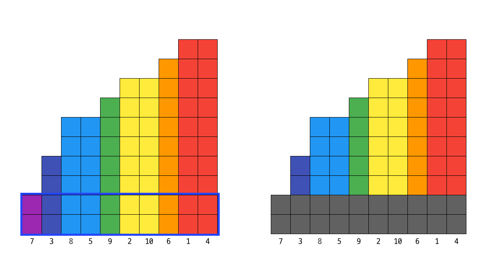
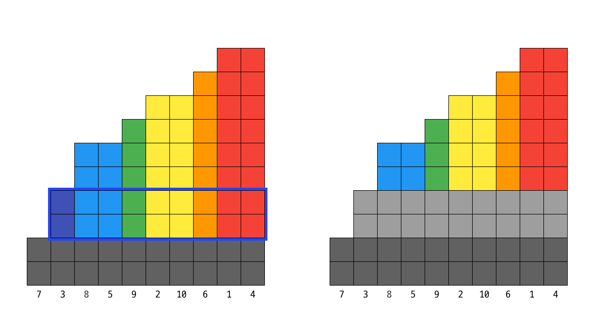

# [Algorithm] 2019 카카오 블라인드 테스트 문제풀이 - 무지의 먹방 라이브


## 문제

```text
* 효율성 테스트에 부분 점수가 있는 문제입니다.

평소 식욕이 왕성한 무지는 자신의 재능을 뽐내고 싶어 졌고 고민 끝에 카카오 TV 라이브로 방송을 하기로 마음먹었다.

그냥 먹방을 하면 다른 방송과 차별성이 없기 때문에 무지는 아래와 같이 독특한 방식을 생각해냈다.

회전판에 먹어야 할 N 개의 음식이 있다.
각 음식에는 1부터 N 까지 번호가 붙어있으며, 각 음식을 섭취하는데 일정 시간이 소요된다.
무지는 다음과 같은 방법으로 음식을 섭취한다.

무지는 1번 음식부터 먹기 시작하며, 회전판은 번호가 증가하는 순서대로 음식을 무지 앞으로 가져다 놓는다.
마지막 번호의 음식을 섭취한 후에는 회전판에 의해 다시 1번 음식이 무지 앞으로 온다.
무지는 음식 하나를 1초 동안 섭취한 후 남은 음식은 그대로 두고, 다음 음식을 섭취한다.
다음 음식이란, 아직 남은 음식 중 다음으로 섭취해야 할 가장 가까운 번호의 음식을 말한다.
회전판이 다음 음식을 무지 앞으로 가져오는데 걸리는 시간은 없다고 가정한다.
무지가 먹방을 시작한 지 K 초 후에 네트워크 장애로 인해 방송이 잠시 중단되었다.
무지는 네트워크 정상화 후 다시 방송을 이어갈 때, 몇 번 음식부터 섭취해야 하는지를 알고자 한다.
각 음식을 모두 먹는데 필요한 시간이 담겨있는 배열 food_times, 네트워크 장애가 발생한 시간 K 초가 매개변수로 주어질 때 몇 번 음식부터 다시 섭취하면 되는지 return 하도록 solution 함수를 완성하라.
```

[프로그래머스 문제 바로가기](https://programmers.co.kr/learn/courses/30/lessons/42891)


## 풀이

```python
from collections import deque


def solution(food_times, k):
    # 남은 음식이 없는 경우
    if k >= sum(food_times):
        return -1

    # [(음식번호-1, 음식량)]을 소요시간의 오름차순으로 정렬
    foods = deque(sorted(enumerate(food_times), key=lambda x: x[1]))

    total_eaten, last_eaten = 0, 0  # 총 먹은 양, 이전 단계 음식 양
    while True:
        # 이번 단계에서 먹을 양 = (맨 앞 음식량 - 이전 음식량) * 남은 음식 가짓수
        to_eat = (foods[0][1] - last_eaten) * len(foods)

        # 먹은 총량과 먹을 양의 합이 k보다 클 경우 음식번호순으로 정렬 후 반복 중단
        if total_eaten + to_eat > k:
            foods = sorted(foods, key=lambda x: x[0])
            break

        # 먹은 총량에 먹을 양 더하고 이전 단계 양에 큐 맨 앞의 음식 뽑아서 양 세팅
        total_eaten += to_eat
        last_eaten = foods.popleft()[1]

    # 남은 시간 = k - 먹은 총량
    # 남은 시간을 남은 음식 가짓수로 나눈 나머지번째의 음식이 다음 먹을 음식
    return foods[(k - total_eaten) % len(foods)][0] + 1
```

어렵다. 시뮬레이션은 쉽다. 그런데 문제 요구사항 그대로 구현하면 필히 효율성 테스트에서 시간 초과가 난다. 효율성 제한사항의 경우 `food_times`의 길이가 최대 `200,000`, 각 원소의 크기가 최대 `100,000,000`이다. 어떤 규칙을 찾아서 최대한 연산을 줄이는 것이 중요하다고 생각했다. 로직을 말로만 설명하긴 좀 어려운 감이 있어서, 그림을 그려보려고 한다. 

### 테스트 케이스

- `food_times`: [10, 8, 4, 10, 6, 9, 2, 5, 6, 8]
- `k`: 42


테스트 케이스는 임의로 지정했다. 각 막대 한개는 음식의 종류이고, 그 높이가 음식의 수량이다. 즉 10 높이의 빨간 막대는 다 먹는데 10초가 소요된다. 왼쪽부터 오른쪽의 순서로 음식이 놓여있다. 편의상 수량이 같은 음식은 같은 색상으로 표현했다.


### STEP 0

```python
# 남은 음식이 없는 경우
if k >= sum(food_times):
    return -1
```
정전이 발생한 k초 후에 먹을 음식이 없는 경우는 `-1`을 리턴한다. 즉 음식의 전체 수량이 k보다 작을 경우는 별도 연산없이 바로 `-1`을 리턴한다.

### STEP 1


```python
# [(음식번호-1, 음식량)]을 소요시간의 오름차순으로 정렬
foods = deque(sorted(enumerate(food_times), key=lambda x: x[1])
```
음식을 우선 정렬한다. 다만 결과는 음식번호를 리턴해야 하기 때문에, `enumerate` 함수로 [(음식번호-1, 음식량)]의 형태로 변경한 후, 음식량의 오름차순으로 정렬한다. 이로써 리스트의 순서가 어떻게 변경되든 최초의 인덱스를 갖고 있을 수 있다. 그리고 `deque`를 이용해서 큐를 만든다.

### STEP 2

```python
total_eaten, last_eaten =    0, 0  # 총 먹은 양, 이전 단계 음식 양
while True:
    # 이번 단계에서 먹을 양 = (맨 앞 음식량 - 이전 음식량) * 남은 음식 가짓수
    to_eat = (foods[0][1] - last_eaten) * len(foods)

    # 먹은 총량과 먹을 양의 합이 k보다 클 경우 음식번호순으로 정렬 후 반복 중단
    if total_eaten + to_eat > k:
        foods = sorted(foods, key=lambda x: x[0])
        break

    # 먹은 총량에 먹을 양 더하고 이전 단계 양에 큐 맨 앞의 음식 뽑아서 양 세팅
    total_eaten += to_eat
    last_eaten = foods.popleft()[1]
```

실질적인 로직이다. 루프의 각 단계는 음식 종류 1가지를 없애는 과정이다. 앞서 정렬한 이유는 가장 적은 음식부터 없애기 위함이었다.



첫번째 루프에서는 먹은 총량도 0, 이전 단계 양도 0이다. 맨 앞 음식량은 2, 남은 음식 가짓수는 10이다. 첫번째 단계에서 먹을 음식의 양는 (2-0) * 10인 20이다. 먹은 총량 + 먹을 양은 20으로, k인 42보다 작다. if문은 건너 뛴다. 먹은 총량과 이전 단계 음식량을 세팅해준다. 이로써 단 1번의 루프로 바닥의 회색 부분만큼의 음식인 20개를 먹은 셈이 됐다. 단순 시뮬레이션을 했을 경우는 20번의 루프였을 것이다. 그리고 보라색 음식은 다 먹었다.



두번째 루프에서는 남색 음식을 다 먹을 것이다. 남색 음식의 원래 수량은 4였다. 그러나 이미 앞 루프에서 2개는 먹어버렸다. 이걸 구하기 위해 `last_eaten` 변수를 갖고 있는 것이다. 이번 루프에서 먹을 양은 (4-2) * 9인 18이다. `total_eaten` + `to_eat`은 38이므로 여전히 k보다 작다. total_eaten에 to_eat을 더해주고, last_eaten을 4로 세팅해준다. 남색 음식은 다 먹었다. 38번의 루프를 2번으로 줄였다. 

세번째 루프에서는 '시간 여유가 있다면' 파란색 음식을 다 먹을 것이다. 단서를 붙인 이유는 이번에 루프를 빠져나올 것이기 때문. to_eat은 아래에서부터 다섯번째 줄이다. (5-4) * 8인 8만큼을 먹어야 한다. 그런데, 현재 total_eaten은 38이다. 즉 경과한 시간은 38초다. 그런데 8만큼을 먹어버리면 46초가 흘러버리므로, 정전이 난 시간을 지나버린다. `if break`문이 실행된다. 다섯번째 줄은 회색으로 지워버리지 않고, 그대로 살아남는다. `foods`는 큐이므로, 앞 두 루프에서 전체가 회색인 막대, 즉 보라색 음식과 남색 음식은 모두 큐 밖으로 빠져나갔다. 남은 건 파란색부터, 즉 수량이 남은 음식들 뿐이다. 이걸 다시 음식번호 기준으로 정렬해준다.

## STEP3

```python
# 남은 시간 = k - 먹은 총량
# 남은 시간을 남은 음식 가짓수로 나눈 나머지번째의 음식이 다음 먹을 음식
return foods[(k - total_eaten) % len(foods)][0] + 1
```

