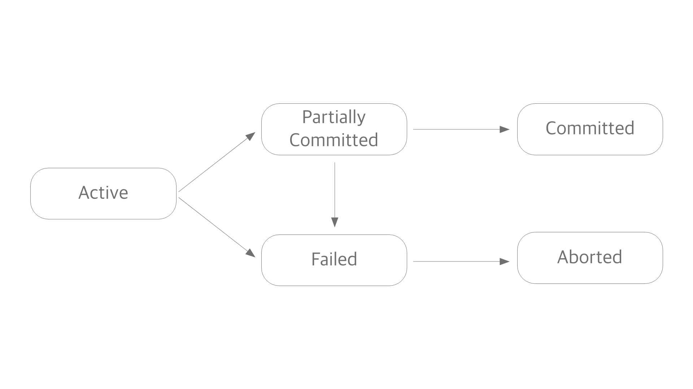

# [Database] 트랜잭션에 대해서

## 트랜잭션이란?

Transaction(트랜잭션)이랑 무엇일까. 영문 위키피디아는 트랜잭션을 이렇게 설명한다.

>  A database transaction symbolizes **a unit of work** performed within a DBMS against a database, and treated in a **coherent and reliable** way **independent of other transactions**.

중요하다고 생각되는 부분만을 취합해보면 트랜잭션이란

- 작업의 단위이며,
- 일관성 있고 신뢰할 수 있어야 하며,
- 다른 트랜잭션에 대해 독립적이다, 즉 상호독립적이다

고 설명할 수 있다. 여기서 작업의 단위란 트랜잭션의 정의이며, 일관성이고 신뢰적이며 상호독립적이라는 것은 그 특성이라고 할 수 있겠다. 그럼 이 정의와 특성에 대해 좀 깊게 알아보려고 한다.

## 트랜잭션의 정의

> ### 논리적 작업의 단위

트랜잭션이란 단어로 구글링을 하면 "트랜잭션은 논리적 작업의 단위이다"라는 말이 수없이 나온다. 근데 '논리적'이라는 말이 어떤 의미인지는 쉽게 와닿지 않는다. 개인적으로는 '추상적'이라는 말을 썼을 때, 더 이해가 잘 된다. 컴퓨터 과학에서 '추상'이란, 컴퓨터의 구조보다 인간의 사고 구조에 가까운 것을 의미한다. 즉 트랜잭션은 **인간이 생각하기에 하나의 작업이라고 생각하는 여러 작업의 묶음**이라고 표현할 수 있을 것 같다.

트랜잭션을 설명하는 가장 대표적인 예시가 바로 은행 계좌의 이체이다. 직관적으로, 그리고 일반적으로 생각하기에 이체는 '내 계좌의 돈을 상대방에게 보내는' 하나의 행위이다. 그러나 이게 전산 작업이 된다면 얘기가 다르다. 이체는 어떠한 작업들로 이루어져있을까? 간단한 이체 절차는 아래와 비슷할 것이다.

1. 내 계좌를 찾고
2. 송금할 금액을 입력받고
3. 계좌에 잔액이 있는지를 확인하고
4. 상대방 계좌를 입력받고
5. 유효한 계좌인지 확인하고
6. 정보를 한 번 더 인증하고
7. **돈을 보낸다**

이 정도면 일반적인 이체 절차라고 할 수 있겠다. 그런데 이건 인간의 입장이다. 각 단계는 보다 많은 작업들로 이루어져있다. 여기서 가장 중요한 마지막 단계, 돈을 보내는 작업을 좀 더 쪼개보겠다.

돈을 송금한다는 건 컴퓨터에겐 두 가지 작업을 의미할 것이다.

1. 내 계좌의 잔액을 차감한다.
2. 상대방 계좌의 잔액을 증가시킨다.

뭐 순서야 바뀔 수도 있겠지만 컴퓨터가 딱히 용쓰는 재주가 있는 건 아닐테니 각 작업을 순차적으로 실행할 것이다. 그런데 만약 1단계를 수행하고 2단계를 수행하기 전에 정전이 일어나면 어떻게 될까? 큰일난다. 내 계좌에는 돈이 빠져나갔는데, 상대방 계좌는 그대로다. 돈이 증발한다.

그래서 컴퓨터의 두 작업은 인간에게는 하나의 작업으로 인식될 뿐만 아니라 반드시 하나로 묶여야만 하고, **두 작업 모두 적용되거나 혹은 아무 것도 적용되지 않아야 한다**. 여기서 일관성이고 신뢰할 수 있어야 한다는 다음 특성으로 넘어가보려고 한다.

## 트랜잭션의 특성

> ### ACID

이 일관성이고 신뢰할 수 있는 특징을 충족하기 위한 조건 4가지를 줄여서 ACID라고 한다. 이 4가지 조건을 충족할 때 트랜잭션이 안전하게 수행된다고 보장할 수 있다. Atomicity(원자성), Consistency(일관성), Isolation(고립성), Durability(지속성)의 약자다.

- 원자성(Atomicity)
  - 트랜잭션은 모두 적용되거나, 혹은 아무 것도 적용되지 않아야 한다.

- 일관성(Consistency)
  - 트랜잭션의 실행 결과는 언제나 일관적이어야 한다. 즉 기대한 바와 같아야 한다.

- 고립성(Isolation)
  - 복수의 트랜잭션이 동시 실행될 경우, 각 트랜잭션은 서로에게 영향을 주어서는 안 되고 독립적으로 실행되어야 한다. 트랜잭션 밖의 어떤 연산도 진행 중인 트랜잭션의 데이터를 볼 수 없다. 즉 트랜잭션의 내부 작업은 연속적이어야 한다. 다만 성능상의 이유로 고립 수준을 조절할 수 있는데, 자세한 내용은 아래 트랜잭션 고립 수준에서 설명.

- 지속성(Durability)
  - 정상적으로 트랜잭션이 종료되면, 작업의 결과는 데이터베이스에 영구 저장되어야 한다. 즉 커밋 이후에 어떤 오류가 발생된다고 하더라도, 커밋까지의 상태는 그대로 남아있어야 한다. 일반적으로는 비휘발성 메모리에 데이터가 저장되는 것을 의미한다.

## 트랜잭션의 상태

- Active
  - 트랜잭션이 활성화된 상태
- Partially Committed
  - 트랜잭션의 모든 작업들이 수행되고, Commit만 남은 상태
- Commited
  - 트랜잭션이 정상적으로 종료된 상태
- Failed
  - 어떠한 오류로 인해 트랜잭션 처리에 실패한 상태
- Aborted
  - 트랜잭션이 취소되고, 실행 이전 상태로 Rollback 된 상태

## 트랜잭션과 데이터베이스 락

## 트랜잭션 격리 수준

Transaction Isolation Level(트랜잭션 격리 수준)이란, 앞서 말한 ACID 중 Isolation의 정도를 나타낸다. 원칙상 트랜잭션의 고립성은 높아야 하나, 현실적으로 높은 고립은 성능 저하를 유발하기 때문에 적정 수준에서 트레이드 오프해야 한다. 격리 수준은 크게 4가지로 나뉜다. 목록에서 아래로 갈 수록 고립성은 높아지나, 성능은 떨어진다.

1. READ UNCOMMITTED
   - 다른 트랜잭션에서 커밋되지 않은 내용도 참조할 수 있다.
2. READ COMMITTED
   - 다른 트랜잭션에서 커밋된 내용만 참조할 수 있다.
3. REPEATABLE READ
   - 트랜잭션에 진입하기 이전에 커밋된 내용만 참조할 수 있다.
4. SERIALIZABLE
   - 트랜잭션에 진입하면 락을 걸어 다른 트랜잭션이 접근하지 못하게 한다.

앞서처럼 이체로 예를 들면, 이 수준에서 두 트랜잭션은 이렇게 상호 작용한다. 트랜잭션 A는 내 계좌에서 상대방 계좌로 이체하는 로직, 트랜잭션 B는 내 계좌에서 잔액을 조회하고

### READ UNCOMMITED

고립성이 없다고 봐야할 것이다. 

1. [트랜잭션 A] 내 계좌에서 상대방 계좌에 보낼 금액을 100만원에서 90만원으로 차감함
2. [트랜잭션 B] 내 계좌의 금액을 조회해감. 이 때 금액은 90만원.
3. [트랜잭션 A] 상대방 계좌에 10만원을 더하려는데, 뭔가 오류가 남.
4. [트랜잭션 A] 롤백됨. 내 계좌는 100만원으로 돌아감.
5. [트랜잭션 B] 2에서 조회한 90만원을 가지고 로직을 수행함.

이러한 경우를 Dirty Read 문제라고 부른다. 데이터의 정합성이 보장되기 매우 어렵다.

### READ COMMITED

오라클에서는 이 수준을 기본값으로 갖는다고 한다. 

1. [트랜잭션 A] 내 계좌에서 상대방 계좌에 보낼 금액을 100만원에서 90만원으로 차감함
2. [트랜잭션 B] 트랜잭션 A가 커밋 이전이므로, 100만원을 조회해감
3. [트랜잭션 A] 

이 경우는 NON-REPEATABLE READ 문제가 발생할 수 있다. 트랜잭션 B가 로직 차원에서 계좌 잔액을 두 번 조회한다고 해보자.

1. [트랜잭션 A] 내 계좌에서 상대방 계좌에 보낼 금액을 100만원에서 90만원으로 차감함
2. [트랜잭션 B] 트랜잭션 A가 커밋 이전이므로, 100만원을 조회해감
3. [트랜잭션 A] 상대방 계좌 잔액 10만원 증가에 성공. 커밋함.
4. [트랜잭션 B] 계좌 잔액을 재조회. 90만원이 조회됨.

### REPEATABLE READ

NON-REPEATABLE READ 문제가 해결된 격리 수준이다. 각 트랜잭션은 번호를 갖는데, 자신보다 앞 번호인 트랜잭션에서 커밋된 내용까지만 조회할 수 있다.

### SERIALIZABLE

가장 높은 고립 수준이다. 그만큼 정확함을 보장한다. 하지만 트랜잭션이 실행되는 동안 락이 걸리기 때문에, 해당 트랜잭션이 종료될 때까지 다른 트랜잭션은 접근할 수 없다. 앞선 트랜잭션이 끝날 때까지 기다려야 하기 때문에 성능저하가 걸리기 쉽다.

