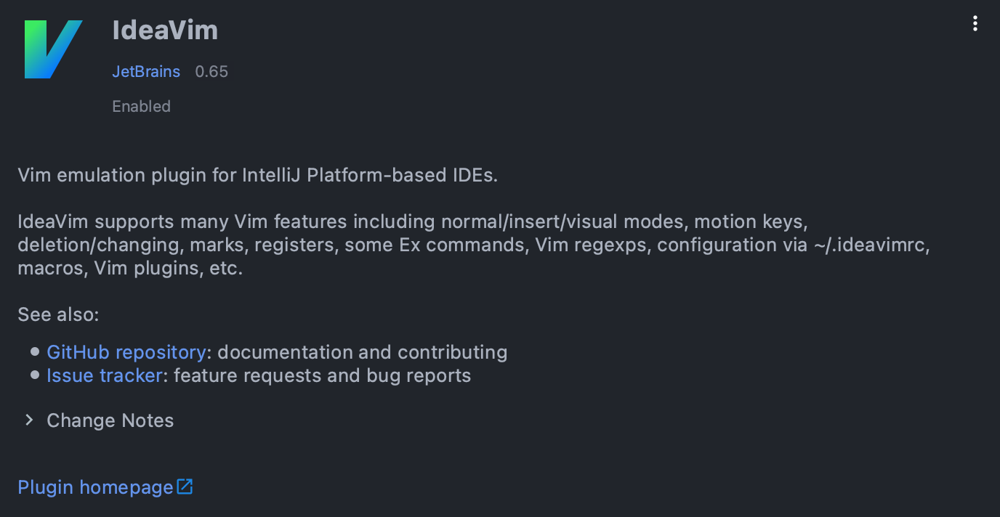
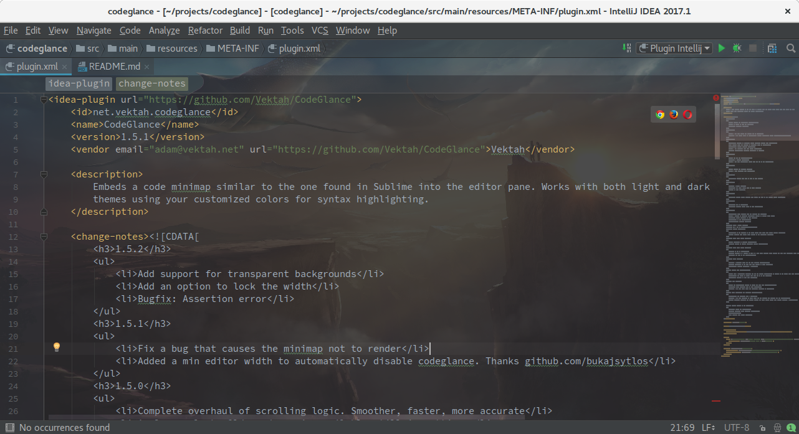
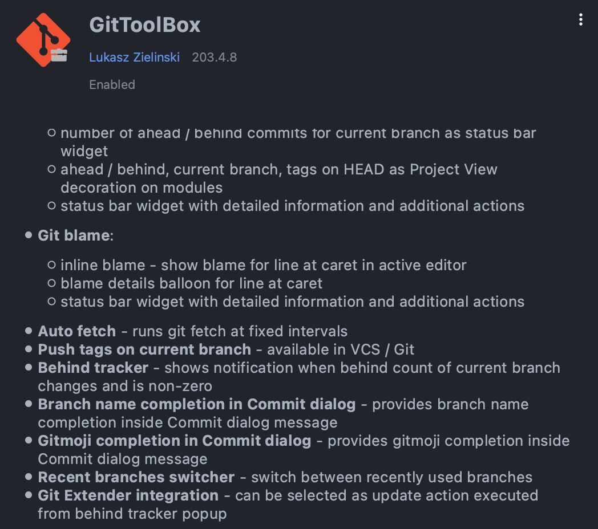
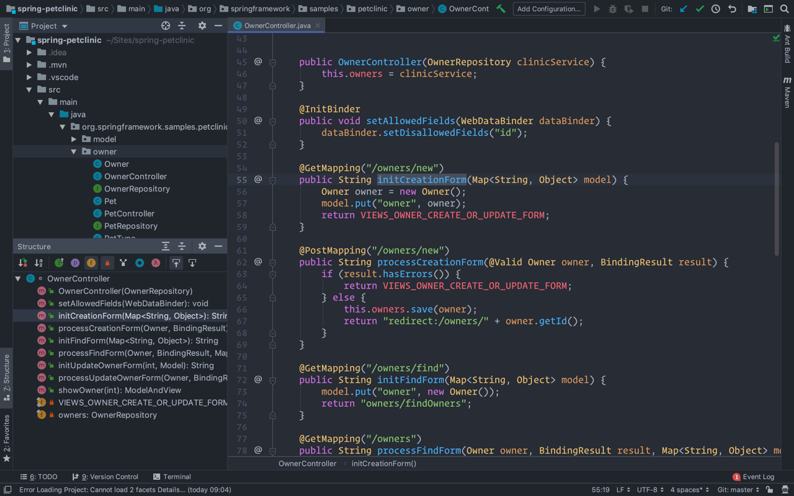
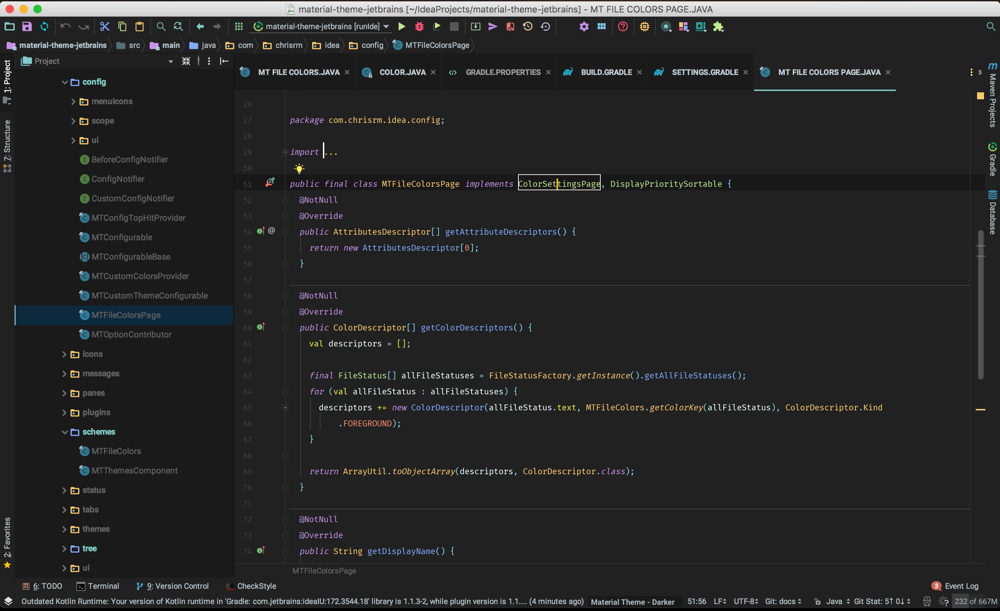

# [IDE] IntelliJ IDEA 플러그인 추천

추천이라 써놓고 내가 사용하는 플러그인 및 테마 모음

## IdeaVim

<!-- [##_Image|kage@b0S14N/btq06g2TJox/ll5ewiXbutTuriGsonPoy1/img.png|alignCenter|width="100%"|_##] -->

- 인텔리제이 에디터를 Vim처럼 사용할 수 있는 플러그인
- 유용도: ⭐️ ⭐️ ⭐️ ⭐️ ⭐️
- [플러그인 홈페이지](https://plugins.jetbrains.com/plugin/164-ideavim)
- [깃허브](https://github.com/JetBrains/ideavim)

Vim 없이 어떻게 컴퓨터로 글을 썼나 싶을 정도로 잘 쓰고 있는 플러그인. 마우스로 손이 가는 횟수를 90% 가량 줄이지 않나 싶다. 그만큼 편하고 속도도 빨라지고 여러 모로 생산성이 높아진다.

## Key Promoter X

<!-- [##_Image|kage@oTUw0/btq04LI58dC/D1ziIk8IzKkiwLa6VURoMk/img.gif|alignCenter|width="100%"|_##] -->

- 클릭한 버튼의 단축키를 알람처럼 표시해주는 플러그인
- 유용도: ⭐️ ⭐️ ⭐️
- [플러그인 홈페이지](https://plugins.jetbrains.com/plugin/9792-key-promoter-x)
- [깃허브](https://github.com/halirutan/IntelliJ-Key-Promoter-X)

기능을 실행하면 단축키를 알려주는 팝업얼 띄워준다. 자주 쓰는 기능들 위주로 빠르게 단축키를 익히기 좋다.

## Rainbow Brackets

<!-- [##_Image|kage@bnw3nY/btq03GnYz92/E92aoTU7coHxzvNKFIjSb1/img.png|alignCenter|width="100%"|_##] -->

- 괄호 쌍마다 색깔을 지정하여 가독성을 높여주는 플러그인
- 유용도: ⭐️ ⭐️ ⭐️ ⭐️
- [플러그인 홈페이지](https://plugins.jetbrains.com/plugin/10080-rainbow-brackets)
- [공식 문서](https://izhangzhihao.github.io/rainbow-brackets-document/)

자바로 개발할 경우 가능한 괄호 중첩을 없애려고 해서, 생각보다 자주 쓰지는 않는다. 그러나 어쨌든 괄호를 구별해야 할 일은 생기고 그럴 때마다 유용하긴 하다. 파이썬으로 개발할 때도 가능한 코드를 한 줄로 합치려는 경향이 있는데, 이 때 가독성을 높여준다.

## Code Glance

<!-- [##_Image|kage@DjJrh/btq09jR8mqt/Kic4QEEFFFkJQuAjtCJRH1/img.png|alignCenter|width="100%"|_##] -->

- 미니맵을 보여주는 플러그인
- 유용도: ⭐️ ⭐️ ⭐️ ⭐️   
- [플러그인 홈페이지](https://plugins.jetbrains.com/plugin/7275-codeglance)
- [깃허브](https://github.com/Vektah/CodeGlance)

에디터 우측에 반투명 미니맵을 보여준다. 소스의 대략적인 구조와 현재 보고 있는 위치를 쉽게 파악할 수 있다. 그리고 스크롤바로 기능해서, 한번에 원하는 위치로 이동하기 용이하다.

## GitToolBox

<!-- [##_Image|kage@CME27/btq09zf9yOj/AWXFUXYE54oAbOQOuaKUaK/img.png|alignCenter|width="100%"|_##] -->

- 깃 관련 편의를 제공하는 플러그인
- 유용도: ⭐️ ⭐️
- [플러그인 홈페이지](https://plugins.jetbrains.com/plugin/7499-gittoolbox)
- [깃허브](https://github.com/zielu/GitToolBox/wiki/Manual)

에디터에서 선택한 라인의 커밋 로그를 바로 옆에 표시해준다거나 하는 등 깃과 관련하여 여러 유용한 기능을 제공해준다. 그거 말고는 딱히 사용하는 기능은 없는데, 플러그인 기능인지 모르고 사용하는 게 있을지도. 

## Atom Material Icons

<!-- [##_Image|kage@crBSD3/btq0iAPwOsj/pkigPB6o7ydLsi3AMUpPp1/img.png|alignCenter|width="100%"|_##] -->

- 아이콘을 Material 디자인으로 바꿔주는 플러그인
- 유용도: ⭐️ ⭐️ ⭐️ ⭐️ ⭐️
- [플러그인 홈페이지](https://plugins.jetbrains.com/plugin/10044-atom-material-icons)

IDE 상에서 보여지는 아이콘들을 이쁘게 바꿔준다. 언어별 로고나, 디렉토리 네이밍에 따라 적합한 디자인으로 보여지기 때문에 가독성이 좋아진다.

## One Dark Theme

<!-- [##_Image|kage@cDtcfD/btq04MaceTh/ti0B66cJfME4K5tSSrUd31/img.png|alignCenter|width="100%"|_##] -->

- One Dark 테마로 바꿔주는 플러그인
- 유용도: ⭐️ ⭐️ ⭐️ ⭐️ ⭐️ 
- [플러그인 홈페이지](https://plugins.jetbrains.com/plugin/11938-one-dark-theme)

여러 테마를 써보다가 이 테마에 거의 정착을 했다. 가독성이 여러 언어에서 종합적으로 만족스럽다. Pycharm, WebStorm 등 JetBrains의 IDE만 쓰는 편인데, 개인 맥북이나 회사 윈도우 데스크탑의 모든 IDE를 이 테마로 적용하니깐 시각적으로 적응하기 상당히 좋다.

## Material Theme UI

<!-- [##_Image|kage@bNvrRA/btq039pXDrU/2eZkib2MBIZPqcKiZqVvSK/img.png|alignCenter|width="100%"|_##] -->

- 다양한 Material Design 테마를 제공하는 플러그인
- 유용도: ⭐️ ⭐️ ⭐️ 
- [플러그인 홈페이지](https://plugins.jetbrains.com/plugin/8006-material-theme-ui)

위에 One Dark 테마를 사용하기 전까진 이걸 사용했었다. 다양한 Material 테마를 제공한다. 이걸 사용할 때는 IDE별로 다른 테마를 사용해서 언어별로 최적화를 시켰었다. 
